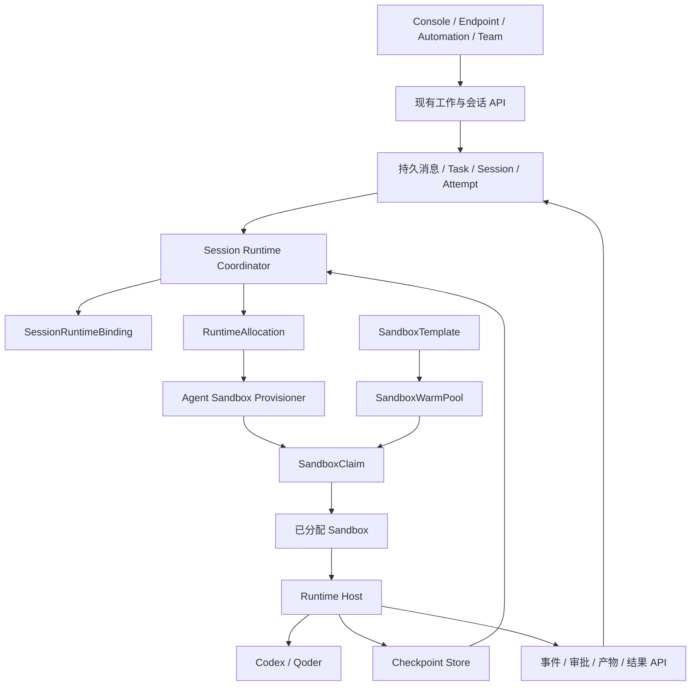

# 平台托管 Coding Agent：预热运行池、会话路由与状态恢复规划

- 日期：2026-09-10
- 状态：方案草稿，供架构与产品评审；尚未实施
- 范围：AgentScope Service 控制面、Console、Runtime Host、Codex/Qoder adapters、Kubernetes 部署及持久存储
- 代码基线：`/Users/ken/agentscope-2/agentscope-java`，审阅时实际分支为 `main`

本文中的新增对象、接口、状态、配置和指标均为建议设计，不表示当前产品已经支持。示例参数用于解释方案，正式默认值由验证结果确定。

## 1. 要解决的问题与建议结论

用户希望在平台上创建一个 Agent，选择 Codex 或 Qoder 作为执行引擎，保存职责、模型、Skills、MCP、仓库和凭据引用之后即可使用。用户不需要自行安装 CLI、注册 Runtime Host，也不需要维护一台持续在线的机器。

平台承担执行资源的供给与维护。用户发起会话或任务时，平台从预热池领取已经就绪的运行环境；同一会话继续使用绑定环境。环境因空闲而回收、进程崩溃或节点故障而失效后，平台能够恢复会话状态并继续工作。

建议以“平台托管运行时”作为产品能力，采用以下组合：

- 静态 Agent 定义与物理运行实例分离。
- Kubernetes 资源供给直接接入 agent-sandbox 的 SandboxTemplate、SandboxWarmPool、SandboxClaim、Sandbox。
- 池化的是干净运行环境，分配与状态连续性的主要单位是 Session。
- 沿用 Runtime Host 和 provider adapters 执行 Codex/Qoder，沿用 ExecutionAttempt 管理执行租约、事件、取消和结果。
- 增加明确的 Session 运行绑定、分配记录、恢复检查点和恢复协调器。
- 第一版优先实现容器级预热、会话亲和、轮次边界保存及跨实例恢复；provider 进程常驻作为独立优化。

本方案面向的完整体验是：**创建时没有常驻实例成本，正常调用命中预热环境，连续对话复用实例，实例可替换而会话身份和持久工作状态连续。**

### 1.1 与现有 Managed 模式的关系

当前 AgentScope Harness 的 Managed 模式由常驻 Dataplane 承载，不存在每次请求先创建 Pod 的固有冷启动。本方案不将它改造成逐请求启动容器，也不改变其 Harness 与工具 Environment 的职责划分。

平台托管 Codex/Qoder 的推理循环由对应 provider 执行。平台可以统一入口、任务、审批和产物，但不能自动获得 Harness 的全部 Memory、工具、Subagent 或恢复能力。可移植定义通过 provider adapter 映射，缺失能力需要在发布与执行准入时明确拒绝。

| 运行方式 | 执行引擎 | 资源生命周期管理者 | 创建者要做什么 |
|---|---|---|---|
| 现有 Managed | AgentScope Harness | 平台 | 保存 Agent 定义与资源绑定 |
| 现有 Hosted | Codex/Qoder 等 | 用户维护 Runtime Host | 连接主机，选择可用运行时 |
| 本方案 | Codex/Qoder 等 | 平台预热池与会话协调器 | 保存定义，选择平台运行时与授权 |
| External | 用户 Agent 应用 | 用户应用部署系统 | 注册或接入应用 |

### 1.2 目标与非目标

第一版必须支持：无在线 Host 时创建静态 Agent、预热池领取、Session 独占绑定、连续多轮、空闲回收、保存成功状态后跨实例恢复、幂等分配、取消、租约失效收敛、权限隔离与容量治理。

第一版不承诺：任意指令中途的透明进程迁移、恢复 Shell 进程内存、任意运行时之间迁移原生会话、跨集群灾备切换、跨用户复用已使用环境、任意用户镜像即开即用，以及任意规模突发下绝对没有等待。

这些范围限制不影响平台保存工作和给出明确失败原因；它们决定平台可以承诺哪一种恢复语义。

## 2. 用户和管理员看到什么

### 2.1 创建 Agent

建议保留现有 Agent 创建入口，在平台托管路径提供运行时选择。最终页面文案可以继续评审，底层不以新的业务 Agent 类型扩散到 Team、Issue 和 Workflow。

创建者配置：

| 配置 | 含义 |
|---|---|
| 运行时 | Codex 或 Qoder，以及平台公布的开发环境规格 |
| Agent 定义 | Instructions、模型、Skills、工具策略、MCP、Subagent 等可支持能力 |
| Provider 授权 | 已授权的组织凭据或个人凭据引用 |
| 工作输入 | 仓库来源、基准 ref、输入文件；也可在发起任务时提供 |
| 资源设置 | 平台允许选择的规格、执行预算、网络权限等级 |
| 恢复策略 | 默认保留原生会话；原生恢复失败时是否允许重建上下文 |

保存时校验定义、权限和运行时模板，不创建 Sandbox。平台运行时选项来自已发布模板，不能由当前在线 Host 列表决定。池暂时没有空闲容量与运行时不可用需要区别展示。

现有 Workspace 继续表达能力定义。执行代码和文件的工作目录是 Session 的运行空间，两者不合并为一个生命周期对象。现有 Managed Environment 是 Harness 的工具执行后端，也不直接等同于本方案的完整 Coding Agent Sandbox。

### 2.2 发起与继续会话

首次发送消息后，平台先保存输入并返回稳定的 Session/Turn 标识，再异步分配环境。Console 根据事件展示“排队中”“准备环境”“恢复会话”“执行中”“等待确认”等阶段。

已有环境时，后续轮次直接使用 Session 绑定。浏览器刷新、网络重连或切换控制面副本，不改变执行归属。历史消息和事件回放来自平台持久存储，不要求浏览器连接原 Pod。

用户可以取消当前轮、关闭会话、查看产物。取消一轮不默认删除会话文件；关闭会话也不等于立即删除所有历史和快照。释放计算资源与删除会话数据是两个不同操作。

### 2.3 任务与团队协作

独立任务创建或关联一个用于执行连续性的 Session。重试继续使用这个上下文；任务完成后可以按任务保留策略较快释放环境。

普通 Chat 保持现有产品语义，不因使用池化运行时而强制产生用户可见 Issue。需要协调的任务仍通过已有 AgentTask/ExecutionAttempt 内核执行。

Team leader、worker、子任务各自拥有执行上下文，不因属于同一 Issue、同一用户或同一仓库就自动共用一个可写目录。跨 Agent 通过现有协作记录和 Artifact 共享结果；需要接续代码时明确传递 commit、patch 或文件快照。

### 2.4 管理入口

普通创建者只选择平台允许使用的 Runtime。管理员在现有运维能力域配置集群接入、模板、池容量、网络策略、凭据授权、数据保留和预算。

不要求普通用户理解 RuntimeProfile、RuntimePool、SandboxClaim。运维页面可提供从 Session/Attempt 到 Allocation、Claim 和 Sandbox 的诊断链接，但不把 Kubernetes 细节放进正常对话流程。

## 3. 当前实现基础与缺口

以下判断来自本次代码审阅，不将规划文档中的目标当作已实现能力。

| 能力 | 当前基础 | 本方案需要的变化 |
|---|---|---|
| Agent 身份 | Agent、Binding、Host、Attempt 已分离 | 保持身份模型，补充资源管理方式 |
| 静态定义 | Hosted 已有可移植定义与 adapter 投影 | 固定定义版本并支持从平台模板选择运行时 |
| Runtime 选项 | 从在线 Host 汇总 Profile/Pool | 增加模板驱动的零实例选项 |
| Chat 准入 | Hosted 候选要求匹配在线 Host | 平台池按可供给能力、权限和配额准入 |
| Host 执行 | 已有 claim、lease、fencing、事件与取消 | 增加 Allocation/Session/epoch 绑定校验 |
| 会话亲和 | 已有 preferredHostId 与稳定工作目录 | 升级为有所有权的 SessionRuntimeBinding |
| Host 离线恢复 | 清除本地恢复引用后重放持久对话 | 优先恢复完整原生状态，禁止静默降级 |
| Provider 进程 | Codex/Qoder 的 Run 启动子进程并等待退出 | 先保留；常驻进程另做生命周期扩展 |
| Sandbox 供给 | 有实验性自定义 CRD 与 Broker 代码 | 现有控制器仍返回 NotImplemented，需要完整接入 |

相关实现位置：

- [身份 ADR](/Users/ken/agentscope-2/agentscope-java/agentscope-service/docs/controlplane/adr-0002-service-v5-agent-identity.md)
- [运行时选项与设置](/Users/ken/agentscope-2/agentscope-java/agentscope-service/aistio/internal/httpapi/agent_catalog_handler.go)
- [Hosted 会话路由与恢复](/Users/ken/agentscope-2/agentscope-java/agentscope-service/aistio/internal/httpapi/hosted_conversation.go)
- [Hosted 任务派发与重试](/Users/ken/agentscope-2/agentscope-java/agentscope-service/aistio/internal/taskplane/service.go)
- [运行空间管理](/Users/ken/agentscope-2/agentscope-java/agentscope-service/aistio/internal/runtimehost/workspace.go)
- [Provider 公共契约](/Users/ken/agentscope-2/agentscope-java/agentscope-service/aistio/internal/runtimehost/provider/provider.go)
- [SandboxBroker 控制器占位实现](/Users/ken/agentscope-2/agentscope-java/agentscope-service/aistio/internal/controller/sandbox_broker_controller.go)
- [尚未接入控制器的 Broker 参考代码](/Users/ken/agentscope-2/agentscope-java/agentscope-service/aistio/internal/sandbox/broker.go)

现有 `agentscope.io` SandboxClaim 不是 agent-sandbox 上游的 SandboxClaim。当前参考 Broker 中的 API group 也不能直接当成目标接入契约。实施时应整体替换这条实验性占位链路，删除重复 CRD、旧 handler、RBAC 和部署说明；新业务入口通过平台资源供给服务调用上游 CRD。遵循当前项目约定，控制面、前端、Runtime Host 和部署包同步更新，不增加旧契约双写或兼容分支。

## 4. 架构与责任边界



### 4.1 控制面

控制面负责 Agent 身份、定义解析、权限、任务预算、会话顺序、运行绑定、分配记录、执行租约、检查点元数据和恢复决策。

新增 Session Runtime Coordinator 处理“使用原实例还是分配新实例”。新增 Agent Sandbox Provisioner 将持久分配意图投影成上游 Claim，并观察资源状态。它们可以作为控制面内的独立工作模块运行，不要求第一版拆成新服务。

业务事件通过事务与 Outbox 驱动；后台定期扫描用于恢复漏掉的事件和处理中状态。不能靠某个 HTTP 请求内启动的 goroutine 保证分配完成。

### 4.2 agent-sandbox

上游负责 Sandbox、预热库存及 Claim 的基础设施生命周期。官方流程是从 WarmPool 领取已准备的 Sandbox，然后补充空闲池。本方案只复用其资源能力，不将用户消息、AgentTask 或运行结果写进 CRD。[官方流程](https://agent-sandbox.sigs.k8s.io/docs/use-cases/examples/quickstart/)

AgentScope 负责写 Claim 和配置池的期望容量，agent-sandbox controller 负责实际资源变化。同一个字段只能有一个期望状态写入者，例如启用 HPA 后不再由另一个定时器同时修改 WarmPool replicas。

### 4.3 Runtime Host

Runtime Host 负责接收受限的绑定授权、准备定义与工作目录、启动 provider、上报标准事件、维持执行租约、保存恢复状态、停止执行和排空。

未绑定的预热 Host 仅可完成健康探测和受限控制握手，不得领取普通 Hosted 队列中的任务。绑定完成后，Host 只允许领取指定 Session/Allocation/epoch 的 Attempt。

Host 的启动身份与 Agent 子进程身份分离。Provider 不能读取 Host 的广泛注册凭据，也不能通过伪造 Session ID 领取其他会话。

### 4.4 Provider adapter

Adapter 负责 provider 协议与状态格式，不管理 Kubernetes，也不自行选择其他 Session。它明确报告指令、工具、MCP、Subagent、审批、会话恢复等能力。

迁移验收需要细化为能力声明，例如 `resumeInPlace`、`restoreOnNewInstance`、`checkpointAtTurnBoundary`、`persistentProcess`。它们用于表达当前模板实际通过验证的能力，不是为旧版本添加运行时兼容探测。

## 5. 核心模型与存储归属

执行后端继续复用 `hosted-runtime` 协议；资源管理方式单独建模为 `user-managed` 或 `platform-managed`。这保留现有调度与 adapter 边界，避免把 Codex 品牌或 Kubernetes 类型加入业务状态机。

### 5.1 现有对象的扩展

| 对象 | 扩展建议 |
|---|---|
| AgentBinding | 引用 Profile/Pool；维持现有稳定 Agent ID |
| RuntimeProfile | provider 参数、能力要求和安全基线；不保存明文密钥 |
| RuntimePool | 增加 managementMode、provisioner、clusterRef、namespace、warmPoolRef、runtimeTemplateRevision、容量与保留策略 |
| RuntimeHost | 增加平台管理标识、Allocation/Session/epoch 绑定与 Pod UID 身份 |
| ExecutionAttempt | 增加 allocationId、sessionEpoch、恢复检查点引用及资源准备阶段信息 |

Pool 中的预热资源必须属于可解释的模板版本。第一版采用不可变模板修订与按修订命名的池，已绑定 Session 固定其修订。替换空闲池不会偷偷更新正在执行的 provider。

Attempt 创建时固定 Agent 定义、Binding、Profile、运行时模板修订和策略快照。实际 Host 在分配并领取执行时确定，此后不可在同一 Attempt 中换 Host；故障重执行创建新 Attempt。动态授权每次重新校验，已经撤销的权限不能因旧快照继续生效。

### 5.2 RuntimeTemplateRevision

平台保存运行时模板的发布元数据及不可变修订：provider、CLI/adapter 版本、镜像 digest、能力描述、固定容器路径、资源规格、安全基线、存储约定，以及上游 SandboxTemplate 引用。

它是平台可发布的 Runtime 目录条目，与 CRD 有明确投影关系，不再实现另一套 Pod 控制器。平台管理的模板禁止在 Kubernetes 中原地变更；发现内容与 digest 不符时暂停新分配并提示运维。第一版只接入平台管理的模板，避免 DB 与人工修改 CRD 形成双重配置源。

### 5.3 RuntimeAllocation

RuntimeAllocation 记录一次具体环境分配，建议保存：

```text
id / tenant / namespace / sessionId / poolId
runtimeTemplateRevision / sessionEpoch / provisioningAttempt
clusterRef / kubernetesNamespace / claimName / claimUid
sandboxName / sandboxUid / podUid / hostId
state / failureCode / failureMessage
createdAt / readyAt / lastActiveAt / releasedAt
version
```

同一 Session 同一 epoch 可因启动失败产生有限次供给尝试，但只能有一个有效目标。Claim 名称由 Allocation ID 确定；API 超时后查询同名对象，不能无条件再建一个。

### 5.4 SessionRuntimeBinding

SessionRuntimeBinding 表达当前会话归属，建议保存：

```text
sessionId / tenant / namespace / agentId / bindingId
allocationId / hostId / epoch / state
runtimeTemplateRevision / definitionRevision
providerSessionId / executionWorkspaceRef
latestCheckpointId / lastCheckpointedTurnId
ownerLease / ownerLeaseExpiresAt / version
```

`epoch` 是会话归属代次。协调器的 ownerLease 用于避免多个控制面副本同时分配和恢复；它与 Host 的执行 lease 是不同的租约。

数据库保证每个 Session 只有一份当前绑定。Allocation 保留历史，旧 Host 不因重新注册而自动成为当前所有者。

### 5.5 SessionCheckpoint

Checkpoint 元数据包括 Session、epoch、provider、运行时修订、定义修订、原生会话 ID、工作目录快照、provider 状态快照、消息处理位置、上一检查点引用、校验和、格式版本、提交状态和失败原因。

恢复存储保存实际文件与二进制状态；数据库只保存可校验引用。Checkpoint 不等同于 Artifact：前者可能包含大量私有工作文件和模型上下文，后者是显式交付给用户或协作者的产物。

### 5.6 Session 输入与命令

新消息、取消、恢复请求必须持久化。优先扩展现有 Session command/Turn 记录，缺少字段时补充序号、请求幂等键、处理状态和目标 Attempt；不新建与现有消息日志竞争的聊天存储。

请求幂等作用域至少包含 principal、Session 和 clientRequestId。超时重试返回同一逻辑输入；幂等键不能让不同调用者绕过会话访问权限。

### 5.7 数据归属

执行资源配置、Allocation、SessionRuntimeBinding、Checkpoint 元数据建议由现有 `rt` 一侧统一负责，因为它们需要与 Session/Attempt 协调。Agent 定义继续沿用现有产品定义存储，Vault 沿用凭据管理边界。

跨定义库、运行库、对象存储和 Kubernetes 不做伪分布式事务。采用可重试工作流、Outbox、确定性资源标识和状态对账。Kubernetes 对象被手工删除时，更新 Allocation 故障事实，不自动删除 Session 历史。

## 6. 预热池如何工作

### 6.1 池化粒度

池按 provider、镜像修订、资源规格、隔离等级、网络边界和必要租户边界划分。第一版在租户/namespace 范围内供给，不跨租户搬移已经创建的 Sandbox。

Agent 数量不决定池数量。同样使用 Codex Java 环境的多个 Agent 共用一类预热库存，领取后再应用各自定义。个人凭据、Instructions、普通 Skills 不作为池的默认划分键。

| 预热层次 | 请求路径还需做什么 | 第一版定位 |
|---|---|---|
| 镜像缓存 | 调度 Pod、容器初始化、provider 启动 | 只是基础优化 |
| Pod 与 Host 就绪 | 绑定、工作区准备、provider 启动 | 必须实现 |
| 绑定 Session 的环境保留 | 下一轮执行，必要时重启 provider | 必须实现 |
| Provider 进程跨轮常驻 | 刷新任务上下文并提交新轮次 | 后续独立优化 |

### 6.2 两级就绪条件

`WarmReady` 是平台对预热环境的就绪判断：镜像正确、Host 健康、provider 二进制可探测、工作盘可写、基础工具满足模板要求。此时尚无用户凭据，不能声称 provider 已完成用户认证。

`ExecutionReady` 表示领取后定义准备、权限校验、凭据获取、工作区准备或恢复已经完成。只有达到此阶段才领取并启动业务执行。

Pod Running、Sandbox Ready、Host 在线、ExecutionReady 需要分别记录。预热命中统计以领取前已经 WarmReady 为准，不以提前创建过一个仍 Pending 的 Pod 充数。

### 6.3 领取后配置

上游当前 API 说明，Claim 设置 `spec.env` 会强制走新建 Sandbox 的路径，不能在已运行的预热 Pod 中注入这些环境变量。因此 Claim 只表达分配请求，动态定义、凭据和任务上下文在领取后交给 Host，由 Host 配置子进程环境和专用文件。[SandboxTemplateSpec API](https://pkg.go.dev/sigs.k8s.io/agent-sandbox/extensions/api/v1beta1#SandboxTemplateSpec)

预热阶段不建立用户登录会话，不把用户 token 烘焙进镜像或模板。仓库内指令文件与平台投影文件继续遵守现有不覆盖原则。

### 6.4 示例

以下示例沿用本次查阅的上游 v1beta1 字段，假设 `codex-java-r1` 模板已经存在。实施时固定经过测试的上游 release、CRD 和镜像版本，不依赖 main 分支行为。

```yaml
apiVersion: extensions.agents.x-k8s.io/v1beta1
kind: SandboxWarmPool
metadata:
  name: codex-java-r1
  namespace: tenant-a-runtimes
spec:
  replicas: 5
  sandboxTemplateRef:
    name: codex-java-r1
---
apiVersion: extensions.agents.x-k8s.io/v1beta1
kind: SandboxClaim
metadata:
  name: allocation-example
  namespace: tenant-a-runtimes
spec:
  warmPoolRef:
    name: codex-java-r1
```

`replicas: 5` 表达池库存的期望数量，不是全平台最大会话数，也不保证五个环境此刻全部 Ready。已领取的环境单独计入分配容量。

### 6.5 池耗尽

第一版采用有界排队：申请进入持久队列，按授权和配额等待环境，超出排队时限后明确失败。补池仍在后台进行。不得以无限创建 Claim 或 Pod 的方式绕过总容量预算。

集群节点、可用区和存储也需要预留容量。只有镜像缓存或零库存自动扩容不能保证交互低延迟。预热池将环境创建移到后台，不能消除模型首响应或大仓库准备时间。

## 7. 实例选择、会话亲和与并发

### 7.1 路由单位

| 范围 | 路由规则 |
|---|---|
| 运行中的 Attempt | 所有执行控制命令到当前 lease owner，不能临时换实例 |
| 同一 Session 的不同轮次 | 当前绑定有效时必须复用，故障或释放后经恢复重新绑定 |
| 同一 Task 的重试 | 保留执行上下文，产生新 Attempt，可恢复到其他环境 |
| 同一 User 的不同 Session | 默认独立环境，User 用于权限、凭据范围与配额 |
| 同一 Agent 的并发调用 | 按 Session 隔离，不默认共享工作目录 |
| 同一 Issue/Team 的不同参与者 | 独立执行，通过协作契约交付结果 |

第一版不按 User 做实例粘性，也不将会话 ID 简单哈希到可变实例列表。亲和关系由数据库明确记录，不能在扩缩容时因哈希变化丢失工作状态。

### 7.2 路由算法

1. 校验调用者对 Session 的权限，持久化输入并分配顺序号。
2. 查询 SessionRuntimeBinding，检查 Session 是否关闭、配置是否允许继续执行。
3. 绑定处于 ready，且 Host 身份、epoch、运行时修订和执行能力有效时，提交到当前环境。
4. 绑定处于 allocating/restoring/draining 时，新输入留在队列，由同一协调流程决定后续动作，不能另开一条无约束分配。
5. 没有可用绑定时，通过 CAS 和协调 lease 取得恢复所有权，更新目标 epoch，创建唯一分配意图。
6. 排除旧执行者后，领取匹配原运行要求的环境；校验检查点并完成恢复。
7. 使用版本条件提交新绑定为 ready，处理尚未执行的输入。

临时网络抖动不立刻迁移。超过健康宽限、执行 lease 失效后进入故障处理；确认旧执行者已经被终止或有效隔离后才激活新执行者。必须记录检测与隔离证据，单独增加 epoch 不等于完成隔离。

### 7.3 同一会话的并发

同一 Session 默认只允许一个活动业务轮次，后续输入按持久顺序排队。现有 Hosted 对并发轮次返回冲突的行为，在平台托管路径需要明确调整为有界队列；队列容量与超时对所有入口一致。

取消和审批命令可以越过普通消息队列，但必须绑定当前 Attempt 和请求标识。第一版不将普通用户消息自动解释成 provider 的 mid-turn steering，避免排队输入意外改变正在执行的任务。

两个请求同时唤醒一个已释放 Session 时，只能产生一次有效恢复。两个控制面副本同时执行 Outbox 时，数据库唯一约束、版本检查和确定性 Claim 名称共同保证收敛。控制面内存缓存仅用于加速，不能作为最终所有权来源。

### 7.4 与执行租约的关系

会话所有权负责“这个上下文归谁执行”，Attempt lease 负责“本次执行归谁领取”。两者同时校验：tenant、namespace、Session、Allocation、Host、epoch、Attempt generation/fencing。

环境分配和恢复期间 Attempt 保持排队并展示准备阶段，不提前启动业务运行超时。排队、资源准备、执行和审批等待各有独立时限。用户总请求预算可以约束这些阶段的总和。

## 8. 状态持久化与跨实例恢复

### 8.1 保存什么

| 状态 | 内容 | 权威位置 |
|---|---|---|
| 平台会话 | 输入、事件、轮次、审批、结果、已消费位置 | 平台数据库和事件存储 |
| 工作空间 | 基准 commit、未提交修改、未跟踪文件、输入和生成数据 | 执行卷与检查点存储 |
| Provider 原生状态 | 会话记录、索引、元数据、必要的子会话状态 | provider 专属状态目录的可恢复快照 |
| 配置 | 定义修订、RuntimeProfile、镜像/adapter 修订、工具配置引用 | 不可变执行与会话快照 |
| 凭据 | 凭据引用、授权范围 | Vault；运行时重新授权获取 |
| 可再生缓存 | 依赖下载、构建缓存 | 可选缓存，不作为恢复正确性前提 |

仅保存 Git commit 或 diff 不足以覆盖未跟踪文件、删除、二进制数据和 provider 状态。仅保存 providerSessionId 不包含原生会话内容。共享 Memory 也不能替代上述执行状态。

Codex 官方的 `thread/resume` 可以打开已保存的 thread 并继续提交 turn；它提供原生恢复入口，但不负责替平台传输跨 Pod 状态。Qoder 需要独立验证其目录和恢复契约，不能由 Codex 测试结果推断。[Codex App Server](https://learn.chatgpt.com/docs/app-server)

### 8.2 第一版存储选择

建议第一版使用“每个 Sandbox 的独立执行卷 + 远端检查点存储”：

- 预热时按模板准备独立空白卷；绑定后只允许该 Session 使用。
- Pod 在原 Sandbox 内重建时，可以使用仍存在的执行卷，但必须重新验证运行身份和状态一致性。
- 释放 Sandbox 后恢复到另一个预热环境时，将远端检查点恢复到新环境自己的卷；不要求给运行中的 Pod 临时追加任意 Session PVC。
- 工作空间与 provider 状态使用固定容器路径。所有恢复路径由受信任组件控制，限制路径穿越、恶意符号链接和非授权目标。
- 平台控制身份、密钥缓存与用户可写目录分离；Checkpoint 的文件选择规则显式排除认证文件和不应持久化的 token。

该方案可以保留预热池的价值，代价是大状态恢复需要数据传输时间。后续可采用增量快照、预缓存、按后端支持的存储延迟绑定等优化，但不将它们作为第一版的隐含前提。上游有存储延迟绑定示例，具体能力依赖部署后端。[存储延迟绑定示例](https://agent-sandbox.sigs.k8s.io/docs/use-cases/examples/latebind-storage-gke-sandbox/)

### 8.3 Provider 恢复包的边界

Adapter 应定义恢复包格式，包括所需文件、索引依赖、原生会话标识、路径约定、版本和验证方法。若根会话需要关联的子会话状态，则一并保存；不能只复制根会话文件后宣称 Subagent 上下文完整恢复。

第一版为每个 Session 使用隔离的 provider 状态目录，不让多个用户共享一个全局 CLI home。目录中可能存在 SQLite、索引和日志等状态，不能在写入过程中随意复制。具体安全导出方式在 P0 用真实 provider 验证：进程退出后复制、原生导出，或具备一致性的存储快照。

部署固定已验证的 provider/adapter 镜像版本，恢复到同一修订。发布新修订时新 Session 使用新池，旧 Session 在保留期限内使用原修订；不默认将旧原生状态导入未验证版本。这是会话版本固定，不是旧平台协议兼容层。

### 8.4 检查点提交协议

第一版以完成轮次为主要检查点边界，正常释放之前必须产生可用检查点。协议如下：

1. 停止接受下一轮执行，等待当前 provider 退出或达到经验证的静止点，并确认没有仍在修改目录的后台进程。
2. 记录本轮结果、provider 会话标识、消息序号和运行时修订，开始 staged checkpoint。
3. 保存工作空间与 provider 状态；使用不可变对象名、完整校验和以及明确文件清单。
4. 验证所有组成部分存在且完整，在数据库事务中将 manifest 标记为 committed，并推进 lastCheckpointedTurnId。
5. 释放检查点屏障，允许下一轮执行或正常回收。

Manifest 提交是可恢复检查点的线性化点。对象上传成功但数据库未提交时，它仍是未提交快照，由重试确认或稍后清理。数据库绝不能先引用还未持久化的文件。

平台事件可能早于检查点进入可见历史；因此 `lastCheckpointedTurnId` 与“用户已经看到的最后一轮”必须分开记录。检查点涵盖位置之外的成功操作不能在恢复时被无条件重复执行。

### 8.5 执行成功与检查点失败

执行结果和恢复能力分别报告。已经通过现有契约提交成功的业务结果，不因快照上传失败被改成业务失败并自动重跑。

若本轮成功但检查点失败：保留当前环境，标记恢复状态 degraded/checkpoint_failed，有限重试保存，暂停正常空闲回收及下一轮派发。超出存储重试预算后明确请求运维处理或结束会话，不能无限占用资源，也不能默默删除唯一状态。

强制释放需要明确说明可能失去最近状态，并保留审计。清理失败与执行失败同样分开记录。Hosted `task.complete`、原生最终回复、Artifact 上传和检查点状态在实现时需要对齐，但不把 Pod 退出码作为业务成功的唯一依据。

### 8.6 三种恢复语义

| 级别 | 恢复内容 | 第一版承诺 |
|---|---|---|
| 原实例继续 | 复用当前环境，继续当前或下一轮 | 健康情况下支持；同一 Attempt 不换实例 |
| 检查点恢复 | 在另一环境恢复原生会话和工作文件，从安全边界继续 | 两个 provider 分别通过验收后支持 |
| 上下文重建 | 用持久消息、结果和文件开启新原生会话 | 仅在明确策略允许时使用，标记为重建 |

“恢复原生会话失败后自动重放聊天”不得作为无提示默认行为。默认策略建议为 `native-required`。可选 `reconstruct-allowed` 表示允许重建，但必须重新评估尚未确定的外部副作用，不能简单逐条重发所有历史输入。

### 8.7 正常回收与故障恢复

正常回收：停止派发 → 排空 → 检查点 committed → 确认 provider 停止 → 更新绑定与资源状态 → 删除 Claim/Sandbox → 检查清理结果。恢复时从远端已提交检查点继续。

故障恢复：持久记录故障 → 停止新派发 → 失效旧 lease → 终止或隔离旧执行者 → 分配新环境 → 验证并恢复最近 committed checkpoint → 对齐待处理输入及未知结果 → 创建新 Attempt。

若最后检查点之后还有已执行但未被安全记录的外部操作，进入 recovery_blocked 或人工核对流程。平台不能通过“成功回到旧快照”证明未发生重复业务操作。

### 8.8 RPO 与进程状态

对已确认 committed 的检查点，在数据库和检查点存储正常的前提下，应恢复其完整状态。突发故障时，最新未提交轮次可能丢失部分运行上下文；其输入仍在平台，外部副作用可能已经发生。

第一版不恢复进程堆、PTY、网络连接和 Shell 后台任务。跨实例接续是检查点恢复加新的执行，不是透明迁移。若工作依赖长期后台服务，需要重新启动并做业务状态检查，或将服务独立于 Session 沙箱部署。

## 9. 防止双实例执行与重复副作用

### 9.1 双重 fencing

每次重新绑定推进 Session epoch，每次业务重执行产生新 Attempt/generation。结果、事件、审批回复和任务 API 同时检查会话归属与执行归属。

旧实例恢复联网后，其注册、续租或回报不能覆盖新绑定。工作负载身份包含实际 Pod UID，不复用其他 Sandbox 的 Host 身份文件。旧 Allocation 只能继续完成被授权的清理操作，不能重新领取业务。

### 9.2 进程与存储隔离

数据库拒绝旧回报不等于旧进程已经停止。平台激活替代实例前，必须获得旧执行者终止或有效隔离的证据：健康节点上确认进程/Pod 退出，异常节点上使用实际可生效的节点或网络隔离、存储写入隔离。

仅从 Kubernetes API 强制删除 Pod 记录，不能证明失联节点上的进程已结束。仅使用数据库锁也不能阻止旧进程写文件。第一版遇到无法证明安全接管的节点分区时，进入 fencing_pending/recovery_blocked，优先保证单执行者。

共享可写存储必须具备独立的单写约束。新实例从不可变检查点恢复到独立卷可以避免直接并发写同一目录，但仍需阻止旧实例继续产生外部副作用。

### 9.3 外部操作

平台内的评论、产物、任务完成等接口沿用幂等键和 Attempt 校验。业务工具尽可能提供 operationId、外部幂等键和结果查询。Provider 自由 Shell 访问外部系统时，平台无法普遍承诺 exactly-once。

对结果未知的写操作，先查询外部结果、核对或等待人工判断，再决定继续。不要把历史工具调用记录作为可安全重放的脚本。

### 9.4 审批

审批记录绑定 Session、Attempt、epoch、toolUseId、输入摘要和到期时间。同一实例中的审批按现有机制回复。

实例迁移后，旧 provider 请求的回调对象已不存在。第一版不把旧 approval 的 allow 回复直接交给新请求；恢复后重新建立有效请求并按当前权限确认。审批中的执行不适用普通空闲回收，独立受审批等待上限约束。

## 10. 生命周期、回收与保留

### 10.1 分配与绑定状态

建议将准备阶段保存在 Allocation/Binding，不直接扩大所有业务 Attempt 的状态枚举。

| 对象 | 建议状态 | 说明 |
|---|---|---|
| Allocation | requested、claiming、bound、preparing、ready、draining、releasing、released、failed | 资源分配与清理事实 |
| SessionRuntimeBinding | unbound、allocating、restoring、ready、draining、suspended、recovery_blocked、closed | 会话是否可以继续执行 |
| Checkpoint | staged、committed、failed、deleting、deleted | 快照完整性与保留状态 |

`suspended` 在本文表示平台已经释放计算资源、保留可恢复数据，不表示一定调用了 agent-sandbox 原生暂停功能。`ready` 表示环境可执行；当前有没有活动 turn 由已有 Session/Attempt 事实表达。

### 10.2 空闲环境和已分配环境

干净预热环境领取后不直接返回公共空闲池。会话中的环境在空闲期仍属于原 Session；结束后保存状态并销毁，池中通过新建环境补充。

清理用户文件不足以证明环境干净，因为工具、后台进程、凭据、缓存和软件安装可能发生变化。跨会话复用已使用环境不进入第一版。

### 10.3 超时建议

以下为试运行候选值，不是性能承诺或固定默认值：

| 参数 | 初始候选 | 目的 |
|---|---|---|
| 目标空闲库存 | 每个常用池 3–5 个 | 吸收小规模突发 |
| Chat 空闲保留 | 10–15 分钟 | 连续交互避免反复恢复 |
| 独立任务结束后保留 | 1–5 分钟 | 短期补交产物与故障诊断 |
| 资源排队上限 | 60–120 秒 | 避免无期限等待 |
| 恢复数据保留 | 7–30 天，由租户策略决定 | 支持延后继续并控制成本 |

执行时限、审批等待、检查点重试和最大工作盘大小需要各自配置。新消息与回收同时发生时，通过绑定版本检查决定保留或重新恢复；不能一边派发下一轮，一边删除 Claim。

### 10.4 数据删除

恢复数据保留不能依赖 Claim 的 ownerReference，否则删除计算资源可能级联删除唯一状态。第一版将远端 committed checkpoint 独立管理，删除执行卷前确认已满足保存要求。

会话关闭、计算释放、检查点过期、Artifact 保留、用户请求删除分别产生可审计操作。清理快照时检查当前绑定、保留策略和引用关系；对象删除失败有限重试并计入清理积压。

## 11. Provider 生命周期与能力约束

### 11.1 第一版执行模型

保留当前每次 Run 启动 provider 子进程的方式。预热 Pod/Host、保留 Session 工作目录，再通过原生 resume 延续会话。这能先消除请求路径上的容器调度等待，并利用进程退出作为检查点静止点。

不能因启用了 WarmPool 就声称 provider 进程已经常驻。应分别测量分配、恢复、CLI 启动、MCP 初始化和模型首响应。

### 11.2 建议 adapter 扩展

以下为职责草案，具体 Go 类型在实施时确定：

```text
ValidateRuntime(templateRevision, definition)
PrepareSession(binding, definition, credentialRefs)
RunTurn(attempt, input, eventSink)
QuiesceSession(session)
ExportCheckpoint(session, target)
ValidateCheckpoint(manifest, runtimeRevision)
RestoreSession(manifest, workspace)
CloseSession(session)
```

Prepare/Restore 必须在执行子进程前完成；Export 必须明确是否需要停止进程。通用层处理清单、校验、上传和恢复协调，adapter 处理原生文件集合与协议语义。

### 11.3 后续进程常驻

如果测量表明 provider 启动有明显成本，再实现 Session 级进程生命周期，保持同一 Session 的进程跨轮存活。它需要额外验证：每轮 token 更新、MCP 会话上下文切换、取消当前轮不误杀整个会话、工具权限变化、空闲时检查点能力、子进程残留。

运行时不支持安全热更新任务权限时，仍需重启进程。不得为降低几百毫秒启动时间而让旧 Attempt token 延长有效期。

### 11.4 Memory、工具与 Subagent

平台托管不改变 provider 的真实能力。共享 Memory 如通过 MCP 暴露，需有明确读写权限和错误语义；不自动复刻 Harness 的内存实现。原生 Subagent 必须遵守同一沙箱资源预算，其状态能否随主会话恢复需要单独测试。

平台 Team 调度与 provider 内部 Subagent 是两条不同层级的执行关系。第一版不自动把每个原生 Subagent 再拆成新的 SandboxClaim，以免改变 provider 原生协作语义。

## 12. 身份、凭据与执行隔离

### 12.1 三类身份

| 身份 | 用途 | 不允许访问 |
|---|---|---|
| 平台资源控制器 | 创建、观察、删除指定范围 CRD | 无需直接读取用户仓库内容或 provider 原生会话 |
| Runtime Host 工作负载身份 | 注册当前 Pod、兑换绑定授权、领取本会话任务 | 不得管理 Kubernetes 副本，不得任意访问其他 Session |
| Provider/Attempt 身份 | 模型调用、MCP/CLI 协作、授权业务工具 | 不得读取控制面管理员凭据与广泛 Host 注册 token |

平台通过可信集群身份验证 Pod UID、namespace、service account 和 Allocation 关联，再签发短期、定向绑定授权。服务账号 token 仅具有所需 audience；Agent 子进程不挂载可操作 Kubernetes 的凭据。

预热环境与已绑定环境的权限不同。绑定授权必须经控制面确认，不能只信任 Pod 自报的 tenant、Session、Pool 或标签。

### 12.2 Provider 凭据

创建时保存 credentialRef，执行或恢复时根据当前授权解析。组织凭据和个人凭据分别计量与限额，审计到真实授权主体。

Codex 的程序化认证可以采用官方支持的 API key 路径；Qoder 按其无人值守认证机制接入。具体账户能力和凭据注入方式在真实镜像验证中固定，不能把桌面登录目录复制到公共池作为默认方案。[Codex 认证](https://learn.chatgpt.com/docs/auth)、[Qoder 认证](https://docs.qoder.com/cli/authentication)

凭据撤销后禁止新执行；运行中的会话按策略停止或等待当前安全边界。新实例获取新授权，不恢复过期的 Attempt token。Provider 必须读取的模型凭据仍处于其信任边界内，不能声称只要用了 Vault 就对 provider 不可见。

### 12.3 信任边界

Host 管理通道与执行用户代码的环境分隔。实现可采用受控 supervisor 加独立执行容器/进程身份，但需要实际验证文件挂载、进程可见性、网络和 token 访问边界；同一 Pod 内两个容器并不自动形成完整安全隔离。

模板约束非特权运行、最小 Linux capabilities、固定可写路径、资源限制、网络出口和禁止宿主机敏感挂载。需要运行不可信代码的部署，应使用经验证的隔离运行时，例如部署支持的 gVisor/Kata 配置，而不是仅依赖 Kubernetes namespace。

已准备的池配置必须允许访问必要的控制面、模型服务、Artifact/Checkpoint 存储和被授权仓库。网络模板测试是发布条件，不能等第一次用户请求才发现 Host 无法回报。

### 12.4 仓库和产物

首次执行记录解析后的 commit SHA，固定本次工作基线。恢复时使用检查点中的代码状态，不因默认分支向前移动而重新 checkout 覆盖未提交修改。

仓库下载、依赖缓存及文件恢复都必须限制作用域。公共缓存只放可再生且允许共享的数据，不保存个人 token 或可执行的跨用户污染状态。共享产物通过已有 Artifact API 发布，不能直接暴露 provider 状态目录。

## 13. 接口、事件和协调协议

### 13.1 用户入口

现有 Agent、Chat、任务、Endpoint 和 Team API 继续使用稳定逻辑身份。新增资源字段通过当前服务契约同步更新，不另建一个“Codex 专用任务系统”。

| 操作 | 行为 |
|---|---|
| 创建/修改 Agent | 可选择 platform-managed Runtime；无需指定 Host |
| 提交消息/任务 | 先保存输入，返回稳定引用；异步准备资源 |
| 查询 Session | 展示执行、资源准备和恢复状态，不泄露敏感基础设施信息 |
| 取消当前轮 | 绑定 Attempt，覆盖排队、准备、恢复和执行阶段 |
| 释放计算资源 | 在安全保存后释放；保留会话与恢复数据 |
| 继续会话 | 复用已有绑定或启动恢复 |
| 删除会话数据 | 按权限执行独立删除流程 |

### 13.2 平台运维接口

建议围绕现有 operations 权限提供 Runtime 模板发布、Pool 配置、Allocation 查询、停止新分配、排空、清理重试和恢复诊断。下面是职责命名，不是已存在的 REST 路由：

```text
PublishRuntimeTemplateRevision
UpdateRuntimePoolPolicy
ListRuntimeAllocations
InspectSessionRuntime
DrainRuntimePool
RetryCheckpointOrCleanup
ReleaseSessionRuntime
```

第一版不提供用户任意传 PodSpec 的接口。平台只允许使用已发布模板与允许的参数，避免通过 CustomArgs、环境变量或卷覆盖放宽模板安全边界。

### 13.3 Host 机器协议

Host 与控制面增加绑定握手、准备状态、恢复结果、检查点提交和排空确认。Host claim 响应仍下发固定的 Attempt 快照和短期任务权限。

机器请求至少携带 Allocation、Session epoch 和当前工作负载身份；准备或恢复完成必须校验返回方仍是当前目标。迟到的旧 Host Ready 不能激活已取消或已替代的分配。

Lease 心跳和用户事件继续走现有传输，不逐次 patch CRD。资源控制器通过 watch 加周期性对账观察 Kubernetes；无需为了执行 provider 再开放公网 Shell 服务。

### 13.4 用户事件

建议新增或投影以下可持久回放的事件，最终命名与现有 SSE 契约统一：

```text
runtime.allocation.queued
runtime.allocation.ready
session.restore.started
session.restore.completed
session.restore.failed
session.checkpoint.failed
session.runtime.released
session.context.reconstructed
```

事件携带稳定 ID、Session、相关 Attempt/Allocation、时间、阶段和可显示原因；原始 Pod IP、token、内部错误堆栈不直接给普通用户。恢复完成事件说明恢复到哪一轮，重建事件说明原生会话发生变化。

### 13.5 两个跨系统提交点

分配提交点：数据库已有 Allocation 意图 → 上游 Claim Ready → Host 完成授权准备 → CAS 将 Session 绑定置为 ready。只看到 Claim Ready 不足以派发执行。

检查点提交点：所有快照上传并验证 → 数据库将 manifest 标记 committed。只有 committed 检查点可用于正常释放和跨实例恢复。

任一提交点中途重启都需要能从持久记录继续。数据库与 CRD 对账以 UID 识别对象，不能只按名称把人工重建的同名 Pod 当成原执行环境。

## 14. 端到端流程与失败处理

### 14.1 首次会话

1. 验证 Agent、模板、凭据授权和配额，保存 Session、输入与固定配置。
2. 创建 queued Attempt 或关联现有排队执行记录，创建绑定与分配意图。
3. Provisioner 创建确定性 Claim，领取 WarmReady 环境。
4. Host 通过工作负载身份兑换绑定授权，准备目录、定义与凭据。
5. 控制面确认 ExecutionReady；Host 原子领取本 Session 的 Attempt。
6. Provider 执行，平台持续保存事件、审批、协作产物和结果。
7. 在轮次边界保存检查点，随后保留环境或安全释放。

### 14.2 后续轮次

新输入先持久化。当前绑定有效且前一轮检查点屏障已结束时，创建/领取下一 Attempt，在相同目录中原生 resume。调用者切换浏览器、网络连接或 API 副本不触发资源迁移。

### 14.3 已释放会话

检查恢复数据仍在保留期内，取得恢复所有权，推进 epoch，从对应修订池领取新环境，恢复并校验状态，提交 ready 后处理新输入。

如果原修订池没有容量，显示等待原运行时；若修订已停用或检查点过期，显示具体原因。不能悄悄换 provider，也不能把恢复数据不存在显示成一个空白但“成功恢复”的会话。

### 14.4 故障分类

| 故障 | 平台动作 | 是否自动重跑业务 |
|---|---|---|
| Claim 创建请求超时 | 查询同名 Claim 和 UID，恢复分配流程 | 否 |
| 池无空闲容量 | 有界排队、后台补池 | 否 |
| 镜像或模板探测失败 | 标记模板/分配失败，暂停继续消耗同类请求 | 否 |
| 凭据无效/撤销 | 明确授权错误，清理未执行分配 | 否 |
| 输入准备失败 | 按错误类型有限重试或等待修正 | 不自动重复已执行工作 |
| Provider 执行失败 | 按现有任务重试策略结合恢复条件创建新 Attempt | 只有策略允许且副作用可判定 |
| 执行中 Pod 丢失 | fencing、检查点恢复、核对未知结果 | 不无条件重放 |
| 原生状态不完整 | recovery_blocked；按显式策略重建 | 不静默重放 |
| 成功后检查点上传失败 | 保留环境、有限重试、暂停下一轮及回收 | 否 |
| 资源删除失败 | 保留 released/cleanup-pending 事实并重试清理 | 否 |
| 旧实例恢复连接 | 拒绝旧 epoch 执行与结果，要求停止 | 否 |

### 14.5 取消竞态

排队时取消：取消输入/Attempt，取消尚未完成的分配意图。Claim 已创建但响应迟到时，协调器识别取消状态并清理。

恢复时取消：停止后续执行；若恢复操作可安全结束，则将环境置为可释放状态，不能直接留下无归属实例。

执行时取消：通知当前 Host 停止 provider，保留取消事实，等待退出证据并保存可用状态。取消不保证已经发出的外部写操作被撤销。

控制面在释放期间收到新输入：根据绑定版本选择撤销尚未开始的释放，或完成释放后恢复。不能同时承诺复用原环境又删除该环境。

## 15. 容量、成本与可观测性

### 15.1 分别计量的资源

| 计量项 | 说明 |
|---|---|
| warmReady / warmPreparing | 空闲已就绪与补充中环境 |
| allocatedActive / allocatedIdle | 已绑定且执行中/空闲保留的环境 |
| restoring / releasing | 恢复与清理中的资源，也计入预算 |
| provider concurrency | 凭据或账号实际承载的执行并发 |
| execution storage / checkpoint storage | 执行卷及远端恢复数据 |

按租户、池、Agent 和凭据设置必要的配额。总容量检查包括空闲、已分配和清理积压；不能只限制 WarmPool replicas。资源预留应与 Allocation 意图在数据库中原子取得，失败释放预留，重试不重复扣账。

有集群 CPU 不代表 provider 账号还有额度。模型调用限流与 Kubernetes 资源排队使用不同原因，避免用户不断重试创建更多环境。

### 15.2 扩缩容

初始空闲目标可按“补充环境所需时间内预计新增的 Session 数 + 突发余量”估算，再由实际队列分布校准。

指标优先采用等待分配数、空闲就绪数、补池耗时、预热命中率和新 Session 到达率。CPU 可以作为辅助指标，不能单独代表被会话占用的容量。上游提供 WarmPool HPA 示例，可用于基础设施侧扩缩容，但业务容量政策仍由平台定义。[HPA 示例](https://agent-sandbox.sigs.k8s.io/docs/use-cases/examples/hpa-swp-scaling/)

缩容优先删除未领取库存，已绑定会话按自己的保留和排空策略处理。第一版人工配置合理库存并观察指标即可，预测性扩容后置。

### 15.3 延迟拆分

至少记录：输入持久化、等待容量、Claim 领取、绑定授权、工作区准备、状态恢复、provider 启动、MCP 初始化、模型首事件、最终结果、检查点提交和清理耗时。

指标使用 P50/P95/P99 并区分预热命中、池耗尽和恢复路径。平台准备耗时不混入模型推理耗时。检查点大小、文件数量、仓库大小和 provider 修订应成为压测维度。

试运行可把“预热命中且无需恢复文件时，从输入受理到 Host 可执行的 P95 不超过 2 秒”作为待验证目标；它不包含 provider/模型首响应，也不是当前实测结论。跨实例恢复先建立不同数据量下的基线，再制定正式 SLO。

### 15.4 诊断与告警

关联链保持完整：Agent → Session → Task/Turn → Attempt → Allocation → Claim/Sandbox/Pod → Checkpoint。

重点告警：空闲池长期不足、补池失败、恢复失败、检查点提交积压、旧 epoch 回报、fencing 长期无法完成、凭据错误集中发生、资源清理积压和预算超限。

日志与事件对 token、认证目录、原始敏感 prompt 和文件内容做适当访问控制。审计至少记录模板发布、授权使用、绑定变更、检查点删除、强制释放和上下文重建。

## 16. 实施拆分与交付顺序

### 16.1 P0：验证核心假设

目标是证明方案成立，避免先完成 UI 才发现原生状态无法跨实例恢复。

交付：

- 固定一个 agent-sandbox release 和 CRD 版本，验证预热领取、补池、取消和删除语义。
- 构建 Codex、Qoder 两种最小运行镜像，验证真实认证、定义/MCP 注入及非交互执行。
- 实例 A 完成一轮，保存代码目录和原生状态；实例 B 使用同镜像恢复并执行下一轮。
- 验证配置路径、认证文件排除、原生子会话依赖、未跟踪文件及一致快照方式。
- 验证 Kubernetes 环境中的工作负载授权、旧实例隔离和存储清理边界。
- 给出预热领取、provider 启动、快照与恢复的测量报告。

通过条件：两个 provider 各自证明原生状态可恢复。某个 provider 未通过时，不把它以“仅重放聊天”的实现标记为完整支持；记录具体阻塞点并单独解决。

### 16.2 P1：资源供给与定义创建

依赖 P0 的固定契约。新增 RuntimeTemplateRevision、Pool 供给配置和 Allocation；接入 agent-sandbox；替换实验性 SandboxClaim 占位链路；实现平台 Host 自动授权和定向绑定。

同步更新 Agent 创建入口与零实例 Runtime 选项。交付单轮任务/会话、有限排队、取消及资源清理。此阶段仍为内部集成里程碑，不能据此发布“完整可恢复会话”。

### 16.3 P2：会话亲和与恢复

新增 SessionRuntimeBinding、epoch、持久输入排队、Checkpoint Store 和恢复协调器。完成多轮亲和、检查点屏障、正常回收后跨实例恢复、原生恢复失败处理和数据保留。

Host claim、事件、任务 API 和审批统一校验新归属。实现旧实例 fencing、成功但检查点失败的处理、恢复请求并发收敛及故障注入用例。

### 16.4 P3：形成第一版可交付能力

补齐 Console 生命周期展示、运维配置、凭据和容量治理、观测指标、部署包、示例和排障文档。通过完整验收矩阵与真实 provider 集成测试。

第一版发布范围包含 Codex/Qoder、一个 Kubernetes 供给后端、租户范围预热池、Session 隔离、轮次检查点恢复和明确的失败处理。控制面、前端、Host、数据库变更和 Helm 作为同一版本交付。

### 16.5 P4：性能与高级能力

在正确性和测量结果基础上优化 provider 进程常驻、增量快照、预取、预测扩容、特殊存储后端和更细粒度恢复。每一项都单独验证收益，不以放松隔离和恢复契约换取表面低延迟。

### 16.6 工作包与责任

| 工作包 | 主要落点 | 建议责任角色 | 依赖 |
|---|---|---|---|
| 模型与协调 | aistio model/store/taskplane/httpapi | 控制面开发 | P0 契约 |
| 资源供给 | 新 provisioner、控制器 wiring、Helm/RBAC | 平台与 Kubernetes 开发 | 固定上游版本 |
| Host 与恢复 | runtimehost engine/workspace/provider | Runtime 开发 | Provider 状态实验 |
| 存储与安全 | Checkpoint Store、Vault、工作负载授权 | 平台/安全开发 | 隔离边界与存储选择 |
| 产品入口 | Console Agent/Session/operations 页面 | 前端与产品 | API 状态契约 |
| 集成验证 | Go 测试、E2E、真实集群与 provider 测试 | 联合负责 | 前述工作包 |

排期应在 P0 之后按实测缺口估算。本稿给出依赖顺序和交付门槛，不以未经验证的人天数字替代评估。

## 17. 代码改造与验证位置

| 区域 | 改造内容 |
|---|---|
| `aistio/internal/controlplane/model` | 模型、归属字段、能力契约、校验规则 |
| `aistio/internal/store` | 数据库存储、唯一约束、CAS、事务、内存测试实现 |
| `aistio/internal/runtimebinding`、`taskplane` | 平台池准入、准备阶段、定向执行与重试 |
| `aistio/internal/httpapi/hosted_conversation.go` | 会话排队、显式亲和与恢复入口 |
| `aistio/internal/httpapi/agent_catalog_handler.go` | 模板 Runtime 选项、创建和配置 |
| `aistio/internal/runtimehost` | 绑定授权、工作目录、checkpoint、drain、状态回报 |
| `aistio/internal/runtimehost/provider/codex`、`qoder` | 原生保存恢复与能力验证 |
| 新 `runtimeprovisioning` / `sessionruntime` 模块 | 模块名待实现时确定，承载供给与恢复协调 |
| `aistio/internal/controller`、`internal/sandbox`、`api`、CRD 包 | 替换未完成的 Sandbox 占位链路 |
| Console Agent/Session/operations 页面 | 托管创建、生命周期展示、诊断 |
| 部署与发布包 | controller 依赖、Host 镜像、RBAC、网络、存储和版本固定 |

上述相对路径均以 [agentscope-service](/Users/ken/agentscope-2/agentscope-java/agentscope-service) 为根，是工作包定位，不表示当前已存在所有建议模块。

实施时遵循项目已有测试与格式要求：Go 模块针对协调、存储和 Host 跑单元/集成测试；Java 控制面涉及定义与权限改动时跑对应 Maven 检查；前端跑类型、构建和关键 E2E；部署包做模板渲染、CRD 校验与真实集群测试。跨 Pod 恢复不能仅靠 Mock adapter 测试证明。

## 18. 验收矩阵

| 编号 | 场景 | 必须验证的结果 |
|---|---|---|
| A01 | 没有在线 Host，存在已发布平台 Runtime | 能保存 Agent；首次调用进入供给流程 |
| A02 | 预热池中有 Ready 环境 | 分配实际命中调用前已就绪 Sandbox，无逐请求新建 Pod |
| A03 | 多个用户同时首次调用 | 不串凭据、不串目录，按配额分配 |
| A04 | 同一 Session 连续多轮 | 复用绑定、原生会话与工作目录 |
| A05 | 同一 User 两个 Session | 两份独立可写上下文 |
| A06 | 同一 Session 同时到达两条消息 | 顺序明确、只存在一个活动执行 |
| A07 | 两个控制面副本同时恢复一个 Session | 一个有效分配与一个执行者，无重复扣配额 |
| A08 | 实例 A 修改已跟踪、未跟踪和二进制文件，正常回收 | 实例 B 恢复相同文件与原生上下文，下一轮可继续 |
| A09 | 根会话使用 Subagent 后回收 | 所需原生状态完整，或在准入时明确禁止未支持组合 |
| A10 | 排队、Claim 创建、准备、恢复时分别取消 | 不执行已取消输入，无迟到激活和泄漏环境 |
| A11 | 执行中取消 | 当前 provider 停止，有终态，后续会话行为明确 |
| A12 | API 创建 Claim 超时但实际已创建 | 重试找回同一资源，不重复创建 |
| A13 | 上传一半检查点后进程/控制面崩溃 | 未提交 manifest 不可恢复；重试或清理收敛 |
| A14 | 业务成功后检查点存储不可用 | 不自动重跑业务，保留环境并阻止不安全回收 |
| A15 | 正常回收后检查点缺失或损坏 | recovery_blocked，不能伪装成功恢复 |
| A16 | 节点断网，旧实例稍后恢复 | 旧 epoch 无法执行/回报；接管前有真实隔离证据 |
| A17 | 模型或业务工具已写外部系统但结果未知 | 不无条件重放，核对或明确请求处理 |
| A18 | 审批期间实例故障 | 旧批准不误用于新请求，权限重新校验 |
| A19 | 凭据在会话空闲期撤销 | 恢复/下一轮拒绝执行，不复用已撤销授权 |
| A20 | 修改 Agent 定义并发布新镜像 | 已有 Session 固定修订，新 Session 使用新修订 |
| A21 | 快照中尝试夹带 token、越界路径或恶意符号链接 | 凭据不入包，越界恢复被拒绝 |
| A22 | 资源删除失败 | 清理重试，不重跑任务，资源仍计入实际成本 |
| A23 | 池耗尽、凭据限流、存储配额满 | 各自有可解释原因、有界等待和预算约束 |
| A24 | 浏览器重连或请求命中另一控制面副本 | 历史连续、事件可回放、不新建重复轮次 |
| A25 | 用户按允许策略选择上下文重建 | 新原生会话明确标记，历史输入不被盲目重放 |
| A26 | Checkpoint 过期与 Claim 删除 | 已保留的数据按独立策略清理，不被误级联删除 |

A08、A09、A11、A14、A18 至少对 Codex 与 Qoder 分别执行。A07、A12、A13、A16 必须包含控制面重启/并发和真实资源故障；仅检查最终数据库字段不够，还要检查是否存在残留 provider 进程及重复外部调用。

发布门槛：第一版范围内的用例全部通过，确认无跨会话数据泄漏、双执行者、已完成业务重复执行和无归属资源泄漏；形成容量和恢复性能基线。未实现的高级能力在产品能力描述中明确不支持。

## 19. 方案取舍与仍需验证的事项

### 19.1 本稿建议采用的决定

| 议题 | 建议决定 | 原因 |
|---|---|---|
| 是否新增业务 Agent 类型 | 不新增执行业务分支，平台托管作为资源管理方式 | 保持 Team/Task 契约统一 |
| 是否自建 Sandbox CRD | 接入上游，替换现有占位实现 | 避免重复资源控制器 |
| 池按什么划分 | 按不可变运行环境和租户边界 | 控制池数量并保证隔离 |
| 路由按什么绑定 | Session；Attempt 有更严格的执行归属 | 满足多轮连续性与单执行者 |
| 是否按用户绑定实例 | 第一版不做 | 避免会话干扰与热点 |
| 是否归还已使用 Sandbox | 第一版销毁并补充干净环境 | 保证跨会话隔离 |
| 默认恢复策略 | 原生恢复必须成功；重建需显式策略 | 防止静默丢上下文 |
| 第一版持久化 | 独立执行卷 + 远端一致检查点 | 兼顾预热池和跨实例恢复 |
| 第一版进程模型 | 保留 per-turn provider 启动 | 先保证正确性与可保存状态 |
| 网络分区时自动接管 | 有可靠 fencing 才接管 | 避免双执行与重复副作用 |

### 19.2 P0 必须回答的问题

1. Codex 和 Qoder 在固定镜像下，各自最小完整恢复包包含哪些状态？能否可靠排除认证数据？
2. Provider 退出后是否仍有后台进程写目录？如何确认可以建立一致快照？
3. Subagent 与 MCP 会话状态有哪些可恢复边界，哪些需要重新建立？
4. 所选 agent-sandbox release 对 Ready、Claim 取消、删除和补池的真实行为是什么？
5. 所选集群在节点分区时如何证明旧执行者已被隔离？哪些场景必须阻塞接管？
6. 工作盘与对象存储的大小、吞吐、文件数量限制，是否满足目标仓库规模？
7. 模型账号和组织授权如何计费、限流和撤销，是否需要按租户进一步拆池？
8. 现有 Hosted task.complete 与事件终态路径如何接入检查点屏障，避免成功后的快照故障引发重复业务？

这些问题是实施实验和接口设计工作，不需要用户先给出 Kubernetes 底层参数才能开展。P0 形成证据后更新本稿中对应决定及默认值。

### 19.3 主要风险与处理

| 风险 | 处理方向 |
|---|---|
| Provider 状态依赖未公开或变化较快 | 固定修订、真实恢复测试、定义 adapter 导出契约 |
| 大仓库/大量小文件导致恢复慢 | 配额、增量上传、缓存与测量；不伪称零恢复延迟 |
| 检查点频率影响交互吞吐 | 先以轮次边界保证正确性，再优化数据面 |
| 预热资源长期空闲增加成本 | 按真实到达率调整库存，区分业务时段 |
| API server 或集群故障 | 持久分配意图、有界重试、明确状态；已有安全执行不被重复启动 |
| 模板更新导致旧会话无法继续 | 不可变修订保留、排空策略与数据保留联动 |
| 长审批等待占用环境 | 独立等待期限，后续再验证可暂停恢复 |
| CRD 与平台 DB 状态漂移 | 确定性命名、UID 关联、watch 与周期对账 |

## 20. 审阅建议与参考依据

第一次通读建议按本文顺序阅读。产品边界集中在第 1–2 节，执行架构和数据模型在第 4–7 节，恢复正确性在第 8–10 节，实施与验收在第 16–19 节。

最值得确认的产品决定是：默认按 Session 独占环境、默认要求原生恢复、保留多长时间的计算资源与恢复数据，以及发生无法安全接管的故障时接受明确阻塞而不是冒险重复执行。

外部资料用于确认基础组件提供的机制；本文提出的平台对象、协调协议、配额、状态和实施步骤为本项目设计建议，不是上游现成产品功能。正式开发固定具体 release 后，应将相应源码与集成测试结果补充进 P0 验证报告。

- [Agent Sandbox 项目与概念](https://agent-sandbox.sigs.k8s.io/docs/)
- [SandboxWarmPool 与 Claim 官方流程](https://agent-sandbox.sigs.k8s.io/docs/use-cases/examples/quickstart/)
- [上游 v1beta1 API 类型](https://pkg.go.dev/sigs.k8s.io/agent-sandbox/extensions/api/v1beta1)
- [存储延迟绑定示例](https://agent-sandbox.sigs.k8s.io/docs/use-cases/examples/latebind-storage-gke-sandbox/)
- [WarmPool HPA 示例](https://agent-sandbox.sigs.k8s.io/docs/use-cases/examples/hpa-swp-scaling/)
- [Codex App Server 原生会话 API](https://learn.chatgpt.com/docs/app-server)
- [Codex 认证](https://learn.chatgpt.com/docs/auth)
- [Qoder 认证](https://docs.qoder.com/cli/authentication)

本文仅新增规划文档，未修改现有运行代码、数据库、部署或集群资源。实施需按上述阶段另行开展。
