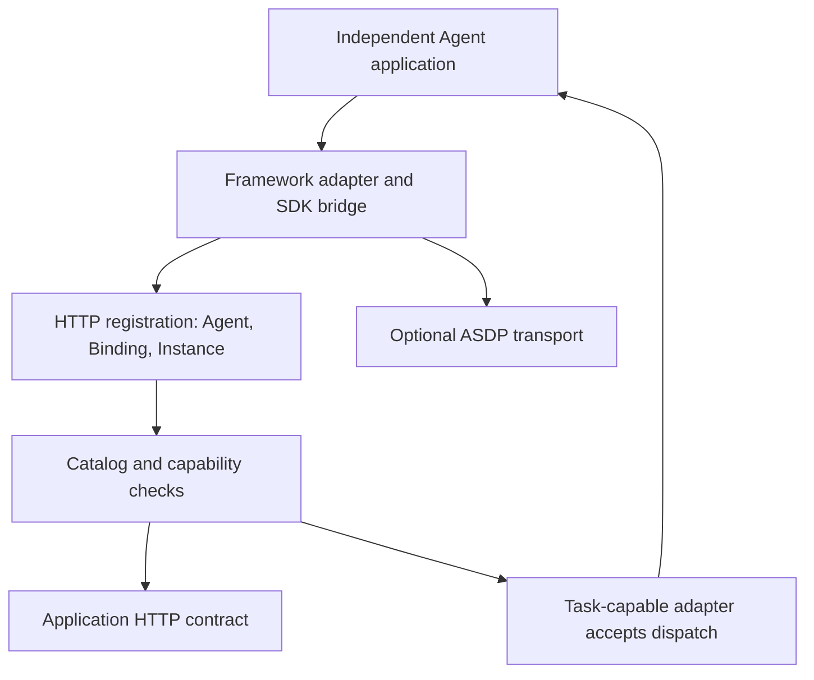

<Note>
This is preview documentation. The official release is not yet available.
</Note>

An External application runs independently. Its SDK bridge connects identity, sessions and implemented capabilities to Service. Registration does not transfer ownership of the framework process.

## Verify three layers separately

1. **Catalog identity**: Agent, runtime binding and instance are registered with the correct scope and replica identity.
2. **Session capabilities**: after the application runs a session, the bridge exposes its declared context, messages and commands. Real-time events require the corresponding transport and framework hooks.
3. **Work execution**: a task-capable adapter receives an Attempt, executes it and reports status. Implement and test this separately.

An observation-only application remains useful for runtime visibility. Service uses actual capabilities to determine availability for Chat, commands and dispatch.

## HTTP contract and ASDP

HTTP registration establishes identity. The application contract exposes queryable capabilities and session operations. Control-plane callback reachability is separate from outbound registration; verify both directions.

ASDP provides persistent event/control transport. Java supports independent HTTP registration; Python currently registers as part of ASDP initialization. See [connection settings](/v2/en/service/external-agent-configuration) for standalone versus ASDP deployments.

An event journal supports connection recovery but does not store all business state or replace the framework's Session store. The application retains responsibility for its data, tool connections and idempotent task handling.

## Dispatch lifecycle

The control plane selects an instance by binding capabilities and creates an Attempt. The application receives its identity, generation and task-scoped context. `AgentTaskStarter` or `handle_agent_task` creates isolated execution, reports progress/comments/Artifacts, maintains the required execution lease/state and reports success, failure or cancellation.

Associate results with that same Attempt. Respect stale-identity rejection rather than relabeling old results as another task's success. Propagate cancellation into the framework and inspect terminal state; an accepted HTTP request does not prove execution has stopped.

## Joining a Team

Members deliver their assigned results. A Leader additionally coordinates work, combines outcomes and closes the coordinator node. Adding an External Agent to the roster does not implement coordinator behavior. Complete [task adaptation](/v2/en/service/external-agent-frameworks) before [Team acceptance checks](/v2/en/service/team-collaboration).
