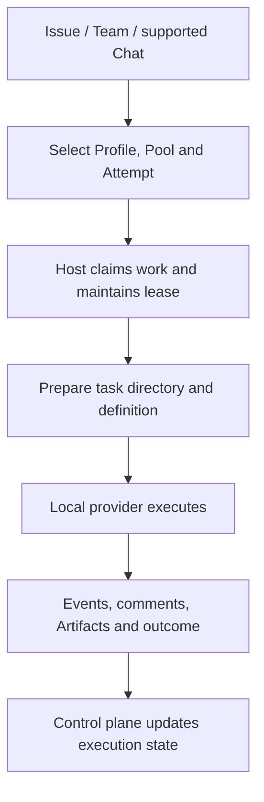

<Note>
This is preview documentation. The official release is not yet available.
</Note>

Hosted provider processes run on the Runtime Host machine. Service stores work and scheduling records; Host manages provider processes, task directories and event reporting.

## Registration and task selection

Host registers stable identity, scope, pool, provider descriptors and capacity. Agent bindings, capability requirements and runtime policy determine an Attempt. Host claims eligible work and maintains its lease. Host connectivity, provider discovery and Agent dispatch readiness are separate checks.

Runtime Profiles select provider parameters. Pools supply eligible Hosts. Host capacity and higher-level scheduling policies jointly constrain concurrency.

## Preparation and execution

Host prepares a task directory, translates supported platform instructions/capability files into provider formats and starts the provider in that directory. It does not automatically use the local checkout you are editing; specify repository, input material and branch during task preparation.

Task-scoped credentials and context are supplied through environment and MCP/CLI integration. Executors can read work, post comments and upload Artifacts. A file left on Host disk is not automatically accessible to collaborators; upload shared deliverables as Artifacts.

## Events, approval and recovery

Adapters convert provider events into execution records. Supported platform approval flows forward tool requests and await a decision. Other providers use their native permission mechanisms.

Host preserves journals, provider session identifiers and checkpoints for supported recovery paths. Keep state and Host identity across restarts. Resume support does not guarantee every interrupted execution can recover: the provider session must still exist and be accessible. The OpenClaw adapter currently has no Session resume.

## Retry and cancellation

Cancellation propagates through execution; check Attempt terminal state and provider process termination. A retry creates a new Attempt. Reuse a provider session only when recovery conditions hold. Cross-backend fresh fallback reconstructs context from persistent Issues, comments and Artifacts, without migrating process memory.

Use `agentscope runtime logs -f` with Task/Attempt diagnostics. If no work is claimed, check scope, pool, bindings, capacity and required capabilities. If claimed work fails, check provider login, parameters, task directory and tool dependencies.

Related: [installation](/v2/en/service/runtime-host), [providers](/v2/en/service/hosted-agent-providers) and [Team collaboration](/v2/en/service/team-collaboration).
