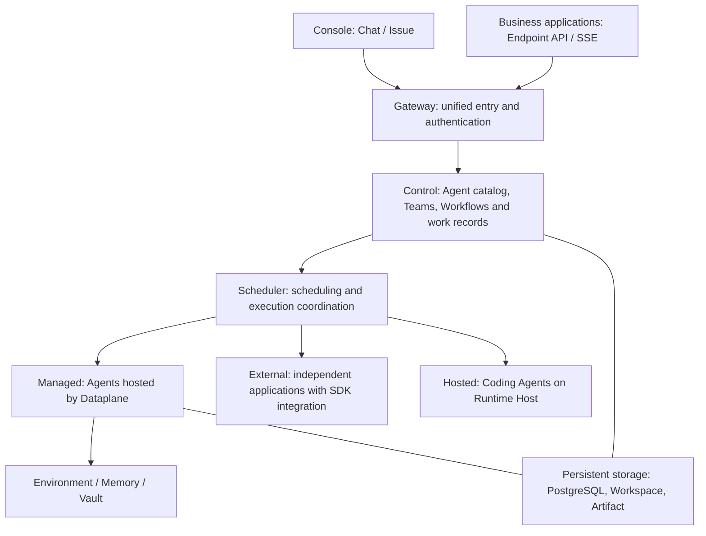

<Note>
This is preview documentation. The official release is not yet available.
</Note>

**AgentScope Service is a platform for running, managing and orchestrating Agent applications, turning individual Agents and multi-Agent collaboration into callable, traceable services.**

Create cloud Agents in the console without writing code, connect applications built with AgentScope, or use Coding Agents such as Codex. Shared conversation, task, collaboration and API entry points let you track execution and deliverables across these runtime models.

The diagram summarizes component responsibilities. Control stores definitions and work; Scheduler coordinates execution. Managed model loops run in Dataplane, External retains an application process, and Hosted starts a provider on a connected host. Developers can use Docker Compose for [local installation](/v2/en/service/quickstart); administrators can use Helm for [production installation](/v2/en/service/kubernetes).

## Three ways to manage and orchestrate Agents

### Build without code: fully managed cloud Agents

**Managed Agent** lets you configure responsibilities, models, knowledge and tools in the console. Service starts the Agent, runs its model and tool loop, and persists Session state. You do not need to write an Agent application or operate its process separately.

Cloud refers to the Service deployment you use; administrators first configure models and execution resources. Bind Workspaces, Environments, Memory and Vault as needed. See [Managed Agent](/v2/en/service/managed-agent).

### Develop with AgentScope: connect your application

**External Agent** fits applications with custom code, existing deployments or direct framework control. Build and run your Agent with AgentScope, then register it through the SDK to expose its identity, Sessions and integrated capabilities in Service.

You still manage the application's models, dependencies and process. With task execution implemented in its adapter, it can receive Issues or join Teams. Registration and executable capabilities depend on that adapter. See [External Agent](/v2/en/service/external-agent).

### Use Agents such as Codex: connect existing execution tools

**Hosted Agent** reuses Codex, Claude Code, Qoder, QwenPaw or OpenClaw. Install and authenticate a provider on your computer or server, then connect Runtime Host so Service can dispatch work there.

Service manages tasks and deliverables; Runtime Host manages provider processes and working directories. Tool, Subagent, approval and recovery support varies by provider. See [Hosted Agent](/v2/en/service/hosted-agent) and the [capability comparison](/v2/en/service/hosted-agent-providers).

Agents from all three modes can participate in orchestration according to their implemented task capabilities. A **Team** lets a Leader delegate and combine member results dynamically. A **Workflow** defines fixed steps, conditions and human gates.

## Core concepts

### Capability definitions

| Concept | Purpose |
| --- | --- |
| Agent | Reusable responsibilities and runtime configuration; the basic unit that performs work |
| Team | A Leader and members collaborating dynamically toward a goal |
| Workflow | Steps, dependencies, branches and human gates executed from a published revision |
| Endpoint | An authenticated API exposing an Agent, Team or Workflow |
| Automation / Channel | Start work from schedules or events, and from messaging platforms, respectively |

### Work and execution

| Concept | Purpose |
| --- | --- |
| Chat / Session | Chat is the console conversation entry; Session stores continuing runtime context |
| Issue | Work objective, owner, discussion and acceptance criteria |
| Run / Node | An orchestration execution and its steps |
| AgentTask / Attempt | Assigned work and one actual execution; retries can create new Attempts |
| Comment / Artifact | Discussion, progress and shared deliverable files |
| Approval | Permission for an operation to proceed; deliverable acceptance is handled separately |

Ordinary Chat can start directly. Work-oriented requests use Issues and execution records to track progress. After execution succeeds, inspect or accept the result according to the work's completion policy.

### Resources and permissions

**Workspace** stores instructions, skills, tools and Subagent definitions. **Environment** selects where Managed tools execute. **Memory** stores shared knowledge; **Vault** stores connection credentials. The Managed Agent section explains how to bind and verify these resources.

**Namespace** organizes resources and permissions. A Workspace is a capability resource, not a Namespace. Seeing an Agent does not grant access to all private work involving it.

### Versions

Agent, Workspace, Team and Workflow configurations evolve. A Workflow revision fixes the process version; an Endpoint release selects the target currently exposed by its API. Publish or update the appropriate binding after editing a draft, then verify with new work.

Follow the [quickstart](/v2/en/service/first-session) to create a cloud Agent, publish an API, register an application and organize a Team.
