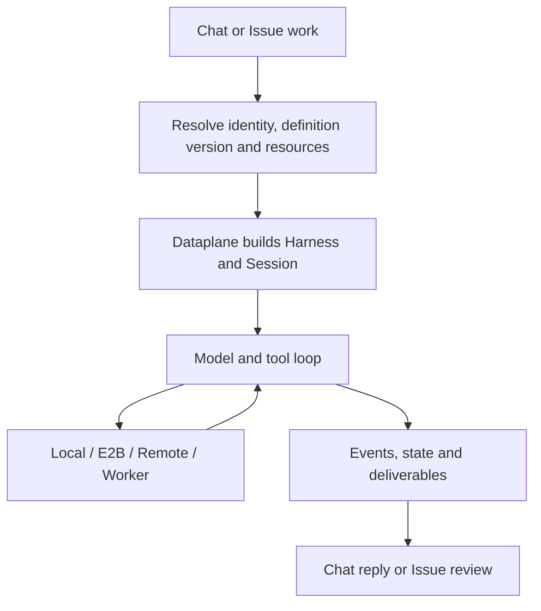

<Note>
This is preview documentation. The official release is not yet available.
</Note>

Service owns the Managed runtime lifecycle. The browser submits work and reads events. The model loop runs in Dataplane; Environment routes file and Shell operations.

## Building runtime context

The control plane resolves the definition version, environment, knowledge and credential references. Dataplane materializes definition files in a session directory, builds Harness and connects persistent state. Definition snapshots, execution files and shared resources have different lifecycles: saving an Agent does not reconfigure every running instance.

Workspace holds capability definitions, Environment chooses where files and commands execute, Memory Store holds shared knowledge, and Vault resolves tool credentials. Their Managed usage is described in this category's resource pages.

## Model and tool loop

Harness uses an explicit Model or the deployment default, reasons from instructions, requests tools and consumes results. `maxIters` limits iterations and tool policy controls operations. Execution can wait for user approval; resubmitting the same work while it waits can create additional execution.

Local tools execute in Dataplane, sandbox uses E2B, remote uses shared file storage, and self_hosted delegates tool work to a Worker. The model still runs in Dataplane for self_hosted environments; the Worker receives tool operations and returns results.

## Persistence and recovery

Session state, events and coordination records use the deployment's persistent stores. Coordination leases constrain execution across replicas. Recovery still depends on the database, working files, chosen environment and external tools. Restarting a service does not reverse an external side effect from a completed tool call.

Shared Memory is live platform knowledge accessed on demand, not a full copy inserted into every prompt. Maintain it as shared knowledge; an Agent definition version does not freeze all external knowledge.

## Execution and acceptance

Finishing a Chat turn is separate from accepting an Issue. Issue/Team execution must record Attempt outcomes, and coordinators must complete or fail the corresponding Run node. For human review, inspect the deliverable and accept it in Inbox. See [Managed task outcomes](/v2/en/service/managed-harness-task-outcomes).

During diagnosis, distinguish model connection failures, pending tool approval, offline Workers, denied tools and completed execution awaiting business acceptance. Use Session, Run and Attempt identifiers to correlate logs.
