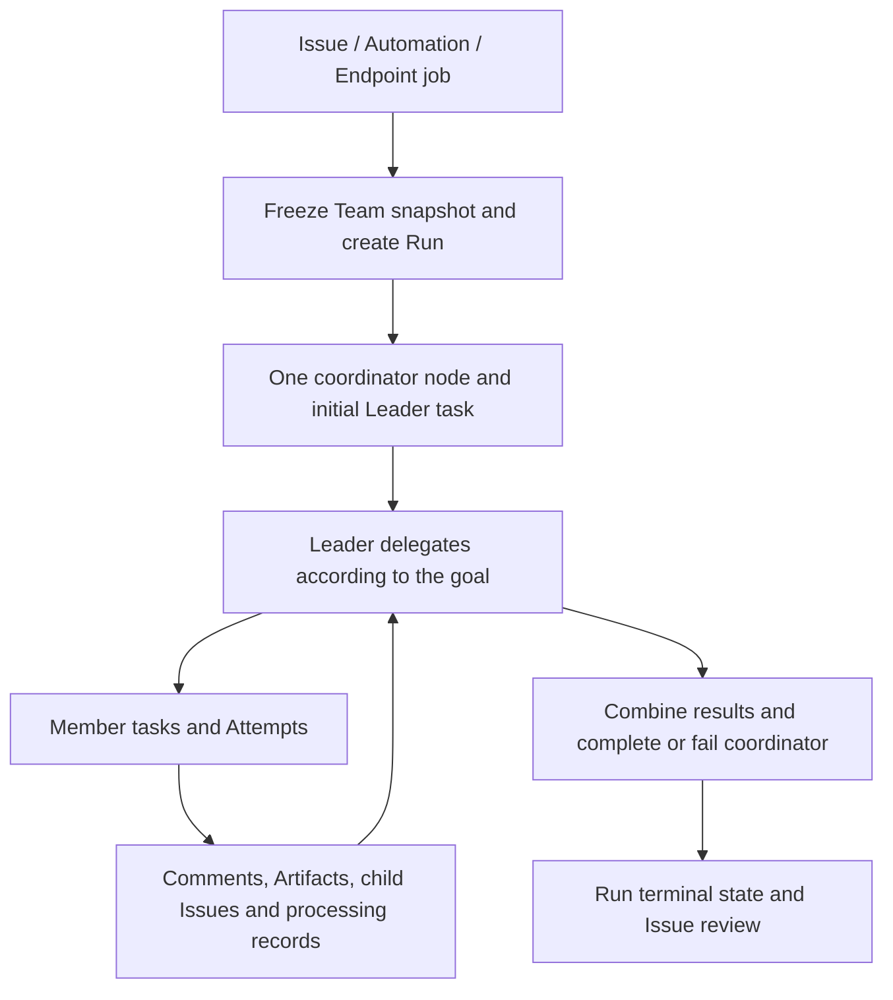

<Note>
This is preview documentation. The official release is not yet available.
</Note>

A Team is a persistent definition. Each piece of Team work creates a Run and a Team snapshot, with the Leader driving coordination. It does not unconditionally run every member in parallel.

## Definition versus execution

Team definitions contain Leader, members and policy. A Run retains the snapshot used for that collaboration. The control plane creates a coordinator node and initial Leader obligation rather than invoking every roster member immediately.

The Leader selects members according to context. Use Workflow for fixed ordering, conditions and joins. A Workflow can also invoke a Team node to embed dynamic collaboration in a larger process.

## Work objects

| Object | Records |
| --- | --- |
| Issue | Goal, ownership, discussion, delivery and acceptance |
| Run / Node | This collaboration and its coordination step |
| AgentTask | Work assigned to one Agent |
| Attempt | One execution on a backend |
| Comment / Artifact | Persistent communication and shared output |
| Child Issue | An independently tracked subgoal |

Retries can produce multiple Attempts for one AgentTask. Executors use task-scoped context and credentials; an administrator's ordinary terminal is not a substitute for a dispatched execution.

## Delegation and communication

Members submit results according to their roles. The Leader reads, follows up or requests changes. Comments/mentions and task-input delivery, acknowledgement and processing state support durable follow-up. Preserve deduplication and processing state during retries rather than treating the same message as new work.

Share work through Issues, comments and Artifacts. Managed environments, Hosted task directories and External private files do not merge automatically when Agents join a Team.

## Completing the work

Member replies, Attempt success, coordinator completion, Run terminal state and Issue acceptance represent different layers. A final Leader message does not replace node completion. When required child work remains, wait, revise the plan or report failure explicitly.

Human reviewers should check the final result, key evidence and failure explanations before accepting or requesting changes. Run succeeded/partial_succeeded still needs comparison with business acceptance criteria.

## Extension and recovery

Test a new member independently before verifying that the Leader uses the role correctly. For mixed Managed, Hosted and External teams, follow the [member configuration checks](/v2/en/service/team-configuration).

Recovery relies on persistent work and execution state. Fresh fallback reconstructs context without migrating the old process. Diagnose along Issue → Run → Node → Task → Attempt: check readiness/policy for missing dispatch, backend/approvals for stuck execution, and outstanding obligations/coordinator state for incomplete delivery.
