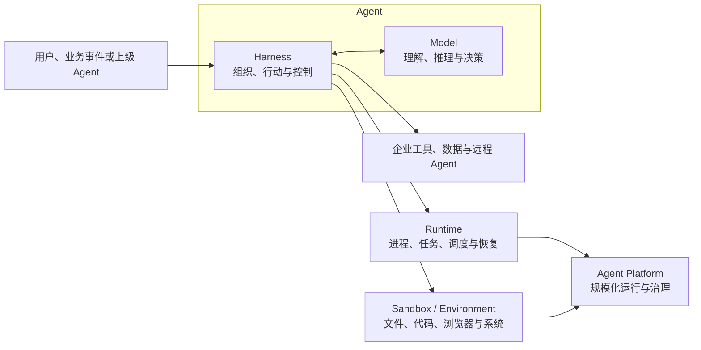
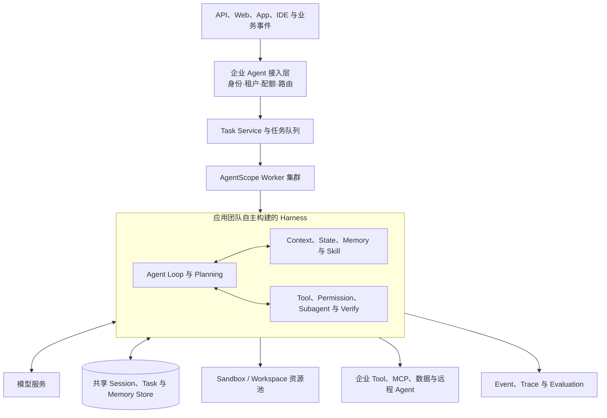
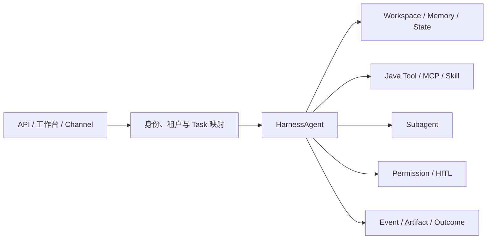
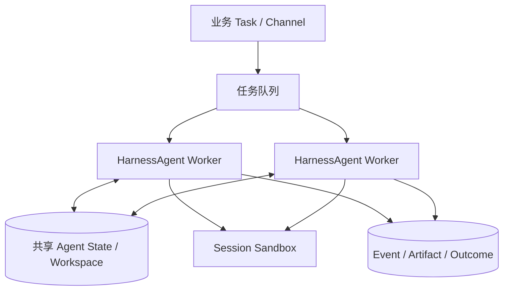
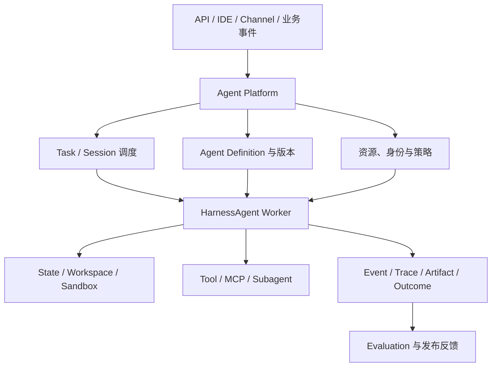

这是“如何构建 Agent Harness”系列的第一篇。本文先建立 Model、Harness、Runtime、Sandbox 与 Agent Platform 的责任边界，再以 AgentScope Java 的 `HarnessAgent` 为统一入口，说明同一套 Harness 如何从本地工作区逐步演进为嵌入式服务、长任务 Worker 和多租户平台。

编码 Agent 为这项工作提供了一个可观察的工程样本。在代码、文件和测试构成的环境中，模型可以通过工具持续行动，系统也可以用编译、测试和文件差异验证结果。它说明，模型能力只有经过上下文组织、任务循环、状态管理、工具执行、权限控制和结果验证，才可能稳定转化为任务结果。但编码场景不是所有企业任务的替代物。审批、交易、客服和运营任务具有不同的业务状态、权限边界和成功标准，企业不能照搬一套 Coding Agent 流程，而应复用其中可泛化的 Harness 机制。

从工程视角看，构建 Agent 的主要工作，是为模型建立与任务结构、风险等级相匹配的 Harness。使用 `HarnessAgent` 并不意味着一次打开所有能力；更稳妥的方式是从相同入口出发，按运行形态逐步增加责任：

- 在本地工作区构建最小 Harness

- 将 Harness 嵌入现有 Java 应用

- 将 Harness 承载为可恢复的长任务服务

- 将多个 HarnessAgent 纳入统一平台交付

在单个 Agent 之外，企业还需要 Agent Platform 创建和接入这些 Agents，并提供规模化交付、运行、治理、协作、观测和优化能力。

这四种形态不是互斥的产品分类，而是 `HarnessAgent` 在不同运行责任下的部署视图。同一企业可以让开发者在本地验证任务契约，让业务服务通过 Java API 调用同一 Agent，再用共享状态、Sandbox、事件流和任务调度承载长任务，最后由 Agent Platform 统一管理版本、租户、资源、发布与质量事实。

## 1.1 Agent = Model + Harness

### 1.1.1 Harness 是模型之外的工程系统

本文将 Agent Harness 定义为：

> **模型之外、围绕 Agent Loop 组织上下文、能力、状态、环境与控制机制，并将模型判断转化为可执行、可恢复、可验证任务过程的代码、配置和执行逻辑。**

这个定义包含三层含义。

- 第一，Harness 不是一个更长的 System Prompt。Prompt 只是它在某一轮推理中生成的输入之一。Harness 还包括任务状态机、工具注册、计划管理、权限检查、环境适配、事件处理、错误恢复和完成验证等确定性逻辑。

- 第二，Harness 不是某一种 Agent Framework 的同义词。Framework 可以帮助企业实现 Harness；成熟的 Coding Agent CLI 或 SDK 可以提供一套现成 Harness；Managed Agents 还可以把 Harness 连同执行服务一起托管。Harness 描述的是 Agent 如何工作的系统层，而不是某一类产品形态。

- 第三，Harness 不是 Runtime 或 Sandbox。Harness 决定下一步应为模型提供什么、允许模型提出什么行动、怎样推进任务；Runtime 负责持续承载这个过程；Sandbox 负责把实际行动限制在可控环境中。三者协同，但责任不同。



一次模型调用没有可靠的跨轮状态，也不知道任务是否已经在其他节点推进；上下文窗口有限，无法自然保留长任务中的全部事实；工具调用只表达行动意图，并不等于当前用户获得执行授权；模型可以声称任务完成，却不能证明文件已经生成、测试已经通过、订单已经提交或审批已经生效。

Harness 因而要把概率性的模型判断嵌入确定性的系统边界。模型决定 Agent 能理解和推理到什么程度，Harness 决定这些能力怎样持续转化为任务结果，Runtime 与 Sandbox 则决定这个过程如何被承载和限制。

| 层次 | 核心问题 | 主要责任 |
| --- | --- | --- |
| Model | Agent 能理解和推理到什么程度 | 语义理解、规划判断、生成与工具选择 |
| Harness 编排 | Agent 如何工作 | Loop、Context、State、Plan、Tool、Skill、Subagent、Permission 与 Verification |
| Runtime | Agent 如何持续运行 | 进程承载、任务调度、并发、等待与故障恢复 |
| Sandbox / Environment | Agent 在哪里行动、影响范围多大 | 文件、进程、网络、Secret、资源和环境隔离 |
| Agent Platform | 如何规模化交付和治理 | 多租户、发布、网关、配额、观测、评估、安全和运营 |

这些逻辑边界不一定对应五个独立产品或部署单元。一个 SDK 可以同时包含 Harness 和本地 Runtime，托管服务也可以同时提供 Harness、Runtime 与 Sandbox。但在架构设计中仍要保留边界，否则企业无法判断故障归属、数据位置、迁移成本和最终责任。

### 1.1.2 开发 Harness 要实现哪些对象

从开发者视角看，构建 Harness 不是罗列功能，而是让一组工程对象在同一个任务生命周期中协同工作：

| 构建对象 | 开发阶段需要回答的问题 | 主要交付物 |
| --- | --- | --- |
| Agent Contract | Agent 为谁工作、目标是什么、允许和禁止什么 | 角色指令、任务输入输出和成功标准 |
| Execution | 模型怎样循环、规划、等待、委派和结束 | Agent Loop、状态机、预算与 Verifier |
| Context & State | 每轮看见什么，任务事实保存在何处 | Context Policy、Session / Task Schema、Workspace 与 Memory |
| Capability | Agent 可以使用哪些方法和外部能力 | Tool Schema、MCP、Skill、Subagent 与能力目录 |
| Environment | 文件、命令、浏览器或企业系统在哪里运行 | Environment Contract、Sandbox 与 Artifact 边界 |
| Control | 以谁的身份行动，哪些动作要拒绝或审批 | Permission Policy、HITL 与短时凭证 |
| Interaction | 用户和上层应用如何看进度、干预和恢复 | Event Schema、Streaming、Channel 与恢复游标 |
| Quality | 如何证明一次任务完成，并判断新版本是否更好 | Trace、Outcome、测试用例和评估基线 |

一个最小 Agent 可以只实现其中一部分，但进入企业生产环境后，这些问题都必须有明确责任人。选择 Harness 构建路径，本质上就是决定哪些对象由企业开发，哪些对象复用现有产品，哪些对象交给托管平台承载。

这些对象可以进一步归纳为三个能力域：执行与编排、上下文与状态、行动与反馈。这里只把它们作为构建检查表；本系列第二至第四篇将分别展开它们的内部原理、实现方式和调优方法。

图 1-1　企业 Agent 的构建与承载关系


构建 Agent 不能从选择框架或打开工具开始，而应先固定任务契约（Agent Contract）。任务契约说明 Agent 为谁工作、接受什么输入、交付什么结果、允许影响哪些系统、哪些动作必须拒绝或审批，以及什么证据能够证明任务完成。同一个修复高危依赖漏洞目标，可以只生成分析报告，也可以在隔离环境中修改代码并运行测试，还可以创建合并请求；除非契约明确授予发布权限并规定审批条件，这些 Agent 都不应把修复完成解释为已经发布生产。

### 1.1.3 四种运行形态解决不同责任问题

在选择具体实现之前，企业还要判断任务路径由谁控制。步骤、分支和异常在设计时已经明确的任务，更适合使用 Workflow；执行路径必须根据中间结果和环境反馈动态决定时，可以由 Agent 持有部分决策权；高风险主流程稳定、局部判断复杂的任务，则可以使用 Hybrid，由 Workflow 固定审批、交易和发布边界，由 Agent 负责检索、分析和方案生成。Workflow、Agent 主导与 Hybrid 描述路径控制方式，不是与 Single-Agent、Long-Horizon Agent 和 Multi-Agent 并列的应用形态。

在此基础上，可以把 `HarnessAgent` 的落地方式归纳为四种运行形态。它们最显著的差异不是模型能力，而是调用从哪里发起、状态保存在哪里、Runtime 与 Sandbox 由谁提供，以及业务应用要补齐哪些控制和验收责任。Single-Agent、Long-Horizon Agent 和 Multi-Agent 都可以采用其中任一形态；任务形态决定所需的状态与协作契约，运行形态决定这些能力部署在哪里。

| 运行形态 | AgentScope 入口 | 企业直接控制的重点 | 需要补齐的运行能力 | 企业仍需承担的责任 | 更适合的条件 |
| --- | --- | --- | --- | --- | --- |
| 本地工作区 | `HarnessAgent.builder()` + Local Filesystem | Loop、Context、Plan、工具与验证逻辑 | 本地进程、文件和开发者交互 | 任务正确性、安全配置和回归测试 | 单人开发、原型验证与可信环境 |
| 嵌入式应用 | `call` / `streamEvents` + `RuntimeContext` | 业务入口、Session 映射、权限与事件展示 | 应用进程、共享状态和业务工具 | 多租户接入、凭证、Artifact 与 Outcome | 将 Agent 接入现有 API、工作台或 Channel |
| 长任务服务 | `HarnessAgent` Worker + StateStore + Sandbox | 任务调度、恢复点、预算、并发与完成门禁 | Worker、任务队列、隔离环境和事件存储 | 幂等、故障恢复、审批、数据边界和结果验收 | 异步、批量和跨请求长任务 |
| 平台化交付 | 版本化的 HarnessAgent 定义与工作区资产 | Agent 目录、资源组合、发布范围和质量基线 | 多租户 Runtime、网关、观测与评估 | 业务目标、所有权、风险策略和最终验收 | 多团队、多 Agent 的规模化运营 |

表 1-2　四种 HarnessAgent 运行形态的主要差异

四种形态可以渐进演进。一个在本地验证过的 `HarnessAgent` 可以被嵌入业务服务，再由任务队列调度到独立 Worker；当 Agent 数量和团队数量增加后，再把定义、工作区资产、权限策略和质量基线纳入统一平台。选择时应分别判断任务效果是否依赖修改 Loop 或 Context、数据和执行环境能否集中承载、团队是否愿意维护状态恢复与 Sandbox，以及最终交付对象是个人工作区、嵌入式应用、异步任务服务还是平台内业务 Agent。

## 1.2 基于高代码框架自主构建 Harness

高代码 Agent Framework 提供模型、消息、工具、Agent、状态和编排等代码级抽象，应用团队在其上定义任务循环、上下文策略、能力组合和企业集成。这里的“高代码”强调开发团队可以直接控制和扩展 Harness 机制，与依靠可视化配置或预置模板的构建入口相区分，并不表示框架路径一定更复杂或更成熟。以 AgentScope Java 为例，HarnessAgent 将工作区、状态、Memory、Context 压缩、Plan Mode、Skill、Subagent、Sandbox 和交互控制等能力组织在统一运行上下文中，使团队可以按业务需要自主构建 Harness。这里的自主构建指开发团队使用框架设计和实现 Harness，并不是 Agent 自己生成或重构 Harness。

Framework 路径的核心价值是任务语义控制。企业可以决定每轮 Context 怎样组成、哪些错误可以重试、计划何时生成和更新、何时请求审批、怎样创建子任务，以及什么证据算完成。与之对应，Framework 提供的是构建材料，不会自动补齐多租户隔离、状态恢复、Sandbox、安全策略、评估基线和业务验收。

一个最小 AgentScope Harness 可以先确定三件事：使用什么模型、Agent 在哪个 Workspace 工作、一次调用属于哪个用户和 Session。

```java
HarnessAgent agent = HarnessAgent.builder()
    .name("remediation-agent")
    .model(model)
    .workspace(Paths.get(".agentscope/workspace"))
    .build();

agent.call(message, RuntimeContext.builder()
    .userId("u-1842")
    .sessionId("remediation-2026-0917")
    .build()).block();
```

这段代码已经建立了最小 Harness 边界，但还不是完整的企业 Agent。name 标识行为主体，model 提供推理能力，workspace 为指令、文件、计划、Memory、Skill 和任务产物提供外部空间，RuntimeContext 则把用户与 Session 身份带入当前调用。

接下来不应一次性打开所有能力，而应从任务成功标准反推需要的 Harness。例如，漏洞修复 Agent 至少需要读取代码、生成补丁、执行测试和验证安全扫描；如果计划未经确认不能修改代码，就需要 Plan Mode 与 Permission；如果分析和评审可以并行，就需要 Subagent；如果任务跨越多个调用，就需要外置状态和可恢复 Workspace。

### 1.2.1 按业务需求组合 Harness 能力

AgentScope 使用 Builder、Middleware 和工作区资产逐步叠加能力。下面的示例在最小 Agent 上增加计划、Todo、上下文压缩、大工具结果卸载和 E2B Sandbox：

```java
HarnessAgent agent = HarnessAgent.builder()
    .name("remediation-agent")
    .model(model)
    .workspace(Paths.get(".agentscope/workspace"))
    .enablePlanMode()
    .enableTaskList()
    .compaction(CompactionConfig.builder()
        .triggerMessages(30)
        .keepMessages(10)
        .build())
    .toolResultEviction(ToolResultEvictionConfig.defaults())
    .filesystem(new DockerFilesystemSpec()
        .image("ubuntu:24.04"))
    .build();
```

真正的构建工作不在于调用多少 Builder 方法，而在于定义这些能力之间的契约：

| 能力 | AgentScope 中的构建入口 | 应用团队需要决定什么 |
| --- | --- | --- |
| 指令与上下文 | AGENTS.md、附加 Context、Middleware | 指令层级、动态信息、Token 预算和冲突规则 |
| 状态与记忆 | Workspace、StateStore、Memory、Compaction | Session / Task 边界、写入规则、恢复和多租户隔离 |
| 计划与任务 | Plan Mode、Todo、Task State | 何时先规划、谁批准、阶段目标如何验收 |
| 能力资产 | Tool、Skill Repository、Subagent | 能力发现、版本、权限、委派和输出契约 |
| 执行环境 | FileSystem、Docker 或其他 Sandbox | 文件、网络、Secret、资源、快照和隔离范围 |
| 控制与交互 | Permission、Channel、Middleware | ALLOW / DENY / ASK、用户干预和事件映射 |
| 质量与反馈 | Trace、Verifier、评估接口 | 完成证据、观测字段和版本回归标准 |

稳定、确定性的步骤应尽量沉淀为 Tool、脚本或策略；需要模型理解目标和权衡方案的部分留在 Agent Loop；可能影响外部世界的动作统一经过权限和 Sandbox。这样构建出来的 Harness 才具有可测试边界，而不是由 Prompt 驱动的一组隐式行为。

### 1.2.2 从单机进程走向分布式服务

本地 HarnessAgent 解决的是单个 Agent 如何工作。要把它变成企业在线服务，还需要在外围建立多租户接入、任务调度、共享状态、隔离环境、能力网关和观测评估系统。



在线实例不应依赖进程内消息历史恢复任务。应用团队需要把 Session、Task、Plan、子任务和 Artifact 映射到共享状态接口；为同一任务设置并发写入或执行租约；在 Worker 失效后从安全点恢复；按租户创建或复用 Sandbox；使用短时身份访问企业工具。物理存储、调度和容灾属于 Runtime，但 Harness 必须先定义相应逻辑契约。

工作区 Agent 的架构重心会有所不同：它可以直接运行在 IDE、CLI 或团队 Workspace 中，保留更长生命周期的文件和用户交互；但只要进入多人、多项目或后台执行，同样需要身份、状态、权限、Artifact 和 Trace 边界。

### 1.2.3 适用边界与构建交付物

Framework 路径适合业务逻辑独特、数据或执行环境不能交给外部托管、需要改变 Loop 或 Context 策略，或者企业希望沉淀统一 Agent 技术底座的场景。它也要求团队具备模型应用、分布式系统、安全和效果评估能力。

这一条路径在 Build 阶段至少应形成：可测试的 Harness 代码、Agent Contract、状态 Schema、Context Policy、Tool 与 Skill 清单、Environment Contract、Permission Policy、Verifier、事件模型和回归用例。只有模型与这些行为配置被共同版本化，线上结果才能被复现和回滚。

## 1.3 将 HarnessAgent 嵌入企业应用

本地运行证明了 Agent 能完成任务，但企业交付还需要稳定的调用边界。`HarnessAgent` 同时提供 `call`、`stream` 和 `streamEvents`：业务只关心最终回复时使用 `call`，需要展示模型增量和工具事件时使用流式接口。无论从 REST API、研发工作台还是 IM Channel 发起，请求都应先映射为稳定的 `RuntimeContext`，再进入同一个 Harness。

### 1.3.1 用 RuntimeContext 固定身份与会话边界

应用层不应把 HTTP 连接或 WebSocket 当成 Session。连接会断开，任务仍可能继续；同一任务也可能从不同 Channel 恢复。更可靠的做法是由业务系统维护 `taskId`，并将租户、用户和任务映射为稳定的 `userId` 与 `sessionId`：

```java
RuntimeContext context = RuntimeContext.builder()
    .userId(request.tenantId() + ":" + request.userId())
    .sessionId(request.taskId())
    .build();

agent.streamEvents(request.prompt(), context)
    .doOnNext(event -> eventStore.append(request.taskId(), event))
    .blockLast();
```

同一个 `sessionId` 的后续调用可以恢复对话与 Harness 状态，但业务系统仍要保存 `taskId`、Agent 版本、输入、Artifact、审批记录和 Outcome。Agent Session 负责推理连续性，业务 Task 负责目标与验收，两者不能混为一谈。

### 1.3.2 把业务能力接入 Harness

嵌入应用的价值不只是把模型输出换成 API 返回值，而是让 Agent 在企业边界内使用确定性能力。应用可以注册 Java Tool、连接 MCP Server、加载 Skill Repository，或声明 Subagent；高影响动作则通过 Permission 与 Middleware 进入统一决策链。



对调用方而言，最重要的不是暴露多少工具，而是建立稳定的能力契约：参数能否校验、调用身份来自哪里、结果是否可审计、失败是否可重试、写操作是否可撤销，以及哪些动作必须等待批准。

### 1.3.3 嵌入式形态的适用边界

嵌入式形态适合把 Agent 接入已有 Java 服务和业务入口，团队能够直接控制 Agent Contract、工具与事件模型。它仍然不自动提供跨节点任务调度、共享状态、执行租约或租户级 Sandbox 池。只要任务可能跨请求、跨进程或运行较长时间，就应继续演进为独立 Worker，而不是让一次前端连接承担任务生命周期。

## 1.4 将 HarnessAgent 承载为长任务服务

长任务服务并不是另一种 Agent 实现。它仍然运行同一个 `HarnessAgent`，只是把调用从同步请求线程移到可调度的 Worker，并将 Session、事件和执行环境外置。这样即使客户端断开、Worker 重启或任务转移到另一节点，任务仍能从权威状态继续推进。

### 1.4.1 用四类对象组织长任务

一个可恢复的 HarnessAgent 服务至少需要四类对象：

- **Agent Definition**：固定模型、Harness 配置、Tool、Skill、Subagent 与权限策略，并带有可追溯版本。

- **Task**：保存目标、业务状态、预算、幂等键、审批条件、Artifact 与完成证据。

- **Runtime Context**：把当前用户与 Session 身份传给 `HarnessAgent`，用于状态和资源隔离。

- **Event**：记录可流式展示和可重放的进度、工具、审批、结果与错误事件。

任务队列只负责“何时由哪个 Worker 运行”，不能代替 Harness 内部的 Plan、Todo 与 Session 状态。反过来，Harness Session 也不能代替业务 Task 的状态机和完成标准。

### 1.4.2 在 Worker 中恢复并推进 HarnessAgent

Worker 收到任务后，使用任务中固定的 Agent 版本创建或取得 `HarnessAgent`，构造相同的 `RuntimeContext`，再消费 `streamEvents`。生产环境应为 Agent State 和 Workspace 配置共享或可恢复的后端，并对同一任务设置执行租约。

```java
void run(Task task) {
    HarnessAgent agent = registry.get(task.agentVersion());
    RuntimeContext context = RuntimeContext.builder()
        .userId(task.tenantId() + ":" + task.userId())
        .sessionId(task.id())
        .build();

    agent.streamEvents(task.nextInput(), context)
        .doOnNext(event -> eventStore.append(task.id(), event))
        .doOnComplete(() -> verifier.verifyAndRecord(task.id()))
        .blockLast();
}
```

如果工具可能修改代码、执行脚本或访问不可信输入，Worker 还应使用 `SandboxFilesystemSpec`，并让 Session 的 Sandbox 状态可以快照与恢复。恢复前必须核对外部系统状态、幂等键和已产生的 Artifact，不能机械重放失效前的写操作。

### 1.4.3 长任务服务的责任边界

AgentScope Harness 负责一轮任务如何规划、行动、压缩上下文、调用子 Agent 和保持 Session 连续；企业 Runtime 负责队列、并发、租约、超时、节点故障与事件保留；Sandbox 负责限制文件、进程、网络、Secret 和资源；Verifier 根据真实环境证据判定 Outcome。四者可以部署在同一服务，也可以拆分，但接口与责任必须清晰。



### 1.4.4 适用边界与构建交付物

长任务形态适合异步、批量、跨请求或需要隔离执行的任务。Build 阶段除 Harness 代码外，还应交付 Task Schema、状态转换规则、任务与 Session 映射、事件模型、租约策略、恢复点、Sandbox Contract、Artifact 生命周期和 Verifier。若这些对象仍只存在于 Prompt 或进程内存中，服务就无法可靠恢复。

## 1.5 用工作区资产快速组装 HarnessAgent

并非每个 Agent 都需要重新编写 Java 逻辑。`HarnessAgent` 把 `AGENTS.md`、Knowledge、Memory、Skill 与 Subagent 声明组织在 Workspace 中，稳定的行为约定和可复用方法可以作为版本化资产交付。应用团队在相同 Builder 基线之上选择工作区、模型、能力仓库和运行策略，就能快速形成面向不同任务的 Agent。

### 1.5.1 从任务契约反推能力组合

组装 Agent 时，应先定义目标、输入输出、允许影响的资源和完成证据，再决定要加载哪些资产：

| 构建对象 | HarnessAgent 中的载体 | 企业需要确定的内容 |
| --- | --- | --- |
| Agent 定义与版本 | Builder 配置、`AGENTS.md` | 目标、行为边界、所有者、版本和回滚策略 |
| Knowledge 与 Memory | Workspace、Memory 配置 | 来源、作用域、检索策略、写入规则和保留周期 |
| Tool、MCP 与 Skill | Toolkit、MCP、Skill Repository | 能力契约、参数校验、风险分级、依赖和审批点 |
| Plan 与 Subagent | Plan Mode、Todo、Subagent 声明 | 分解规则、委派边界、阶段门禁和结果合并方式 |
| Runtime 与 Sandbox | StateStore、FilesystemSpec | 状态后端、隔离粒度、网络、Secret、资源和快照 |
| 交互与质量 | Event、Middleware、Verifier | Channel 映射、可见事件、完成证据和评估基线 |

把所有可用知识与工具一次性装入 Agent 会扩大 Context、权限和回归面。更好的做法是通过 Skill 与能力目录渐进披露，只有当前任务需要且当前身份获权的能力才进入 Harness。

### 1.5.2 让工作区成为可发布资产

工作区不是某台机器上的临时目录。`AGENTS.md`、Skill、子 Agent 规格、测试样例和策略文件都应与 Harness 代码一起版本化；Memory、Session 快照和任务 Artifact 则按作用域写入运行存储。发布时固定代码版本与资产版本，回滚时同时回滚，避免“代码已回退但 Prompt、Skill 或权限规则仍是新版本”。

### 1.5.3 从一个 Agent 扩展到多个角色

多个 Agent 之间的差异应优先体现在任务契约、工作区资产、工具权限和 Subagent 规格，而不是复制整套运行框架。例如漏洞修复 Agent、数据分析 Agent 与评审 Agent 可以共享状态、Sandbox、事件和评估基础，只替换各自的 `AGENTS.md`、Skill 与 Verifier。这样既保留任务差异，也减少基础设施分叉。

### 1.5.4 组装式构建的适用边界

组装式构建适合任务模式相近、主要差异来自领域指令和能力资产的 Agent。如果任务需要改变 Agent Loop、Context 编译、状态语义或权限决策，应回到代码层扩展 Builder 与 Middleware，而不是把复杂控制塞进工作区文本。

## 1.6 用 Agent Platform 规模化交付 HarnessAgent

当多个团队和多个 `HarnessAgent` 同时存在时，平台的重点从“创建一个 Agent”转向“持续交付一组可管理、可运行、可评估的 Agent”。平台统一的是目录、身份、资源、版本、任务和质量事实，不是要求所有 Agent 使用完全相同的 Prompt、工具和工作区。

### 1.6.1 企业级 Agent Platform 的能力边界

| 平台能力 | 主要管理对象 | 对 HarnessAgent 交付的价值 |
| --- | --- | --- |
| Agent 目录与发布 | Definition、Workspace Version、Owner、Tenant | 统一所有权、版本、灰度与回滚 |
| 运行与调度 | Worker、Deployment、Task、Session、Lease | 多副本运行、故障恢复、限流与成本控制 |
| 能力与数据资源 | Model、Tool、MCP、Skill、Memory、Credential | 复用经过审核的企业能力，避免凭证散落 |
| 安全与治理 | Identity、Permission、Policy、Audit、Retention | 在 Harness 执行前后实施统一控制 |
| 交互与协作 | Endpoint、Channel、Event、HITL、Subagent | 从多个入口安全推进同一任务 |
| 观测与优化 | Trace、Artifact、Outcome、Dataset、Evaluation | 连接运行轨迹、业务结果和版本改进 |

平台可以为 `HarnessAgent` 提供标准 Builder 基线、共享状态适配器、Sandbox 资源池和事件网关，但不能替业务应用定义任务目的、正确性和最终责任。一个版本“运行成功”只说明调用链结束，不代表业务 Outcome 已经达成。

### 1.6.2 让不同 HarnessAgent 进入同一平台

平台接入应使用公共契约，而不是侵入每个 Agent 的内部实现。Agent Definition 记录 Builder 与工作区版本；Task 保存目标与业务状态；Runtime Context 传递租户、用户和 Session；Event 传播进度与干预；Artifact 和 Outcome 用于验收；Trace 连接每一次模型、工具和权限决定。



### 1.6.3 从规模化运行走向持续优化

平台化之后，Agent 版本、模型、System Context、Tool Schema、Skill、权限策略和 Sandbox 镜像都应进入同一个发布单元。每次变更先在固定数据集与环境中回放，再灰度到受控流量，最后根据 Outcome、成本、时延、越权率和人工介入率决定是否扩大发布。失败案例应回流为测试、Verifier、策略或 Skill，而不是只追加一句 Prompt。

这条反馈链路让 `HarnessAgent` 不只是可运行的 Java 对象，而是可版本化、可部署、可观测、可评估和可回滚的企业 Agent 交付单元。

## 1.7 本章小结

构建企业级 Agent 的核心，是决定怎样实现 Harness，以及由谁承担其行为、运行和效果责任。`HarnessAgent` 提供统一的代码入口，但本地工作区、嵌入式应用、长任务服务和平台化交付仍具有不同的 Runtime、状态、隔离和验收责任。

四种形态不是成熟度高低关系，也不必互斥。企业应根据任务结构、数据边界、环境影响、团队能力和交付方式选择最低充分方案。无论采用哪种形态，都要区分 Task 与 Session、Event 与 Trace、Artifact 与 Outcome，把权限与验证落实为确定性机制，并让模型、Harness 配置、工作区资产、环境、策略和评估基线共同受版本控制。

当多个团队和多个 `HarnessAgent` 同时存在时，Agent Platform 不只是创建 Agent 的入口，而是支持 Agent 创建、接入、规模化交付、运行、治理、协作、观测和优化的综合平台。平台统一公共对象和质量事实，但不抹平任务差异，也不替业务应用定义任务目的和正确性。这一边界使不同形态的 HarnessAgent 能够进入同一套运行、治理与调优体系。

接下来，本系列第二至第四篇将从任务、信息、行动三类工程契约继续展开 Agent Harness 的构建。

**系列导航**：[下一篇：任务编排、长程推进与协作流转](/v2/zh/blogs/how-to-build-agent-harness/02-task-orchestration)
