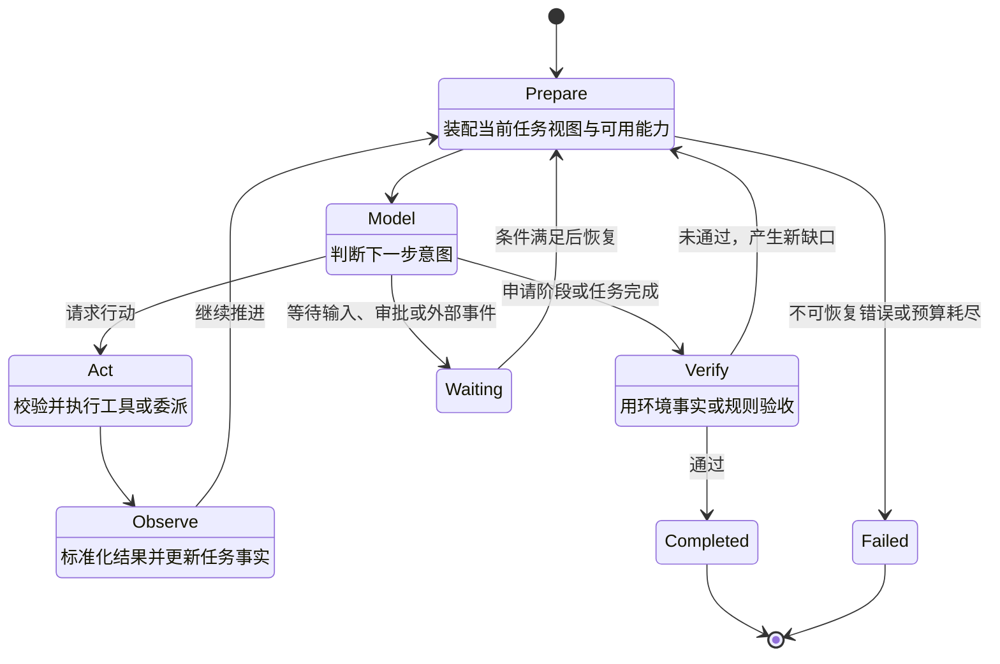
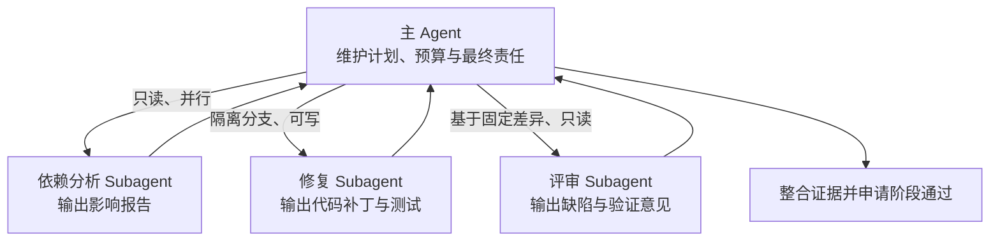
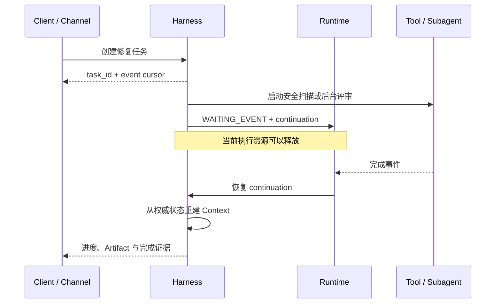
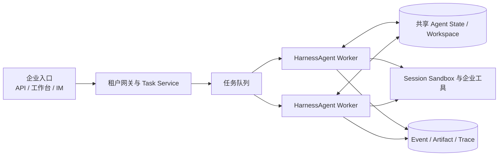

本系列第一篇建立了 `HarnessAgent` 从本地工作区、嵌入式应用、长任务 Worker 到平台化交付的四种运行形态。本文继续向下，关注一个更具体的问题：当任务不能通过一次模型调用完成时，Harness 如何把模型的离散判断组织为可持续推进、可中断恢复、可验证结束的任务过程。

模型的一次输出只是离散判断，而要解决一个企业级任务通常是一个持续的过程。它可能需要先理解环境、再制定计划，连续调用多个工具，在关键动作前等待审批，把部分工作委派给子代理，经历失败和恢复，最后还要用环境事实证明目标已经达成。Harness 执行内核的职责，就是把模型的每一次判断组织成有状态、可控制、可恢复的任务过程。

本章聚焦 Harness 的执行与编排系统：Agent Loop 如何推进任务，Planning 和 Todo 如何把目标外部化，Subagent 如何形成受控委派，异步任务如何跨越请求、进程和上下文窗口，以及如何判断 Agent 是真正完成，而不是仅仅停止。Context、Memory 与 Workspace 的信息组织将在本系列第三篇展开；工具、Sandbox、权限、Streaming、Trace 与 Evaluation 则在第四篇主讲。

本章使用同一个企业案例贯穿全章，这个案例既包含长程执行，也包含并行委派、异步等待、人工介入和确定性验证，能够代表大量企业工程任务。

> **生产服务漏洞修复与变更发布 Agent**：收到支付服务高危依赖漏洞任务后，Agent 需要定位受影响代码和运行实例，制定升级方案，将依赖分析、代码修改和独立评审分配给不同执行者，在隔离环境中修改代码并运行测试，生成变更单；涉及发布时等待责任人审批，最后以代码差异、测试报告、安全扫描和发布状态验证任务是否完成。

## 2.1 Agent Loop 与任务状态机

### 2.1.1 从模型调用到任务循环

Agent Loop 是 Harness 最稳定的内核。它不要求模型一次性给出完整答案，而是允许模型根据当前目标和环境反馈，重复执行“判断—行动—观察—再判断”，直到任务被验证完成、进入等待、失败或取消。

一个最小但完整的 Loop 可以抽象为五个阶段：



- **Prepare** 读取权威任务状态，确定本轮目标，并向本系列第三篇介绍的 Context Builder 请求模型输入。

- **Model** 调用模型，由模型判断下一步应行动、委派、询问、等待还是申请完成。

- **Act** 将模型意图交给本系列第四篇介绍的 Action Plane，完成参数、身份、策略、审批和执行。

- **Observe** 将工具、环境、子任务或用户反馈转换为结构化 Observation，并更新任务事实。

- **Verify** 不接受“我已经完成”作为唯一依据，而是运行与任务相匹配的验收器。

浏览文件、执行代码、查询业务系统和调度远程 Agent，都是 Act 的不同实现；用户追加要求、工具返回和异步任务完成，都是 Observe 的不同来源。核心 Loop 保持稳定，具体能力通过扩展点加入。

### 2.1.2 用权威状态驱动任务

消息历史记录了模型和用户曾经交换的内容，却不应成为任务状态的唯一来源。企业 Harness 至少要维护一份可机读的权威状态：目标、当前阶段、Plan 与 Todo、已确认事实、阻塞项、子任务、Artifact、剩余预算、等待原因和完成依据。

| 状态 | 语义 | 允许的下一步 |
| --- | --- | --- |
| CREATED | 任务已经建立但尚未开始 | 进入运行或取消 |
| RUNNING | 正在准备、推理或行动 | 继续、暂停、等待、验证、失败或取消 |
| WAITING_INPUT | 缺少用户或业务信息 | 接收输入后恢复，或超时结束 |
| WAITING_APPROVAL | 行动明确但需要批准 | 批准、拒绝、修改或取消 |
| WAITING_EVENT | 等待工具、子任务或外部系统 | 收到事件后恢复，或按策略超时 |
| PAUSED | 用户或系统主动暂停 | 恢复、修改规则或取消 |
| VERIFYING | 正在核验阶段或最终结果 | 通过、生成修复项或失败 |
| COMPLETED | 验收条件已经满足 | 交付结果与证据 |
| FAILED | 当前策略下不能继续 | 重开尝试、转人工或结束 |
| CANCELLED | 任务被显式终止 | 清理资源并保留审计事实 |

WAITING 不是失败，PAUSED 也不是结束。只有把这些状态显式化，上层 Runtime 才能在等待期间释放计算资源并准确恢复；交互界面才能说明 Agent 在等什么；观测系统才能区分执行慢、审批慢和工具慢。

Loop 还必须有外部终止边界。步骤数、总时长、Token 与费用、工具调用次数、子任务并发数、高风险动作次数都应进入预算。预算接近阈值时，Harness 可以要求模型收敛范围、停止新委派、优先完成可交付部分或请求用户选择；预算耗尽时，则应产生明确终态与未完成清单，而不是悄然截断。

### 2.1.3 案例：一次修复任务如何推进

漏洞修复任务进入系统后，不应只生成一串聊天消息，而应形成持续更新的任务对象。例如在完成影响分析后，权威状态可以表示为：

```text
task_id: remediation-2026-0917
goal: 修复 payment-service 中 CVE-XXXX 并形成可审批变更
state: RUNNING
stage: implement_fix
facts:
  affected_module: payment-core
  current_version: 4.2.1
  target_version: 4.2.4
todos:
  - {id: t1, title: 确认影响范围, status: completed}
  - {id: t2, title: 修改依赖并补充测试, status: in_progress}
  - {id: t3, title: 独立评审变更, status: pending}
artifacts:
  - impact-report.md
budgets:
  remaining_steps: 36
  remaining_minutes: 48

completion_evidence: [ ]
```

模型看到的是由这份状态生成的当前任务视图，而不是被迫从几百条历史消息中猜测进度。当安全扫描还未通过时，即使模型输出“修复已完成”，状态也只能进入 VERIFYING；只有验收器补齐证据，才能提交 COMPLETED。

## 2.2 Planning、Todo 与阶段目标

### 2.2.1 把计划变成外部控制对象

Planning 的价值不是展示模型隐藏的思考过程，而是把任务结构外部化为 Harness 和用户都能读取、修改和验证的控制对象：要达到什么阶段目标、有哪些依赖、哪一步正在执行、用什么证据判定完成。

根据任务复杂度，Harness 可以使用三种控制方式：

| 模式 | 表示方式 | 适用任务 |
| --- | --- | --- |
| 轻量 Todo | 简短、有序的待办列表 | 目标明确、步骤少、反馈快 |
| Plan Mode | 只读探索、形成计划、确认后执行 | 影响面较大、需要审阅、环境尚不清楚 |
| Planner–Executor | Planner 维护阶段和依赖，Executor 逐项执行 | 长任务、多依赖、可并行或需要专业角色 |

计划必须允许修订。工具结果可能推翻假设，用户可能改变目标，环境也可能暴露新约束。每次重规划都应说明触发事实并保留已完成项，不能通过改写目标掩盖失败。Todo 则不需要记录每次微小工具调用，只记录会改变任务可交付状态的事项，并保持唯一的当前进行项或明确的并行分组。

### 2.2.2 用阶段门禁约束执行

长任务不应直到最后才验证。漏洞修复案例可以划分为五个阶段：

| 阶段 | 主要产物 | 进入下一阶段的门禁 |
| --- | --- | --- |
| 影响分析 | 受影响模块、依赖链、运行实例清单 | 影响范围可追溯，版本事实已核验 |
| 修复规划 | 升级方案、兼容风险、回滚方案 | 计划获批准，写操作权限被放开 |
| 变更实施 | 代码差异、依赖锁文件、测试补充 | 修改仅发生在授权工作区 |
| 独立验证 | 单测、集成测试、安全扫描、评审意见 | 所有强制检查通过或缺口被显式接受 |
| 发布准备 | 变更单、发布窗口、回滚入口 | 责任人审批；本章不自动执行生产发布 |

阶段门禁既降低错误方向上的继续投入，也为 Context 压缩、人工接管和跨窗口续行提供稳定边界。有效的阶段描述必须回答“输出是什么、证据在哪里、谁来确认”，而不是只写“分析问题”“处理代码”“确保质量”。

### 2.2.3 将探索、计划和执行分开

在 Framework 路径中，应用团队可以直接把计划能力组合进 Harness。下面的 AgentScope 示例为修复 Agent 启用 Plan Mode 与任务列表：

```java
HarnessAgent agent = HarnessAgent.builder()
    .name("remediation-agent")
    .model(model)
    .workspace(workspace)
    .enablePlanMode()
    .planFileDirectory("plans")
    .enableTaskList()
    .build();
```

Plan Mode 将执行过程分为“只读探索—写入计划—人工确认—进入执行”。探索阶段只开放只读工具以及 plan_enter、plan_write、plan_exit、todo_write 等计划工具；plan_exit 触发人工确认，获批后才进入可修改工作区的阶段。计划写入 plans/PLAN.md，Todo 保存在 Agent 状态中，因此两者都能跨调用恢复。

这一实现展示了 Prompt 与 Harness 控制的区别：Prompt 可以要求模型“先规划再修改”，但只有权限模式、工具白名单、持久状态与 HITL 共同生效，系统才真正具备“计划获批前不可写”的约束。

## 2.3 Subagent 与任务委派

### 2.3.1 何时值得委派

Subagent 的价值不是把一个 Agent 包装成多个角色，而是解决三个具体问题：

1. **上下文隔离**：子任务只加载相关文件、工具和历史，避免主 Agent 的窗口被探索过程占满。

1. **能力隔离**：不同子任务使用不同模型、指令、Skill、工具与权限。

1. **并行执行**：互不依赖的检索、实现或验证可以同时推进，缩短墙钟时间。

任务很短、步骤高度依赖或共享对象频繁变化时，委派会增加通信和合并成本。只有隔离、专业化或并行收益超过这些成本时，Subagent 才有价值。

### 2.3.2 建立清晰的委派契约

主 Agent 负责全局目标、计划、预算、依赖和最终结果，不应把“任务完成”的责任一并交出去。研究 Subagent 收集事实与候选方案，执行 Subagent 在限定范围内产生变更，评审 Subagent 使用相对独立的上下文寻找缺口。这些是运行时职责，不一定是永久角色。

每个子任务都应携带可机读契约：

| 契约项 | 需要回答的问题 |
| --- | --- |
| 目标与边界 | 交付什么；哪些目录、系统和动作在范围内 |
| 已知上下文 | 哪些事实已确认；哪些决定不可自行改变 |
| 能力与权限 | 可用模型、Skill、Tool、环境和权限是什么 |
| 预算 | 最大时间、步骤、Token、费用和并发是多少 |
| 输出与证据 | 结果采用何种结构，证据和来源如何附带 |
| 失败语义 | 何时重试、返回部分结果、升级或终止 |
| 验收条件 | 父 Agent 用什么条件判断结果可采用 |

**Delegation** 是父任务保留责任，将有边界的子任务委派出去；结果返回后仍由父 Agent 整合和验收。**Handoff** 则是任务控制权发生转移，接收者成为当前责任人，并获得继续推进所需的目标、状态和恢复位置。二者都不能只通过一条自然语言消息实现；至少要有任务关系、状态与责任变更记录。

### 2.3.3 案例：分析、修改和评审如何协同



分析与代码库探索可以并行，但代码修改需要基于已确认目标版本；评审必须读取固定的差异和测试结果，而不能与执行者共享未经提交的中间判断。多个执行者若同时修改同一工作区，应使用隔离分支、对象级锁或补丁合并，不能依赖“大家小心不要冲突”。

AgentScope 支持把子代理声明为工作区中的版本化规格。例如：

```text
---
description: 对漏洞修复补丁进行独立评审，检查兼容性、测试和回滚风险。
workspace:
  mode: isolated
steps: 8
tools: [read_file, grep_files]
---

只审查已生成的差异和测试证据，不修改代码。
按“阻断问题、一般问题、证据缺口”输出结构化结果。
```

主 Agent 可通过 agent_spawn 同步调用，也可以设置后台执行并获得 task_id。子代理默认不应继承父任务的全部上下文和权限；父任务有权委派，并不意味着子 Agent 自动获得同等授权。

### 2.3.4 合并结果与传播失败

父任务需要显式定义子任务失败策略：关键分析失败时 FAIL_FAST；非关键探索可以 BEST_EFFORT；瞬时故障可以 RETRY_OR_REASSIGN；需要业务决定时进入 ESCALATE。合并结果时还要校验输入版本和证据时间，避免采用基于旧代码或旧业务状态得出的结论。

Subagent 的产物不是主 Agent 可以直接复述的“答案”，而是新的 Observation。只有经过 Schema 校验、版本检查和父任务验收后，才能进入权威任务状态。

## 2.4 异步任务与长程续行

### 2.4.1 让任务脱离当前连接持续存在

企业任务经常超过一次 HTTP 请求、一个终端进程或一个模型上下文的生命周期。Harness 必须把任务身份与当前连接分离：调用方提交任务后获得稳定 task_id，可以持续消费事件，也可以断开；任务进入等待或后台运行时，Runtime 可以释放当前计算资源；条件满足后，从权威状态恢复，而不是依赖原进程仍然存在。



后台任务、事件和恢复应共用一套契约：稳定任务 ID、父任务 ID、当前状态、创建者与执行者、输入和 Artifact 引用、事件序号、超时、取消与幂等语义、结果位置、错误分类，以及恢复所需的 Continuation。

暂停前，Harness 应停止创建新行动，处理可中断操作并保存最新状态；恢复时重新检查目标、外部条件、工具是否实际执行、权限是否仍有效、工作区是否变化以及剩余预算。取消需要沿父子任务传播，但已发生的外部副作用不能假装消失，必须保留事实并在必要时执行补偿。

Context Reset 只负责控制语义：在旧窗口结束前形成一致的继续点，在新窗口中从权威状态重建当前任务视图。Continuation 应包含目标、当前 Plan、已确认事实、失败尝试、Artifact、等待项、剩余预算和权限模式。其具体存储、压缩和装配方式将在本系列第三篇展开。

### 2.4.2 将 HarnessAgent 嵌入企业服务

希望保留现有业务入口、同时复用成熟执行内核时，可以直接在 Java 服务中调用 `HarnessAgent`。下面的示例用稳定的用户与任务标识构造 `RuntimeContext`，再消费任务级事件；事件写入外部存储后，客户端无需维持原连接也能查询进度或恢复显示。

```java
RuntimeContext context = RuntimeContext.builder()
    .userId(task.tenantId() + ":" + task.userId())
    .sessionId(task.id())
    .build();

agent.streamEvents(
        "分析 payment-service 的高危依赖漏洞，修改代码并补充测试；不要发布。",
        context)
    .doOnNext(event -> eventStore.append(task.id(), event))
    .doOnError(error -> taskStore.recordFailure(task.id(), error))
    .blockLast();
```

`HarnessAgent` 提供 Loop、Plan、工具调用、上下文压缩和 Session 接续；企业服务仍需补齐租户身份、任务队列、Agent 版本、Artifact 存储、权限策略和业务验收。相同 `sessionId` 解决的是 Harness 状态接续，不会自动解决同一任务的并发执行和业务幂等。

在多实例或弹性环境中，应配置共享 `AgentStateStore`，并让 Workspace 或 Sandbox 快照可以从其他 Worker 恢复。任务调度器对同一 `taskId` 设置执行租约，Worker 失效后由新 Worker 使用相同 `RuntimeContext` 继续推进；恢复前先查询外部工具和业务系统的真实状态，避免重复执行写操作。



### 2.4.3 由平台调度 HarnessAgent 长任务

当团队不希望每个应用各自维护 Worker、状态适配器和 Sandbox 池时，可以由统一 Agent Platform 承载 `HarnessAgent`。平台固定 Agent Definition 与工作区版本，Task Service 维护业务状态与幂等，Worker 使用 `RuntimeContext` 恢复 Session，Event Store 提供事件游标与重连，Verifier 依据环境事实提交 Outcome。

平台化降低了重复建设成本，但业务责任不会消失。企业仍要定义工具与数据边界、任务目标、审批人、成功标准和最终验收。本系列第四篇将用同一案例展示 HarnessAgent 的事件流、审批与 Sandbox 连接。

## 2.5 Middleware 与执行内核测试

### 2.5.1 保持核心 Loop 稳定

一个常见演进问题是：每加入压缩、计划、权限、模型路由或观测能力，就在 Loop 中增加一组条件分支。短期直接，长期会使状态迁移不可预测。更稳健的结构是“稳定内核 + 可插拔能力”：核心 Loop 只定义阶段与状态迁移；Middleware、Hook 或 Ability 在明确的生命周期点读取 Runtime Context，返回放行、修改、短路或追加行为。

| 扩展时机 | 可加入的能力 | 不应做的事 |
| --- | --- | --- |
| Task 创建前后 | 任务分类、初始预算、版本绑定 | 隐式改变用户目标 |
| Prepare 前后 | 计划提醒、Context 请求、模型路由 | 把持久状态只写进 Prompt |
| Model 调用前后 | 参数策略、输出解析、无进展检测 | 记录不应保留的敏感推理内容 |
| Action 前后 | 预算检查、结果标准化 | 绕过本系列第四篇定义的统一 Action Plane |
| State 变化前后 | 状态校验、Checkpoint、通知 | 多处各自维护权威状态 |
| Verify 前后 | 选择验收器、生成缺口、质量门禁 | 仅凭模型自述标记完成 |

扩展本身也需要顺序、读写范围、冲突规则、失败语义和可观测性。最好让扩展返回结构化 Decision 或 Patch，由核心 Loop 统一提交，而不是任意修改共享对象。

AgentScope 的 HarnessAgent 采用能力组合方式，将工作区、状态存储、计划、Subagent、Memory、压缩、Skill、Sandbox 与 Channel 叠加到统一运行上下文中。Framework 路径因此具有最大的业务调优空间，也意味着应用团队要为能力组合、生命周期顺序和最终效果负责。

### 2.5.2 对确定性部分做契约测试

Harness 测试不能只看最终回答。执行内核至少需要四类确定性测试：

- **状态迁移测试**：每个状态只接受合法事件，暂停、取消和失败正确传播。

- **扩展顺序测试**：Middleware 在确定时机运行，冲突与短路行为稳定。

- **恢复测试**：在任意安全点中断后，任务能够重建且不重复副作用。

- **预算与边界测试**：达到步骤、时间、费用和风险阈值后，Loop 按设计收敛。

例如，修复 Agent 的恢复测试可以在“补丁已写入但测试结果尚未返回”时强制中断：恢复后应先查询原测试任务，而不是再次修改文件或重复启动发布。模型输出可通过固定样本、录制回放或模拟器替代，以验证 Harness 的确定性控制；真实模型的端到端效果进入本系列第四篇的 Evaluation。

## 2.6 可靠性与完成验证

### 2.6.1 针对失败类型选择恢复策略

“Agent 失败”不是一个可执行的诊断。瞬时模型或网络错误适合有界退避；参数错误需要修正；环境缺失需要重建；权限拒绝应等待或终止；重复探索需要重新规划；业务条件不满足则要明确缺口。盲目重试只会增加成本和风险。

有副作用的行动在重试前必须先回答“上一次究竟有没有发生”。对于发布、通知、写数据库等操作，超时可能只是响应丢失。Harness 应生成幂等键，记录请求与结果，并优先查询状态；无法证明未执行时，不应直接重复。切换模型、工具或环境的降级路径也要被记录，因为能力、权限和结果质量可能已经变化。

无进展检测比单纯的最大步数更早发现问题。常见信号包括：连续调用相同工具且参数高度相似、反复得到同一错误、Plan 长时间不变、工作区没有新增事实、模型在少数行动间循环。检测后可以先要求模型根据结构化证据重新规划，再逐步采取缩小任务、切换能力、创建独立评审或转人工。

### 2.6.2 让完成由证据决定

模型只能提出完成申请，Harness 才能提交完成状态。验证强度应与风险匹配：

| 层级 | 验证方式 | 适用结果 |
| --- | --- | --- |
| 结构验证 | Schema、必填字段、格式和文件存在 | 低风险结构化产物 |
| 环境验证 | 查询真实系统、检查文件差异与执行结果 | 工具和工作区任务 |
| 确定性验证 | 测试、规则、静态检查和业务校验 | 可编码成功条件 |
| 独立模型验证 | 使用独立 Context 检查质量与遗漏 | 开放式分析和复杂内容 |
| 人工验收 | 责任人审阅、签署或批准 | 高影响、主观或合规任务 |

Verifier 应返回结构化缺口、失败证据和可修复性。验证失败不是简单结束，而是新的 Observation：Harness 决定继续修复、重新规划、转交还是失败。Verifier 是单次任务的完成门禁；跨版本判断某个 Harness 是否更好，则属于本系列第四篇的 Evaluation Harness。

### 2.6.3 案例：什么才算漏洞修复完成

对贯穿案例而言，以下事实必须同时成立：

1. 依赖清单证明受影响版本已经被替换，且没有通过传递依赖重新引入。

1. 代码差异仅落在授权目录，变更与已批准计划一致。

1. 单元测试、集成测试和安全扫描均有可寻址报告，强制项全部通过。

1. 独立评审没有未关闭的阻断问题。

1. 变更单包含影响范围、回滚方案和证据引用。

1. 如果目标只到“形成可审批变更”，系统不得把“尚未发布”误判为未完成；如果目标包含发布，则必须进一步核验审批和真实部署状态。

因此，最终结果不是一句“已完成”，而是一组目标相关的事实：

```text
state: COMPLETED
outcome: change_ready_for_approval
evidence:
  dependency_check: artifacts/dependency-tree.json
  code_diff: artifacts/remediation.patch
  unit_tests: artifacts/unit-test.xml
  integration_tests: artifacts/integration-test.xml
  security_scan: artifacts/security-scan.sarif
  review: artifacts/review.json
  change_request: CR-18427
remaining_actions:
  - 由服务负责人审批并安排发布窗口
```

这套结构可以直接迁移到其他场景：合同审查以条款覆盖、来源和责任人签署为证据；数据修复以影响行数、抽样校验和回滚点为证据；客户工单以系统状态、沟通记录和用户确认作为证据。变化的是 Verifier，稳定的是“模型申请完成、Harness 依据事实提交完成”的原则。

### 2.6.4 用 HarnessAgent 的 Trace 与 Outcome 完成验证

`HarnessAgent` 的运行事件与 Trace 可以统一呈现模型调用、Plan 变化、工具执行、Subagent 状态和权限决定，但它们不应替代业务完成语义。业务 Task 仍需维护状态版本、幂等键、审批条件和 Artifact 引用，并把当前 Agent 与工作区版本写入任务记录。

获得授权的 Verifier 联合确定性测试、真实业务系统状态和人工授权判定 Outcome。平台统一运行多个 `HarnessAgent`，也不意味着它们天然共享同一父子任务语义或完成标准。可复用的是事件、Trace、资源装配和评估基础；具体业务何时算完成，仍由 Agent Contract 和 Verifier 定义。

## 2.7 本章小结

Harness 执行内核把模型的离散判断组织成可靠任务过程。稳定的 Agent Loop 以 Prepare、Model、Act、Observe、Verify 推进任务；显式状态和多维预算提供确定性边界；Planning、Todo 与阶段门禁把任务控制外部化；Subagent 通过上下文、能力和责任隔离实现受控委派；异步任务、Continuation 与共享 Session 让任务跨越连接、进程和上下文窗口；Middleware 则使能力可以在不重写核心 Loop 的前提下组合演进。

下一章进入 Harness 的信息工程，即上下文、状态与可复用能力资产：如何在有限模型窗口与持续增长的任务事实之间，组织 Context、Session、Workspace、Memory、Knowledge 和 Skill。

**系列导航**：[上一篇：架构范式与责任边界](/v2/zh/blogs/how-to-build-agent-harness/01-patterns) · [下一篇：上下文、状态与可复用能力资产](/v2/zh/blogs/how-to-build-agent-harness/03-context-and-state)
