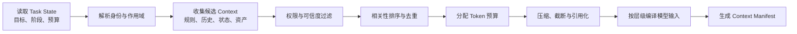
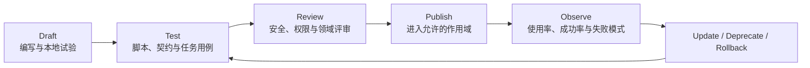

**长程任务每推进一轮，广义 Harness 都要重新回答一个看似简单、实际决定执行质量的问题：模型此刻应当看见什么。把完整对话、全部文件、所有工具说明和长期经验同时放入模型窗口，不仅会增加成本与延迟，也会让关键约束被重复信息和低可信内容淹没；只保留最近几轮交互，又会丢失目标变更、已确认事实、外部副作用、验收缺口和恢复位置。模型窗口有限，而任务世界持续增长，两者之间必须存在一套独立的信息组织机制。**

因此，Harness 需要一套独立的上下文与状态系统。它不是把更多文本喂给模型，而是持续完成四项工作：把多来源信息编译成本轮 Context；把不断增长的历史压缩和卸载；把任务事实保存在模型窗口之外；把长期 Memory、企业 Knowledge 与可复用 Skill 在正确权限下按需提供给模型。

本文与上一篇有明确边界：本系列第二篇定义任务如何流转，本文定义任务过程中的信息和状态如何表示、保存和进入模型。物理数据库、索引、对象存储和跨副本恢复属于 Runtime 实现；本文聚焦 Harness 所依赖的逻辑模型、构建管线和资产契约。

本章继续使用“生产服务漏洞修复与变更发布 Agent”作为贯穿案例。进入本章后，我们关心的不再是任务如何推进，而是 Agent 在每一步应看见什么：初始漏洞公告、项目规则、当前依赖版本和计划如何进入 Context；长日志和测试报告如何退出模型窗口但仍可查询；计划、补丁和证据如何保存在 Workspace；一次成功修复又如何沉淀为后续任务可以发现但不会被误用的 Memory 与 Skill。

## 3.1 Context 构建管线

### 3.1.1 System Context 的动态编译

生产级 Agent 的 System Prompt 不应只是仓库中的一个长字符串。模型每轮实际接收到的 System Context，需要根据 Agent 版本、当前任务阶段、用户身份、工作区规则、剩余预算、可用工具和选中的 Skill 动态生成。其角色更接近一次“编译”：多个来源按优先级合并，冲突被处理，超出预算的内容被压缩或移除，最终得到本轮可执行的模型视图。

```text
System Context
├── Platform Policy        平台安全边界、不可覆盖规则
├── Agent Contract         角色、目标、能力边界与输出要求
├── Tenant / Project Rule  租户制度、项目约定与工作区规则
├── Runtime Reminder       当前阶段、预算、等待项与操作模式
├── Selected Skill         本轮所需方法、脚本与参考资料
└── Tool Descriptors       本轮允许披露的能力与参数 Schema

Task Context
├── User Goal / Steering   原始目标和最新纠偏
├── Plan / Todo            当前阶段和未解决事项
├── Recent Interaction     最近消息和 Observation
├── Compacted History      早期过程的结构化摘要
├── Retrieved Memory       与当前任务相关的历史经验
├── Retrieved Knowledge    带来源、权限和时效的企业事实
└── Workspace References   文件、Artifact 和大结果引用
```

这套分层解决的是责任问题。平台策略不能被项目文档覆盖；用户最新要求可以改变任务方向，却不能突破企业安全边界；Memory 中的历史偏好不能替代当前业务事实；工具返回的外部内容也不能自动升级为系统指令。若所有内容被拼接成同一层文本，Harness 将很难判断冲突来自哪里，更无法进行独立版本和回归。

### 3.1.2 Context Builder 的处理流程

Context Builder 在每次模型调用前执行一条确定性管线：



候选信息至少从 Agent 配置、Task State、Session、Workspace、Memory、Knowledge、Skill Registry 和 Tool Registry 中产生。管线应先做身份和权限过滤，再做相关性排序，不能为了排序方便先把跨租户内容交给检索器或模型。对于外部内容，还要保留来源和信任等级，避免检索到的文档或网页把自身文本伪装成高优先级指令。

### 3.1.3 优先级与 Token 预算

Context 构建不能只按相似度排序。一个实用的优先级函数通常同时考虑：

- **约束强度**：平台政策和明确业务规则高于经验性建议。

- **任务相关性**：是否直接影响当前阶段的判断与行动。

- **时间有效性**：当前环境事实高于已经过期的历史结论。

- **来源可信度**：权威系统事实高于未经确认的模型摘要。

- **执行依赖**：即将调用的工具说明和验收条件应优先保留。

- **信息增量**：与已选内容重复的信息应合并或移除。

- **Token 成本**：同等价值下优先采用更紧凑、可引用的表达。

Harness 可以把可用窗口划分为若干预算区，例如为不可覆盖规则、当前目标和状态保留固定下限，为最近交互、检索知识、Skill 和工具 Schema 分配动态额度，并预留模型输出与后续 Observation 空间。预算不是静态百分比：当任务进入工具密集阶段时，工具定义和环境状态权重上升；进入最终综合阶段时，证据和验收条件更重要。

### 3.1.4 用 Context Policy 与 Manifest 管理模型输入

每次模型调用都应生成一份 Context Manifest，记录模型究竟看到了什么，而不只是保存最终拼接文本。Manifest 至少包括：

| 字段 | 说明 |
| --- | --- |
| source_type / source_id | 来源类型与稳定标识 |
| scope | Global、Tenant、Project、User、Session 或 Task |
| version | 指令、文档、Skill、Tool Schema 或摘要版本 |
| trust_level | 平台规则、企业事实、用户输入、外部内容等可信等级 |
| permission_basis | 本轮为何有权读取该内容 |
| selected_reason | 规则命中、当前阶段、检索相关或显式引用 |
| token_count | 实际占用窗口大小 |
| transform | 原文、摘要、截断、去重或引用化 |
| content_hash | 支持回放与变更检测的内容摘要 |

Manifest 为三类工作提供基础：开发时解释模型为什么遗漏某项信息；评估时比较两个 Agent 版本的 Context 差异；安全审计时确认某条敏感内容为什么进入了模型输入。只记录 Prompt 文本无法稳定完成这些任务，因为同一文本片段的来源、权限和版本可能完全不同。

企业应把上下文层级、检索范围、预算分配、压缩阈值、工具披露和敏感内容处理统一定义为 Context Policy，并与可运行的 Agent 版本绑定。模型、Prompt、Skill 或 Knowledge 索引变化后，Context Policy 仍决定它们如何组合。这样才能把“偶然在某次调用中看见了什么”转化为可测试、可回放的工程行为。

在漏洞修复任务的“变更实施”阶段，一份精简的 Manifest 可以是：

```text
model_call_id: call-083
context_policy: remediation-context@2.3
sources:
  - {type: platform_policy, id: prod-change-policy, version: 7, tokens: 620}
  - {type: agent_instruction, id: remediation-agent, version: 12, tokens: 480}
  - {type: task_state, id: remediation-2026-0917, version: 19, tokens: 910}
  - {type: workspace_rule, id: payment-service/AGENTS.md, version: a83c1e, tokens: 740}
  - {type: skill, id: dependency-remediation, version: 3.1, tokens: 530}
  - {type: artifact_ref, id: impact-report.md, transform: summary, tokens: 360}
omitted:
  - {id: raw-security-scan.sarif, reason: artifact_reference_only}
  - {id: unrelated-user-memory, reason: scope_mismatch}
```

这份 Manifest 不保存敏感内容本身，却能回答本轮采用了哪些版本、为何选择、如何变换以及为何排除。出现错误时，团队可以先检查“模型是否看见了正确材料”，再判断模型推理或工具执行是否有问题。

## 3.2 Context 生命周期与压缩

随着任务推进，消息、工具结果和文件内容会持续增长。将完整历史永久放进窗口，会同时带来成本、延迟和注意力退化；简单截断最早内容，又容易丢失初始目标和关键决定。Harness 应把原始历史保存在外部状态中，并根据当前阶段构造一个分层的活动上下文：

```text
Active Context
├── Stable goal and constraints  长期稳定、不可遗漏
├── Current task state           当前阶段、Plan、Todo、预算和阻塞
├── Recent verbatim turns        需要精确理解的最近交互
├── Structured history summary   更早过程的压缩表示
├── Retrieved facts              本轮相关 Memory / Knowledge
└── Artifact references          可按需继续读取的外部内容
```

“最近”不只按时间定义。用户对目标的最新修改、尚未解决的工具错误、待审批动作和验收失败证据，即使产生得更早，也应被视为活动状态；已经完成且可由 Artifact 证明的探索过程，则可以退出活动窗口。

### 3.2.1 Commit、Compact、Rebuild 与 Validate

对话压缩不是普通摘要。它要支持下一轮继续执行，因此至少保留：

- 原始目标、成功标准和不可变约束；

- 已确认事实及其来源，区分事实、假设和模型建议；

- 已做决定、决定原因和被否决方案；

- 已执行行动、工具结果和副作用；

- 当前 Plan、Todo、阻塞与下一步；

- Artifact、工作区路径和外部对象 ID；

- 用户偏好、审批结果和权限模式；

- 失败尝试及避免重复的原因。

摘要应采用结构化 Schema，并携带覆盖的事件范围、生成版本和来源引用。高风险事实不能只由模型自由归纳，最好从 Task State、工具结果和审批记录中确定性提取，再让模型压缩叙述性内容。

一次日志查询、网页抓取、代码搜索或数据分析可能返回数万行内容。大结果不应反复进入每轮 Context。Harness 可以将原始结果写入 Workspace 或 Artifact Store，只保留结果摘要、首尾或关键片段、内容类型、大小、生成工具、权限范围和可继续读取的引用。

模型需要细节时，通过搜索、范围读取或分页工具按需取回。引用必须稳定且受权限保护；如果只给出一个临时 URL，任务恢复时可能已经失效。如果结果会随时间变化，还要记录读取时版本、时间或快照标识，避免后续将新内容与旧推理混为一谈。

任何会影响后续行动的事实，都应先进入权威状态，再允许从活动上下文中移除。典型包括审批、工具提交结果、Plan 状态、Artifact、外部对象 ID、预算消耗和用户变更。否则一次不准确的摘要就可能改变任务真实状态。

完整的生命周期可以归纳为四步：

1. **Commit**：将结构化事实提交到 Task State、Workspace 或相应资产库。

1. **Compact**：把可叙述历史转换为摘要，附带来源和覆盖范围。

1. **Rebuild**：用新摘要、当前状态和最近消息重新构造 Context，并检查关键约束是否仍在。

1. **Validate**：对目标、未解决项、权限模式和关键证据做完整性检查，并用续行用例验证行为没有明显漂移。

当多次压缩仍不足以维持有效窗口，或任务进入新的大阶段时，可以进行 Context Reset。Reset 的前提是本系列第二篇所述 Continuation 已经形成一致继续点。本文负责把它表达为可重新加载的信息包：

```text
Continuation Package
├── Goal & Acceptance Criteria
├── Current Plan / Todo / Blockers
├── Structured Facts & Decisions
├── Workspace / Artifact Manifest
├── Active Async Tasks & Approvals
├── Relevant Memory / Knowledge References
├── Permission & Budget Snapshot
└── Next-step Brief
```

新窗口不需要重放全部对话，而是从 Continuation Package、权威 Task State 和当前环境重新构建。文件式交接特别适合工作区 Agent：计划、进度、发现和测试结果可以由人和 Agent 共同检查，也不会因为一次模型上下文结束而消失。

压缩质量不能只看节省多少 Token。至少要同时衡量：

- **事实保留率**：关键事实、约束和决定是否完整保留。

- **继续成功率**：压缩或 Reset 后能否在不重复大量探索的情况下继续。

- **矛盾率**：摘要是否与工具事实、Task State 或最新指令冲突。

- **引用可用率**：外部 Artifact 和分页引用是否仍可访问。

- **成本收益**：减少的 Token 与额外压缩调用、读取轮次之间的平衡。

压缩器、摘要 Schema 和阈值都应版本化，并进入 Agent 版本的回归范围。

### 3.2.2 AgentScope：让大结果退出窗口而不退出任务

Framework 路径下，应用团队可以根据场景定义压缩阈值与保留尾部，并把超大工具结果卸载到 Workspace。下面的 AgentScope 配置表示：历史达到 30 条消息时进行压缩，保留最近 10 条；过大的工具结果不继续内嵌，而是写入外部文件并在 Context 中留下引用。

```java
HarnessAgent agent = HarnessAgent.builder()
    .name("remediation-agent")
    .model(model)
    .workspace(workspace)
    .compaction(CompactionConfig.builder()
        .triggerMessages(30)
        .keepMessages(10)
        .build())
    .toolResultEviction(ToolResultEvictionConfig.defaults())
    .build();
```

在漏洞修复案例中，完整安全扫描结果可以保存为 evidence/security-scan.sarif，活动 Context 只保留漏洞数量、阻断项摘要和文件引用。Agent 若需要查看某条漏洞，再按范围读取原始 Artifact。由此节省的不是一次输入长度，而是后续每一轮都不再重复携带同一大结果。

## 3.3 Session、Task State 与 Workspace

### 3.3.1 区分 Call、Session 与 Task

这三个边界经常被合并为“会话”，但它们解决不同问题：

| 对象 | 定义 | 生命周期 | 典型内容 |
| --- | --- | --- | --- |
| Call | 一次应用对 Agent 的请求或恢复动作 | 秒到分钟 | 请求 ID、当前身份、临时凭证、输入和返回游标 |
| Session | 某个用户或调用方与 Agent 的连续交互边界 | 分钟到数天 | 参与者、Channel、消息、偏好和可见任务 |
| Task | 围绕一个可验收目标持续存在的执行对象 | 可跨 Call、Session、进程和节点 | 目标、状态、计划、子任务、预算、Artifact 和完成证据 |

一个 Session 可以发起多个 Task；一个长 Task 也可以在多个 Session 中被查看、干预和恢复。将 Task ID 绑定为消息线程 ID，会限制后台执行、多人协作和跨渠道续接。Harness 应分别保留两者，并显式记录关联关系。

### 3.3.2 用状态事实支持恢复

任务状态可以用三种互补表示：

- **Event Log** 记录发生过什么，适合追踪因果、审计和重建。

- **Snapshot** 记录某一时刻的聚合状态，适合快速读取当前视图。

- **Checkpoint** 表示可以安全恢复执行的位置，除 Snapshot 外还要包含 Continuation、幂等和环境依赖。

三者不能互相替代。只有 Event Log，恢复成本会随任务长度增长；只有 Snapshot，无法解释状态如何形成；把每次状态保存都称作 Checkpoint，则会掩盖某些工具事务仍在进行、不能安全重放的事实。

Harness 应定义状态 Schema、事件到状态的归并规则、乐观并发版本和安全点语义；“运行（Run）”篇再决定这些对象落在数据库、日志系统、对象存储还是其他后端。

Harness 还应面向逻辑状态接口编程，而不是把恢复能力绑定到本地内存或某个数据库：

- append_event：追加带版本与因果关系的事件；

- load_task_state / commit_task_patch：读取和提交权威状态；

- save_snapshot / load_snapshot：保存和读取聚合视图；

- put_artifact / get_artifact：存取带元数据的对象；

- create_checkpoint / resume_checkpoint：在安全点保存与恢复；

- search_workspace / read_range：为 Context Builder 提供按需访问。

本地 Agent 可以把这些接口映射到文件和进程内状态；分布式在线 Agent 则映射到外置状态服务。只要逻辑语义一致，Framework、SDK 和托管路径就能接入同一企业状态平台。

### 3.3.3 Workspace 的外部工作记忆模型

Workspace 为 Agent 提供可寻址、可检查、可逐步修改的外部工作空间。它可以是代码目录、文档空间、数据分析目录、远程文件系统或受控对象存储视图。与 Memory 的主要区别是：Workspace 服务当前任务的显式工作过程，内容通常可被用户直接查看和编辑；Memory 则是跨任务选择性保留的经验和事实。

```text
Workspace
├── inputs/       用户提供或任务同步的输入
├── scratch/      临时分析、搜索结果和中间文件
├── state/        Plan、Todo、Continuation 和结构化任务视图
├── artifacts/    可交付产物与机器可读结果
├── evidence/     测试、查询、审批和验证证据
└── manifest      来源、版本、权限、状态和保留策略
```

目录形式只是示意，核心是区分生命周期和责任。输入应保持来源；Scratch 可以在任务结束后清理；状态文件由 Harness 管理；Artifact 是可能交付、发布或进入下游系统的结果；Evidence 用于证明完成。不能因为它们都存在文件系统中，就使用同样的保留和权限策略。

### 3.3.4 文件与 Artifact 的生命周期

Harness 对 Workspace 中的对象至少要记录：稳定 ID、路径或对象引用、内容类型、创建者、来源、版本、权限范围、所属任务、状态、校验摘要和保留期限。

Artifact 可以经历：

```text
Draft → Validating → Ready → Published / Rejected → Archived / Deleted
```

模型写出文件不等于产物已经完成。进入 Ready 前应通过格式、测试或业务验收；进入 Published 往往还需要权限审批和提交动作。本系列第四篇的 Action Plane 负责这些状态变化对应的实际外部行动，本文负责保存对象与版本事实。

### 3.3.5 案例：把任务世界放在模型窗口之外

在 AgentScope 的 Workspace 约定中，指令、长期记忆、知识、Skill、Subagent、Plan 与任务状态可以形成可检查的文件结构。结合本章案例，可以组织为：

```text
.agentscope/workspace/
├── AGENTS.md                         # 项目级工作规则
├── MEMORY.md                         # 已整理的长期经验
├── knowledge/KNOWLEDGE.md            # 企业知识入口
├── skills/dependency-remediation/    # 漏洞修复 Skill
├── subagents/security-reviewer.md    # 独立评审者规格
├── plans/PLAN.md                     # 当前修复计划
├── tasks/remediation-2026-0917/
│   ├── STATE.yaml                    # 当前阶段与 Todo
│   ├── CONTINUATION.md               # 跨窗口交接
│   ├── scratch/                      # 临时分析
│   ├── artifacts/remediation.patch   # 变更产物
│   └── evidence/security-scan.sarif  # 完成证据
└── sessions/                         # 会话历史与摘要
```

真实产品不必采用完全相同的目录，但必须具备相同的逻辑边界。这样即使模型窗口被重置、执行节点被替换，新的 Worker 仍能通过 Task State、Continuation 和 Artifact 引用恢复；用户也可以直接审查计划、差异和证据，而不必阅读完整对话历史。

## 3.4 Memory 与企业知识

### 3.4.1 四类 Memory

Memory 不是一个无限增长的历史数据库。它是 Harness 有选择地写入、检索、更新和遗忘的信息，用于改善后续决策。按功能可分为四类：

| 类型 | 内容 | 典型作用域 | 进入 Context 的方式 |
| --- | --- | --- | --- |
| Working Memory | 当前任务的临时事实、变量和未解决项 | Task / Session | 直接来自 Task State 或 Workspace |
| Episodic Memory | 过去任务、行动和结果的经验片段 | User / Project / Tenant | 按当前任务相似性和结果质量检索 |
| Semantic Memory | 稳定事实、偏好、实体和关系 | User / Project / Tenant | 按实体、主题和权限检索 |
| Procedural Memory | 已验证的方法、步骤和注意事项 | Project / Tenant / Global | 通常沉淀为 Skill、规则或策略 |

Working Memory 与第 3.3 节的 Task State 关系最紧密，不一定长期保留。Episodic Memory 要保留当时条件和 Outcome，避免把一次偶然成功当成普遍规律。Semantic Memory 需要来源与更新时间。Procedural Memory 如果已经稳定且可复用，最好升级为受版本治理的 Skill，而不是长期停留在自由文本记忆中。

### 3.4.2 Memory 的写入与使用

“每次任务结束自动总结并写入 Memory”很容易造成污染。Harness 在写入前应判断：

1. 这条信息是否会在未来任务中产生可预期价值？

1. 它是经过环境验证的事实，还是模型推测或用户临时表达？

1. 它应属于哪个用户、项目、租户和保留周期？

1. 是否包含敏感、受限或依法不应长期保存的数据？

1. 是否已经存在，应该新增、合并、更新还是标记冲突？

1. 如果未来错误，谁可以纠正或删除，派生索引如何清理？

高价值 Memory 应包含内容之外的元数据：来源事件、证据、可信度、适用条件、作用域、创建者、最近验证时间、使用次数、成功或失败反馈、过期策略和版本。

Memory 检索应同时考虑语义相关性、实体匹配、时间、作用域、可信度和历史效果。被检索到并不代表可以直接写入 Context；Context Builder 还要依据当前身份和任务目的过滤，并把它标记为历史经验而不是当前事实。

当新信息与旧 Memory 冲突时，Harness 不应静默覆盖。可以保留多个版本和来源，按时间或权威性选择当前值，并在高影响场景请求确认。长期未使用、长期未验证或持续导致错误结果的 Memory 应衰减权重、进入复核或被遗忘。

遗忘不是只删向量。它要同时处理原文、摘要、索引、缓存、派生实体关系和可能引用该 Memory 的 Skill 或评估样本。删除语义将在第 3.6 节统一说明。

### 3.4.3 让 Knowledge 提供事实、Memory 提供经验

企业 Knowledge 是由组织维护、具有来源和时效的业务事实，例如制度、产品说明、技术文档、数据字典和经营数据；Memory 是 Agent 从任务和用户交互中选择性积累的经验或个体信息。两者都可以通过检索进入 Context，但治理责任不同：

| 维度 | Knowledge | Memory |
| --- | --- | --- |
| 主要来源 | 企业权威文档、数据库、知识系统 | Agent 任务、用户反馈、历史行动与结果 |
| 权威责任 | 内容所有者和业务系统 | Harness、用户或项目责任人 |
| 更新方式 | 同步、发布、索引刷新与数据查询 | 写入、合并、纠正、衰减和遗忘 |
| 使用风险 | 过期、权限泄漏、来源冲突 | 污染、错误固化、跨用户混淆 |
| 进入 Context | 带来源、权限、时间和版本 | 带来源、作用域、可信度和适用条件 |

通用知识库的切分、向量化和召回算法不是本章重点。Harness 更关心的是：当前任务是否需要这项事实；调用方是否有权获得；来源是否仍有效；多个来源冲突时如何呈现；答案是否需要引用证据；检索结果是否含有试图改变 Agent 行为的非可信指令。

面向 Harness 的知识接口应返回结构化证据，而不仅是一段拼接文本：

```text
Knowledge Evidence
├── content / structured value
├── source and stable identifier
├── version or effective time
├── owner and authority level
├── tenant / project / ACL scope
├── retrieval reason and score
├── freshness / expiration
└── citation or query trace
```

对实时经营数据或强一致事实，优先查询权威工具，而不是依赖离线索引；对稳定文档，可使用检索索引定位，再读取原始来源。任何检索结果在进入模型前都必须完成租户和用户权限过滤，权限不能仅靠向量库中的自然语言标签推断。

### 3.4.4 AgentScope：用双层记忆保留经验

一种实用实现是把“原始记忆流水”和“已整理长期记忆”分开。AgentScope 将当日抽取的事实追加到 memory/YYYY-MM-DD.md，再周期性合并、去重到 MEMORY.md；前者保留来源过程，后者在每轮按策略进入 System Context。对话压缩前还可以先 Flush 关键事实，避免摘要把可复用经验一起抹掉。

在漏洞修复任务中，下面的内容适合写入不同位置：

| 信息 | 去向 | 原因 |
| --- | --- | --- |
| 当前补丁、测试状态和待审批项 | Task State / Workspace | 只服务当前任务，必须精确恢复 |
| 某依赖在 payment-service 中存在特殊兼容约束 | Project Memory 候选 | 后续升级可能复用，但需来源与验证时间 |
| 企业批准的依赖升级与发布制度 | Knowledge | 由制度所有者维护，不应由 Agent 自行改写 |
| 已验证的影响分析与测试步骤 | Skill 候选 | 稳定方法应被测试、版本化和发布 |
| 模型曾猜测某版本“不兼容”但未验证 | 不写入长期 Memory | 推测不应固化为事实 |

这一区分可以阻止最常见的记忆误用：把一次任务的临时状态当成长期经验，把模型总结当成企业事实，或把尚未验证的方法直接推广到所有项目。

## 3.5 Skill 与渐进式能力披露

### 3.5.1 Skill 的能力资产模型

Tool 告诉 Agent “能做什么动作”，Skill 告诉 Agent “在某类任务中如何正确使用若干动作”。一个 Skill 可以由指令、脚本、模板、示例、检查清单和参考资料组成，封装经过验证的任务方法，例如服务故障排查、合同审阅、数据质量分析或发布前检查。

Skill 不等于一段 Prompt，也不等于 Tool 的别名。它通常包含模型需要判断的步骤，也可以调用确定性脚本和工具；它不直接拥有额外权限，只有在当前用户、任务和环境允许时，相关能力才能执行。

```text
Skill Package
├── manifest
│   ├── name / version / owner
│   ├── description / applicability
│   ├── required tools / permissions / environment
│   └── input / output / acceptance contract
├── instructions
├── scripts
├── templates
├── examples
├── references
└── tests / evaluation cases
```

### 3.5.2 发现与按需加载

当企业积累数百个 Skill 时，全部注入每轮 Context 会迅速耗尽窗口，也会让模型选择错误能力。渐进式披露可分为三层：

1. **发现层**：模型只看见名称、简短描述、适用条件和主要风险。

1. **选择层**：Harness 根据任务、权限和环境解析候选 Skill，加载完整 Manifest。

1. **执行层**：只有真正需要某一步时，才读取详细指令、脚本、模板和参考资源。

Skill 选择不应只依赖模型语义匹配。Harness 还应检查模型兼容性、工具依赖、环境条件、租户许可、数据范围和版本状态。若 Skill 要求写生产系统，而当前任务处于只读探索阶段，它可以被发现，但不能进入可执行状态。

**确定性步骤与模型判断的边界。**

Skill 中稳定、重复、可编码且失败代价高的步骤，适合沉淀为脚本、工具或规则，例如格式转换、固定校验、权限查询和测试执行；需要理解模糊目标、比较方案、解释异常或根据新证据调整方向的部分，保留为模型指令。

这个边界可以降低成本和方差：模型负责语义判断，确定性组件负责可以明确表达的执行。但脚本不能藏在说明文本中被不受控地运行，仍要通过本系列第四篇的 Action Plane、环境和权限契约。

### 3.5.3 案例：把成功修复沉淀为 Skill

一次任务成功，不意味着它已经成为可复用能力。团队应先从 Trace 中提取稳定步骤，移除特定任务 ID、临时路径和一次性判断，为脚本和模板补充测试，再形成 Skill。下面是一份精简的 SKILL.md：

```text
---
name: dependency-remediation
description: 当企业代码库需要分析并修复第三方依赖漏洞、生成可审批变更时使用。
---

# Dependency Remediation

1. 读取项目规则和漏洞公告，确认坐标、受影响版本与修复版本。
2. 运行 `scripts/dependency-tree.sh`，将完整结果保存到 evidence/。
3. 先生成影响报告与回滚方案；计划获批前不得修改文件。
4. 只在隔离工作区升级依赖并补充必要测试。
5. 运行 `scripts/verify.sh`，不得跳过失败检查。
6. 输出补丁、测试、安全扫描和未解决风险；不得自行发布生产环境。
```

Skill 的描述决定它何时进入候选集合，正文说明模型判断步骤，脚本承担确定性动作，参考目录保存项目规范和兼容矩阵。完整内容只在任务真正需要时加载；若当前用户没有仓库写权限或任务处于 Plan Mode，Skill 仍不能绕过 Action Plane 获得写能力。

### 3.5.4 将 Skill 纳入发布与回归

企业需要把 Skill 当作软件资产管理。Skill Registry 至少记录所有者、作用域、版本、依赖、权限需求、支持的 Agent / Model、测试结果、发布日期、弃用状态和使用效果。



Skill 的评估不应只看是否被模型选中。还要比较启用前后的任务成功率、步骤数、工具错误、人工修改量、成本和安全事件；对于很少被采用或持续降低效果的 Skill，应调整描述、缩小适用范围或下线。

线上 Trace 必须能够定位到具体 Skill 版本。latest 指针适合开发，不适合不可追溯的生产执行。Agent 版本可以锁定允许的 Skill 集与版本范围；紧急修复通过新 Agent 版本、受控热补丁或明确的策略覆盖生效，并触发相关回归集。

`HarnessAgent` 的 Skill Repository 可以连接项目目录、Git 或企业 Registry，使能力资产按需发现。无论 Repository 位于本地还是共享服务，Skill 的所有权、依赖、权限、评估和版本都应纳入企业统一治理。

## 3.6 多租户资产治理与反退化

### 3.6.1 用作用域和元数据建立资产边界

Context、Memory、Knowledge 和 Skill 都可能跨任务复用，但不能默认全局可见。企业应建立一致的作用域模型：

| 作用域 | 典型资产 | 默认可见范围 |
| --- | --- | --- |
| Global | 平台安全策略、通用基础 Skill | 所有获授权 Agent，通常只读 |
| Tenant | 企业制度、租户 Knowledge、租户 Skill | 单一企业或组织 |
| Project | 项目规则、代码规范、项目 Memory | 项目成员和关联 Agent |
| User | 个人偏好、个人历史经验 | 用户本人及明确委派任务 |
| Session | 当前交互偏好和临时输入 | 当前 Session |
| Task | Plan、Todo、Scratch、Artifact 和证据 | 当前 Task 及获授权父子任务 |

检索和 Context 构建必须先确定调用身份、租户、项目和任务，再查询允许作用域。不要先跨作用域召回再在生成端“提醒模型不要泄漏”，因为内容进入模型输入时，隔离已经失败。

每项资产都应携带最小治理元数据：来源、所有者、作用域、版本、创建与更新时间、权限、敏感级别、保留周期、内容摘要、派生关系和状态。Memory 还需要可信度与适用条件，Knowledge 需要生效时间与权威来源，Skill 需要依赖和评估基线，Context Summary 需要覆盖事件范围。

统一元数据使 Harness 可以用同一套 Policy 决定“能否读取、能否写入、如何引用、何时过期、如何删除”，也使 Agent 版本能准确绑定所依赖的资产版本。

### 3.6.2 防止污染并支持真正的删除

1. **记忆污染**：错误推测、失败轨迹或恶意输入被长期写入，并在未来任务中被当作经验。

1. **指令污染**：外部文档、工具结果或 Memory 中的文字被错误提升为高优先级行为规则。

1. **跨租户污染**：索引、缓存、摘要、Artifact 或评估数据把一个租户的信息带入另一个租户。

防护需要覆盖写入和读取两端。写入时进行来源识别、验证、敏感数据检测、作用域绑定和冲突检查；读取时进行身份过滤、信任标记、指令与数据分离、最小披露和输出审查。高风险 Memory 可以先进入候选区，经过人工或规则验证后再发布。

企业要能够从稳定资产 ID 追踪派生链：原始文档产生了哪些切片、向量、摘要和实体；某条 Memory 是否被合并到更高层总结；某个 Skill 是否引用了已经下线的模板。当用户请求删除、数据保留期到期或来源失效时，系统需要：

- 禁止新的读取与 Context 注入；

- 删除或隔离原始内容；

- 清理索引、缓存、摘要和其他派生数据；

- 更新引用该资产的 Manifest 与 Skill；

- 保留法律允许且最小化的审计证明；

- 触发受影响 Agent 版本的验证或重新发布。

“遗忘”有时是权重衰减，有时是彻底删除，二者必须在策略中区分。需要撤回的数据不能只通过降低检索分数来处理。

### 3.6.3 把资产变更纳入反退化闭环

Context Policy、Memory、Knowledge 和 Skill 的任何更新都可能改变 Agent 行为。企业应把资产变更纳入与代码相同的发布链：

```text
资产变更
  → 结构与权限校验
  → 受影响 Agent / 用例分析
  → 离线回放与安全评估
  → 灰度进入新 Agent 版本
  → Trace 与 Outcome 监测
  → 保留、修订或回滚
```

反退化不仅是防止成功率下降，还要监测成本、延迟、引用准确性、跨租户泄漏、错误 Memory 使用、Skill 误选和上下文膨胀。一个资产可能提升某类任务，却损害另一类任务，因此评估必须按场景、租户、风险和任务复杂度分层。

### 3.6.4 三种 HarnessAgent 运行形态如何实现上下文与状态

同一个 `HarnessAgent` 在不同运行形态下使用相同的逻辑对象，但存储与恢复责任不同：

| 能力 | 本地工作区 | 嵌入式企业服务 | 分布式长任务 Worker |
| --- | --- | --- | --- |
| Context 装配 | Builder、Middleware、Workspace 与本地检索器 | 在相同基线上加入租户身份、业务状态和企业检索 | 按固定 Agent 与资产版本从共享来源重建 Context |
| Session / Task | 本地 Session 可满足交互接续，Task 可轻量维护 | 应用保存业务 Task 与 `RuntimeContext` 映射 | 共享 AgentStateStore 保存 Session，Task Service 管理租约、幂等和终态 |
| Workspace / Artifact | 本地文件系统承载工作区与产物 | 重要 Artifact 外置并绑定任务与访问权限 | 使用共享文件系统或 Sandbox 快照，按 Worker 恢复 |
| Memory / Knowledge | 适合个人或项目作用域 | 按租户、用户和项目过滤读写 | 统一作用域、版本、保留和删除策略，跨副本一致 |
| Skill | 从项目目录或 Git Repository 发现 | 由应用固定允许的 Repository 与版本 | 随 Agent Definition 发布，并通过评估和灰度进入生产 |

本地形态便于快速验证任务与 Context；嵌入式服务需要补齐身份、Task 和外部 Artifact；分布式 Worker 进一步要求共享状态、执行租约、Sandbox 恢复和资产版本锁定。运行位置发生变化时，不应改变 Context、Session、Workspace、Memory 和 Skill 的语义。

## 3.7 本章小结

Harness 上下文与状态系统的目标，是在有限模型窗口与持续增长的任务世界之间建立可靠边界。Context Builder 将平台策略、Agent 指令、任务状态、历史、Memory、Knowledge、Skill 和 Tool 描述按身份、可信度、相关性与 Token 预算动态编译，并用 Context Manifest 保持可解释性。压缩、卸载和 Reset 负责控制窗口增长，但任何关键事实都必须先保存到权威状态。

Session 表达交互连续性，Task 表达可验收目标，Workspace 承载模型窗口之外的工作记忆；Event Log、Snapshot 和 Checkpoint 分别记录过程、当前视图和安全恢复点。Memory 保存经选择的经验，Knowledge 提供带来源和权限的企业事实，Skill 则把可复用行动方法变成可发现、可测试、可发布的能力资产。所有这些资产都必须具有明确作用域、版本、所有者、保留与删除语义，并与 Agent 版本绑定。

下一章将进入 Harness 的第三类工程契约：行动。即模型产生行动意图之后，系统如何连接 Tool、MCP、远程 Agent 和执行环境，如何用 Sandbox、Permission 与 HITL 控制副作用，并通过交互事件、Trace 和 Evaluation 把真实结果反馈到下一次 Harness 迭代。

**系列导航**：[上一篇：任务编排、长程推进与协作流转](/v2/zh/blogs/how-to-build-agent-harness/02-task-orchestration) · [下一篇：受控执行、验证反馈与交付准备](/v2/zh/blogs/how-to-build-agent-harness/04-controlled-execution)
