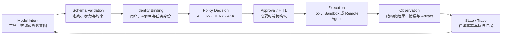
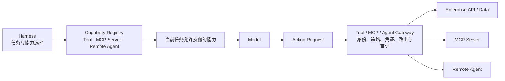
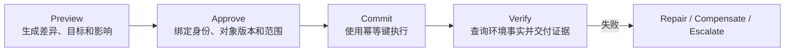
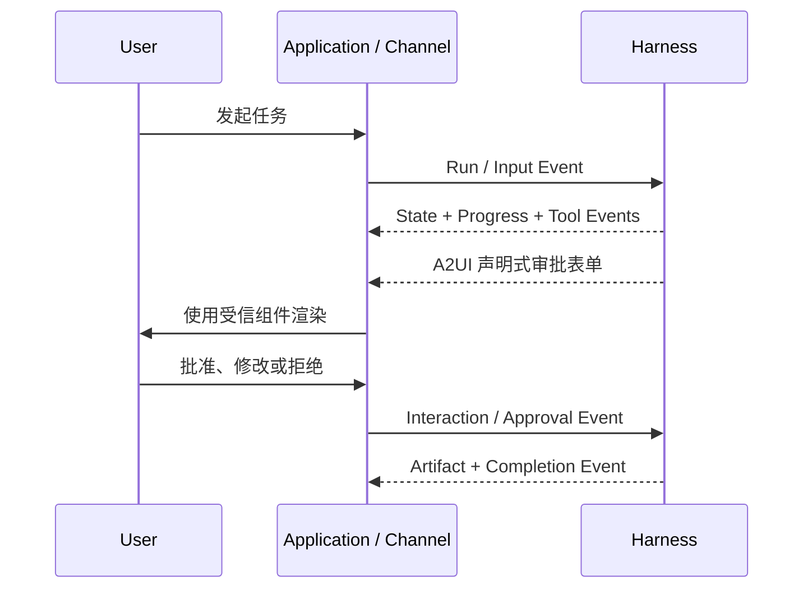
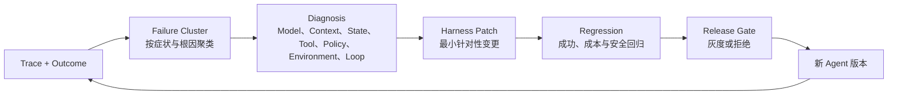

模型输出的工具调用只是一项行动意图。它没有自动获得当前用户身份，不等于企业策略允许执行，也不能证明远程系统已经产生预期结果。真正把意图转化为行动的是 Harness：它选择并披露能力，校验参数，绑定身份与凭证，执行权限和审批策略，在隔离环境中运行，将结果转换为 Observation，再把任务过程交给用户、观测和评估系统。

本章把这些能力统一称为 Harness 的行动与反馈系统。它包含两条相连的链路：Action Plane 负责连接外部世界并限制影响范围；Feedback Plane 负责把执行进度、状态、结果和质量信号反馈给用户与下一个 Agent 版本。Tool、MCP、A2A、Sandbox、HITL、AG-UI、A2UI、Trace 和 Evaluation 在这套架构中各有位置，而不是一组并列的协议或产品名称。

本系列第二篇已经定义何时行动和如何推进任务，第三篇定义行动所依赖的上下文与状态。本文进一步回答：行动怎样被注册、授权和执行，人与应用怎样持续干预，真实执行结果又怎样成为 Harness 演进的依据。

本章继续使用“生产服务漏洞修复与变更发布 Agent”作为贯穿案例。前两章已经让它完成计划、补丁和测试，本章将重点观察最后一公里：Agent 如何获得仓库和安全扫描工具，代码如何在隔离环境中执行，变更单为什么可以自动创建而生产发布必须等待审批，用户如何在断线后继续查看任务，以及一次失败怎样从 Trace 进入下一版 Harness。

## 4.1 Harness Action Plane

### 4.1.1 从模型意图到环境事实

一个完整的行动链不应从“调用 Tool”开始，也不应在“返回文本”处结束：



这条链路建立三个必须区分的事实：

1. **模型看见某个工具**，表示 Tool 描述进入了当前 Context。

1. **Harness 注册某个工具**，表示系统知道如何调用和解析它。

1. **当前用户和任务获得执行授权**，才表示这次具体行动可以发生。

三者不是同一件事。企业可以在 Registry 中注册大量能力，却只向当前模型披露少数相关能力；模型能够描述高风险动作，也仍需 Policy 和审批决定是否执行。若“出现在 Tool Schema 中”就等价于“可以调用”，最小权限、用户委派和阶段性只读模式都无法成立。

### 4.1.2 用统一行动契约约束不同能力

模型可能通过 Function Calling 请求 Tool，也可能要求 Shell、浏览器、Computer Use 或远程 Agent。Harness 应先把这些不同表达转换为统一 Action Request：

```text
Action Request
├── action_id / task_id / parent_event_id
├── capability_id / version
├── arguments and expected output schema
├── actor: user / service / agent identity
├── purpose and current task stage
├── requested environment and resource scope
├── side-effect / reversibility / risk classification
├── idempotency key and timeout
└── approval and audit requirements
```

统一请求使预算、权限、审计、重试和 Trace 不必为每一种连接方式重新实现。模型产生的自由文本说明只能作为 purpose 的候选输入，能力名称、参数类型、影响范围和身份必须由确定性代码解析与校验。

Action 本身也应有生命周期：REQUESTED → VALIDATED → AUTHORIZED / WAITING_APPROVAL → RUNNING → SUCCEEDED / FAILED / CANCELLED。对于外部异步系统，还可能进入 ACCEPTED 或 WAITING_RESULT。任务状态与 Action 状态相关，但不能混为一谈：一个 Tool 失败不一定使整个 Task 失败，一个 Task 取消也可能需要等待已提交 Action 返回后再补偿。

Action Result 不应只有模型可读文本，至少应包括：

- 成功、失败、未知或部分完成状态；

- 结构化数据与面向模型的紧凑 Observation；

- 原始结果、日志或 Artifact 的稳定引用；

- 错误类别、可重试性和是否已产生副作用；

- 实际执行身份、环境、时间、版本和成本；

- 对 Task State 的候选 Patch；

- 可供 Verifier 使用的环境证据。

Harness 统一提交 State Patch，避免每个 Tool 任意修改任务权威状态。大结果按本系列第三篇的规则卸载，敏感字段在进入 Context 和交互事件前分别脱敏。

每个 Agent 版本都应明确：可发现和可执行的能力集合、Action Schema、身份传递方式、风险等级、超时与幂等、环境需求、Observation 格式和验收证据。Runtime、Sandbox 和 Gateway 可以采用不同实现，但必须兑现这份契约。

这也是不同 `HarnessAgent` 运行形态的共同边界。本地工作区可以在可信环境中直接执行；嵌入式服务通常接入企业工具和权限网关；长任务 Worker 则在可恢复的 Session 与隔离环境中执行。无论谁承载，企业都要知道一次行动以谁的身份、在哪个环境、依据什么策略发生，并能够关联到最终 Outcome。

### 4.1.3 案例：创建变更单与执行发布是两个 Action

漏洞修复 Agent 已经生成补丁和验证报告。此时“创建变更单”与“发布生产环境”不能被包装成一个模糊工具，因为它们的身份、风险、可逆性和审批要求完全不同。创建变更单的请求可以表示为：

```text
action_id: act-241
task_id: remediation-2026-0917
capability: change.create@v3
actor:
  user: u-1842
  agent: remediation-agent@12
purpose: 为已验证的漏洞修复创建待审批变更
arguments:
  service: payment-service
  patch_ref: artifacts/remediation.patch
  evidence_refs:
    - evidence/unit-test.xml
    - evidence/security-scan.sarif
risk: medium
reversible: true
idempotency_key: remediation-2026-0917:create-change
policy_decision: ALLOW
```

production.deploy 则应成为新的 Action：它引用已经创建的变更单和批准版本，风险为高，Policy 返回 ASK，进入 WAITING_APPROVAL。即使两个动作最终调用同一变更平台，Harness 也能分别授权、审计、重试和验证。企业 Tool 设计应优先暴露这种业务语义，而不是让模型通过通用 HTTP 或 Shell 自行拼接生产操作。

## 4.2 工具、MCP 与远程 Agent

### 4.2.1 Function Calling、MCP 与 A2A 的职责边界

这三者处理的是不同连接层次：

- **Function Calling** 让模型用结构化形式表达“想调用哪个能力、提供什么参数”。它是模型与 Harness 之间的意图接口。

- **MCP** 让 Agent Host 以标准方式发现和连接工具、资源等外部能力。它是 Harness 与能力提供方之间的连接协议。

- **A2A** 面向拥有独立任务循环、状态和自主性的远程 Agent。它传递任务、消息、状态和 Artifact，而不只是执行一个函数。

协议不会替 Harness 完成授权、租户隔离、业务语义验证和效果评估。MCP Server 能描述工具，不代表调用方有权访问底层数据；A2A Agent 声明任务完成，也仍需委派方按契约验收。

### 4.2.2 面向 Agent 的 Tool 设计

Tool 是 Harness 交给模型的行动单元。模型能否正确使用，取决于 Tool 是否提供清晰、稳定、可约束的语义，而不仅是 API 能否调用。

一个适合 Agent 的 Tool 应做到：

- 名称和描述说明业务目的、适用条件与非目标。

- 输入 Schema 使用明确类型、枚举、边界和示例，避免让模型拼接任意请求。

- 输出区分结构化结果、面向模型的摘要和原始证据引用。

- 明确是否只读、是否有副作用、是否可逆、是否支持预览和幂等。

- 错误采用稳定分类，告诉 Harness 能否重试、需要修正参数还是转人工。

- 将认证和 Secret 留在执行侧，不放入 Tool 描述或模型 Context。

工具粒度过粗，会让一次调用影响范围过大，审批和验证都难以精确；粒度过细，则需要模型编排大量低级步骤，增加错误与成本。合理粒度通常对应一个可描述、可授权、可观察和可验证的业务动作。

例如，change.create 的 Schema 应要求服务名、补丁引用、验证证据和回滚说明，而不是只接收一段自由文本；返回值应包括稳定 change_id、对象版本、可审批状态和系统查询入口。这样模型负责选择与补齐业务参数，Harness 负责确定性校验，Verifier 能再次查询真实变更单，而不必解析自然语言回执。

### 4.2.3 Registry、Gateway 与渐进式披露

Tool、MCP Server 和 Remote Agent 都应进入统一或可关联的能力目录。Registry 负责能力元数据、所有者、版本、健康、作用域和依赖；Gateway 负责协议入口、身份、凭证、路由、限流、审计和策略执行；Harness 则根据任务选择候选能力，并向模型渐进式披露。



当能力数量较少且信任边界简单时，Harness 可以直连；当多个 Agent、框架和团队共享大量能力时，Registry 与 Gateway 可以避免凭证和治理逻辑在每套 Harness 中重复。具体网关实现属于运行与平台治理层，本文只固定 Harness 所依赖的发现、身份、权限和审计契约。

### 4.2.4 Tool、MCP Server、Skill、Subagent 与 Remote Agent 的边界

| 对象 | 是否有独立 Agent Loop | 主要封装 | 状态与责任 | Harness 中的使用方式 |
| --- | --- | --- | --- | --- |
| Tool | 否 | 一个可执行动作 | 调用方负责组合和验收 | 产生一次 Action Request |
| MCP Server | 否，协议本身不要求 | 一组工具、资源等能力 | Server 负责能力实现，Host 负责选择、授权与集成 | 发现后注册为 Tool / Resource |
| Skill | 否 | 完成某类任务的方法、脚本和资料 | 当前 Agent 仍负责 Loop 与结果 | 按需加载到 Context 并调用 Tool |
| Subagent | 是，通常由同一 Harness 或平台承载 | 有边界的子任务执行者 | 父 Agent 保留总体责任 | 本地 Delegation，父子状态可直接关联 |
| Remote Agent | 是，独立部署和治理 | 可持续执行的外部任务能力 | 远程 Agent 对其任务承诺负责，委派方负责最终采用 | 通过 A2A 或 Agent API 建立远程任务 |

这张表能避免两种常见混淆。把固定 API 包装成“Agent”不会自动获得规划和恢复能力；把复杂远程 Agent 当作同步 Tool，则会丢失任务状态、异步事件和 Artifact 语义。

### 4.2.5 连接远程 Agent

本系列第二篇已经定义 Delegation 的编排语义。跨系统委派还要增加互操作契约：

- 远程 Agent 的身份、能力声明、版本和服务边界；

- 任务目标、输入、上下文引用与数据使用限制；

- remote_task_id 与本地 task_id 的关联；

- 状态、进度、消息、Artifact 和错误的映射；

- 超时、取消、幂等、重试与回调语义；

- 凭证委派、租户边界和可审计的代表关系；

- 结果 Schema、证据和最终验收标准。

远程 Agent 不应获得父 Agent 的全部 Context。委派方发送最小必要信息，并将数据使用限制作为机器可执行策略一并传递。接收方返回的消息和 Artifact 都是外部输入，必须经过 Schema、权限和内容安全检查，不能因为来源是另一个 Agent 就被视为可信系统指令。

如果能力是短时、参数明确且结果可立即返回的动作，优先使用 Tool / Function Calling；如果需要跨 Host 复用工具或数据能力，可采用 MCP；如果能力拥有自己的任务循环，需要异步状态、进度、消息和 Artifact，则使用 A2A 或等价 Agent API。企业可以在内部保留专有协议，但应在 Harness 边界转换为统一 Action 与 Event 语义，避免协议差异侵入核心 Loop。

在本章案例中，读取依赖清单适合本地 Tool，连接企业安全扫描平台可以使用 MCP Server，委派给独立安全团队维护的审计 Agent 则适合 A2A 或企业 Agent API。协议选择由能力是否拥有独立任务循环、是否需要异步状态和 Artifact 决定，而不是由协议的新旧或流行程度决定。

## 4.3 执行环境与 Sandbox 契约

Agent 不只通过业务 API 行动，还可能直接使用 File、Shell、Code Interpreter、Browser 和 Computer Use。这些能力给模型提供了通用操作空间，也显著扩大了副作用和攻击面。Harness 需要声明完成任务所需的 Environment，Runtime 与 Sandbox 则负责真正创建、隔离和销毁它。

| 环境能力 | 典型用途 | 主要风险 | 必要控制 |
| --- | --- | --- | --- |
| File | 读取、搜索、修改工作区文件 | 越界读取、覆盖、路径穿越、敏感文件泄漏 | 根目录、读写范围、版本和变更集 |
| Shell | 执行命令、构建、测试和系统检查 | 任意代码、进程逃逸、网络与 Secret 暴露 | 命令策略、用户权限、资源和网络隔离 |
| Code Interpreter | 数据处理、代码运行与文件生成 | 不受控依赖、资源耗尽、恶意输入执行 | 临时环境、包策略、CPU/内存/时间限制 |
| Browser | 页面检索、表单和 Web 系统操作 | Prompt Injection、会话劫持、误提交 | 域名策略、下载隔离、操作确认、内容信任标记 |
| Computer Use | 操作通用桌面和应用 | 影响面难预测、视觉误判、不可逆操作 | 应用范围、屏幕/输入隔离、预览与人工确认 |

Tool 常把复杂操作压缩成受 Schema 约束的业务动作，环境接口则更通用、更灵活。能用窄 Tool 完成的高风险动作，通常不应优先开放通用 Shell 或 Computer Use；当企业需要处理长尾应用和非结构化工作区时，再用 Sandbox 把通用能力限制在可接受边界内。

### 4.3.1 声明并兑现 Environment Contract

Harness 不应假定“本机一定有某目录、某版本依赖或可访问公网”，而应提交 Environment Contract：

```text
Environment Contract
├── image / OS / architecture
├── filesystem mounts and read-write scope
├── network egress / ingress policy
├── secret references and delegated identity
├── required tools, packages and versions
├── CPU / memory / storage / GPU quotas
├── timeout, idle policy and concurrency
├── persistence / snapshot requirement
└── audit and cleanup policy
```

Runtime 根据契约选择本地、共享、托管或自托管环境，Sandbox 将逻辑要求落实为进程、容器、虚拟机或其他隔离机制。如果环境无法满足，Action 应在执行前失败或请求降级，而不是让模型进入不确定状态后自行猜测。

| 形态 | 优点 | 限制 | 适合场景 |
| --- | --- | --- | --- |
| 本地工作区 | 访问用户真实文件和应用，交互延迟低 | 环境差异大，影响用户设备，难以集中治理 | IDE、CLI、个人工作区 Agent |
| 共享远程环境 | 复用基础设施和缓存 | 租户隔离、并发冲突与残留数据风险高 | 受控内部开发与低风险任务 |
| 托管隔离环境 | 按 Session / Task 快速创建，生命周期清晰 | 数据边界、镜像定制和网络接入需评估 | 在线、异步、批量 Agent |
| 企业自托管 Sandbox | 数据和工具执行留在企业网络 | 企业承担容量、补丁和隔离质量 | 强合规、私域数据和内网工具 |

托管 Harness 与自托管 Sandbox 可以组合：推理和任务编排由平台管理，实际工具执行留在企业环境。关键是 Session、Harness 与 Sandbox 之间使用稳定事件、状态和身份契约，不能把长期 Secret 或完整企业数据复制到托管控制侧。

环境可以按 Agent、Session、Task 或 Action 隔离。粒度越细，污染和横向移动风险越低，但创建成本和状态传递成本越高。在线多租户任务通常至少按 Task 或 Session 隔离；同一用户的长期工作区可以持久化，但要把可共享基础镜像与私有可写层分开。

环境生命周期包括：创建、准备、挂载输入、运行、快照、恢复、清理和销毁。销毁前应明确 Artifact 和证据已经转存，临时凭证已经撤销；恢复时要验证镜像、依赖、文件版本和外部对象是否仍与 Checkpoint 一致。

`HarnessAgent` 通过可插拔 FileSystem 和 Sandbox 适配本地、远程或企业自建环境。应用可以让每个 Session 获得独立隔离环境，也可以在受控条件下复用缓存与基础设施；具体实现不同，Harness 依赖的仍是同一 Environment Contract。

### 4.3.2 让代码修改只发生在隔离工作区

Framework 路径中，应用团队可以把 Sandbox 作为 Harness 的文件系统实现，而不是让模型直接操作宿主机。下面的 AgentScope 示例为每个 Session 绑定 Docker 文件系统；项目规则、Skill 和输入文件投影到隔离工作区，补丁与测试结果再作为 Artifact 取回。

```java
HarnessAgent agent = HarnessAgent.builder()
    .name("remediation-agent")
    .model(model)
    .workspace(workspace)
    .filesystem(new DockerFilesystemSpec()
        .image("ubuntu:24.04"))
    .build();

agent.call(message, RuntimeContext.builder()
    .userId("u-1842")
    .sessionId("remediation-2026-0917")
    .build()).block();
```

生产部署还要为镜像固定摘要，限制网络与资源，为持久工作区配置快照，并在多副本并发恢复时增加执行租约。AgentScope 也可以将 StateStore 与 Sandbox Snapshot 接到 Redis、数据库和对象存储，或通过统一分布式存储配置完成多节点接续。代码示例展示的是 Harness 接口，不代表默认 Docker 配置已经满足生产隔离要求。

对贯穿案例而言，Sandbox 允许修改 payment-service 副本并执行构建，却不提供生产集群凭证；发布只能通过受控 production.deploy Tool 发起。即使工作区中的恶意文件诱导模型执行部署命令，Sandbox 网络与 Secret 边界仍阻止它绕过企业 Action Plane。

### 4.3.3 Secret、网络与数据出站

Secret 不应出现在 System Prompt、Tool Schema、Task State 或模型可见环境变量中。执行侧应根据 Action、身份和目的获取短时凭证，只注入目标工具或进程，并记录使用而不记录密文本身。

网络策略应默认限制出站目标、协议和数据量。浏览器访问的网页、下载文件和工具返回必须被标记为不可信内容；高敏数据出站需要额外策略或审批。Sandbox 防止进程越界，Policy 决定业务上是否允许，二者缺一不可。

运行时资源调度、镜像供应链、快照后端、容灾和规模化 Sandbox 属于后续运行与治理工作；本文的 Build 交付物是可验证、可移植的环境与隔离要求。

## 4.4 Permission、HITL 与安全控制

### 4.4.1 让身份、资源与风险共同参与决策

Harness 需要同时记录三类信息：发起任务的用户或服务身份、发起行动的 Agent 版本、实际执行 Tool 或 Sandbox Action 的 Runtime 身份。一次调用可以使用服务身份，也可以传递用户委派，但必须明确数据访问和副作用最终归属于谁。

权限决策至少考虑：主体、租户、任务目的、能力、参数、目标资源、环境、当前阶段、数据敏感度、影响范围、可逆性、预算和历史审批。仅按 Tool 名称做静态白名单，无法区分“读取一条测试记录”和“导出整个生产库”。

Harness 可以将策略结果统一为三类：

- **ALLOW**：当前条件下可直接执行，并记录决策依据。

- **DENY**：无论模型如何解释都不得执行，向 Loop 返回结构化原因和允许替代项。

- **ASK**：动作可以执行，但需要指定的人或系统确认。

ASK 不是默认兜底。过多审批会让用户形成机械确认，也让 Agent 失去连续性。应该优先通过更窄 Tool、参数约束、预览、资源范围和 Sandbox 降低风险，只在目的或后果无法由策略充分判断时请求人工参与。

| 风险示例 | 建议默认策略 |
| --- | --- |
| 读取当前项目内非敏感文件 | ALLOW，记录范围 |
| 查询当前用户有权查看的业务数据 | ALLOW 或基于数据等级 ASK |
| 修改工作区文件但尚未提交外部系统 | ALLOW，并提供 Diff 与可撤销能力 |
| 发送外部消息、发布、支付、删除或改变生产数据 | ASK 或 DENY，要求预览和明确影响 |
| 访问跨租户数据、绕过安全控制、请求长期 Secret | DENY |

### 4.4.2 在真正需要判断的位置引入 HITL

HITL 可以出现在三个层次：

1. **Plan 审批**：在进入执行前确认目标、范围、方案和影响面。

1. **Action 审批**：对某次具体 Tool、环境或远程 Agent 调用进行批准、拒绝或修改。

1. **结果验收**：对高影响 Artifact 或业务结果做最终签署。

审批请求应包含：Agent 想做什么、为什么、以谁的身份、作用于什么对象、预计影响、参数和差异、是否可逆、失败如何处理，以及批准范围是仅本次、当前 Task 还是一类受限动作。用户批准后，Harness 仍要重新校验对象版本和策略，防止等待期间环境已经变化。

不可逆或高影响动作可以统一采用“Preview—Approve—Commit—Verify”模式：Preview 展示接近实际提交的内容和影响；Approve 绑定身份、范围和对象版本；Commit 使用幂等键执行；Verify 查询真实系统状态。无法回滚的动作必须在 Preview 中明确说明，验证失败则进入 Repair、Compensate 或 Escalate，而不是把已发送的请求当作成功。



### 4.4.3 把 HarnessAgent 审批接入企业界面

企业应用可以让 `HarnessAgent` 使用 `DEFAULT` 权限模式，并把规则判定为 `ASK` 的 Tool 请求转换为审批事件。审批界面展示关联 Task、调用身份、Tool、参数、目标资源和预计影响；后端完成确定性策略校验后，再把批准或拒绝结果交回当前 Session。

```java
RuntimeContext context = RuntimeContext.builder()
    .userId("tenant-a:operator-1842")
    .sessionId("remediation-2026-0917")
    .build();

agent.setPermissionMode(context, PermissionMode.DEFAULT);

agent.streamEvents(
        "读取验证报告并生成变更单；写入或提交前必须询问。",
        context)
    .doOnNext(event -> approvalGateway.publishIfRequired(
        "remediation-2026-0917", event))
    .blockLast();
```

事件发布只是交互入口，企业后端仍应依据当前登录身份、租户、资源版本和 Policy 做确定性判断。对生产发布，批准结果应生成短时、限定目标与动作的授权，不能把整个 Session 永久切换成无条件放行模式。拒绝也必须成为可恢复的任务事实，让 Harness 保留草稿并说明未完成项。

**Steering、Interrupt 与 Resume。**

人工参与不只发生在审批点。用户还需要在任务运行中追加信息、改变优先级、缩小范围、暂停或取消。Harness 应把 Steering 表示为高优先级任务事件，由本系列第二篇定义的状态机在安全点处理；对紧急中断，可以取消可中断行动并阻止新 Action。

恢复前，Harness 要把用户新要求提交到 Task State，判断现有 Plan、权限和后台任务是否仍有效，再重新构建 Context。直接把一条用户消息追加到长历史末尾，可能无法覆盖已经进入执行队列的旧计划。

### 4.4.4 Guardrail 与 Prompt Injection 防护

Guardrail 可以部署在输入、Context 构建、Action 请求、Tool 结果和输出阶段，但它不应成为唯一安全边界。对确定可编码的权限和资源限制，应使用 Policy 与 Sandbox；模型或分类器适合识别复杂语义风险、敏感内容和可疑意图，并把结果作为额外信号。

Prompt Injection 的关键防线是区分指令与数据。网页、邮件、文档、MCP Server、工具结果和远程 Agent 返回的内容都属于不可信输入，不能改变平台政策、授权范围或当前 Tool Set。Harness 应保留内容来源，限制外部文本进入高优先级指令层，对数据外传和高风险 Action 做独立授权，并在必要时隔离读取与执行阶段。

完整威胁模型、身份体系、MCP 安全、Sandbox 逃逸和合规审计将在“治理（Governance）”篇展开。本节给出的是 Build 阶段必须嵌入 Harness 的执行控制点。

## 4.5 Streaming、Channel 与交互协议

### 4.5.1 面向任务语义的事件流

长任务如果只在结束时返回一段文本，用户无法知道 Agent 当前在做什么、是否等待审批、是否遇到阻塞，也无法及时纠偏。Harness 应产生一组与内部事件对应、经过脱敏的外部语义事件：

| 事件类别 | 典型内容 | 界面或调用方用途 |
| --- | --- | --- |
| Text | 文本增量、最终说明 | 实时展示模型对用户的可见输出 |
| Progress | 当前阶段、Todo、百分比或里程碑 | 解释任务正在推进到哪里 |
| Tool | 工具意图、执行状态、紧凑结果 | 展示行动与失败，不泄露 Secret |
| State | Running、Waiting、Paused、Completed 等 | 驱动界面和上层业务状态机 |
| Approval | 预览、风险、选项与决策结果 | 呈现 HITL 控件 |
| Artifact | 文件、报告、Diff、链接和版本 | 交付可检查结果 |
| Error | 错误分类、可重试性与下一步 | 恢复、转人工或告警 |
| Usage | Token、费用、预算和资源 | 成本展示与预算控制 |

模型内部的隐藏推理不需要通过 Streaming 暴露。用户真正需要的是任务状态、可见说明、行动、证据和可操作选项。

### 4.5.2 Channel 的职责

Channel 是 Agent 与 Web、App、IDE、CLI、企业 IM 或其他入口之间的适配层。它不负责重写 Harness，而是处理：

- 将外部用户和组织身份映射到平台身份；

- 将消息线程映射到 Session，并选择或创建 Task；

- 把附件、回复、按钮和命令转换为统一输入事件；

- 将 Harness 事件转换为渠道支持的消息、卡片和状态；

- 在用户从一个入口切换到另一个入口时保持任务连续；

- 实施渠道级内容限制、速率、脱敏和审计。

Session 和 Task 的分离在这里尤其重要：一个 IM 线程可以查看后台 Task，IDE 中创建的 Task 也可以在 Web 控制台继续审批。Channel 不应成为唯一状态存储。

### 4.5.3 AG-UI 与 A2UI

**AG-UI** 适合表达 Agent 与应用之间的双向、流式交互事件，使前端不必依赖某个 Framework 的内部对象。它可以承载运行生命周期、文本、工具、状态和中断等语义。采用时，企业仍需决定内部事件到外部事件的映射、字段脱敏、身份绑定和恢复游标。

**A2UI** 适合让 Agent 输出声明式界面，例如表单、卡片、列表和动作。客户端使用本地受信组件目录渲染，而不是执行模型生成的任意代码。A2UI 描述“界面是什么”，AG-UI 处理“Agent 与应用如何交换事件”；A2UI Payload 可以通过 AG-UI 或其他传输发送，两者并不互相替代。



### 4.5.4 让事件可以续传、限流和按身份展示

事件流必须假定网络会断开、客户端会重复连接、消费者速度不同。每个事件要有单调序号或可恢复游标；客户端重连时从最后确认位置续传，服务端支持去重；快消费者可以实时接收增量，慢消费者可以先读取状态快照再补充关键事件。

对于高频文本 Token 或细粒度工具日志，系统可以合并、采样或仅在调试模式下发送；状态、审批、Artifact 和终态事件则不能因背压被丢弃。用户发出 Cancel 或 Interrupt 后，Channel 要尽快确认请求已经进入状态机，并区分“已收到取消”和“底层 Action 已安全停止”。

同一 Task 在不同 Channel 中显示的内容可能不同。开发控制台可以查看详细 Tool 和 Trace，面向客户的应用只展示业务进度；审批人能查看影响对象，普通观察者只能看到等待状态。事件发布前要根据接收者身份与 Channel 能力生成视图，不能把内部 Trace 原样广播。

协议的价值是降低适配成本，语义契约才决定体验能否一致。企业应先稳定 Task、Event、Approval 和 Artifact 模型，再选择 AG-UI、A2UI、WebSocket、SSE 或消息平台接口作为具体承载。

### 4.5.5 用 HarnessAgent 事件承载持续任务

`HarnessAgent.streamEvents` 把一次 Session 中的模型、工具和状态变化暴露为流。应用将这些事件写入带单调序号的 Event Store，再通过 SSE、WebSocket 或消息平台向客户端投影；客户端断线后从最后确认的游标续传，而不是要求原 Worker 和原连接一直存在。

```java
RuntimeContext context = RuntimeContext.builder()
    .userId(task.tenantId() + ":" + task.userId())
    .sessionId(task.id())
    .build();

agent.streamEvents(task.nextInput(), context)
    .index()
    .doOnNext(item -> eventStore.append(
        task.id(), item.getT1(), item.getT2()))
    .blockLast();
```

客户端应在完整事件处理成功后保存游标，并对重复事件幂等。文本增量和细粒度日志可以合并或采样；状态、审批、Artifact、错误和终态事件不可丢弃。企业应用还要把 `sessionId` 关联到 Task、租户和审批单，并针对不同 Channel 与接收者生成安全视图。

当 Harness 等待 Tool 审批、用户输入或外部任务时，任务进入显式 WAITING 状态；`idle`、流结束或模型停止都不能单独判定完成。恢复时，Runtime 使用相同 `RuntimeContext` 重新进入 Harness，先核对 Task State、外部系统和剩余授权，再继续行动。

## 4.6 Observability、Evaluation 与效果闭环

### 4.6.1 用端到端 Trace 连接决定、行动与结果

Agent 的最终质量来自模型与 Harness 的组合，问题可能发生在 Context、计划、工具、权限、环境、状态或验证任一环节。Trace 因而不能只记录模型输入输出。一次 Task Trace 至少应关联：

```text
Task Trace
├── Agent Version / Model / Harness Version
├── Session / Task / Parent-child topology
├── Context Manifest and compaction decisions
├── Plan / Todo / state transitions
├── Model calls, latency, token and cost
├── Action Requests, policy and approvals
├── Tool / Environment / Remote Agent results
├── Workspace changes and Artifacts
├── Retry, downgrade and failure classification
├── Verifier results and completion evidence
└── Business Outcome and user feedback
```

Trace 需要因果关系，而不只是按时间排列的日志。一次模型决策使用了哪份 Context，产生了哪个 Action，Action 又更新了哪些状态、触发了哪次验证，都应能够关联。敏感原文可加密、脱敏或只保存摘要与引用，但核心元数据和决策事实不能缺失。

在 Build 阶段，应用团队应为每个 Loop 阶段、Middleware、Tool、Subagent、Environment 和 Verifier 定义 Span 或等价观察单元，统一任务、模型、能力、权限、成本和错误属性。还要明确：

- 哪些内容默认记录，哪些仅在调试模式记录；

- 敏感字段如何分类、脱敏、加密和控制保留期；

- Trace 如何关联 Agent 版本与 Context Manifest；

- Outcome 从哪个业务系统或人工反馈写回；

- 采样后如何保留错误、高风险和低频长尾任务；

- 多个 Agent、Runtime 和远程系统之间如何传递 Trace Context。

线上采集、指标聚合、SLO、告警和根因分析将在“治理（Governance）”篇展开。本章强调：如果 Build 时没有稳定事件、版本和关联 ID，后续平台无法补出可信的 Agent Trace。

### 4.6.2 区分单次完成门禁与跨版本评估

需要再次区分两套系统：

| 系统 | 核心职责 | 输入 | 输出 |
| --- | --- | --- | --- |
| Agent Harness | 在真实或测试环境中完成一次任务 | 目标、Context、能力、环境与策略 | 轨迹、Artifact、完成证据和 Outcome |
| Evaluation Harness | 以一致方式运行、回放和比较 Agent 版本 | 数据集、环境、预算、评分器和待测 Agent 版本 | 指标、失败聚类、版本差异和发布建议 |

Evaluation Harness 必须固定或披露模型、推理设置、Harness、工具版本、预算、重试、环境和评分规则。否则两个版本的分数差异可能来自运行条件，而不是所评估的 Harness Patch。

本系列第二篇介绍的 Verifier 是单次任务完成门禁，运行在 Agent Harness 内部；Evaluation 则对多个样本和版本进行质量判断。Verifier 可以成为 Evaluation 的数据来源，Evaluation 也可能发现某类 Verifier 过松或过严，但不应把昂贵的发布评估器直接嵌入每次线上任务。

对高风险任务，Verifier 关注可交付底线；对 Agent 版本，Evaluation 还要判断相对改进、退化分布和长尾风险。人工反馈也不是天然真值，需要区分用户偏好、业务结果和操作便利性，并与环境证据结合解释。

**三层评测对象。**

| 层级 | 评测对象 | 典型问题 | 适合方法 |
| --- | --- | --- | --- |
| 单步 | 某次 Context、模型判断或 Tool 调用 | 工具是否选对、参数是否正确、检索是否包含关键证据 | 规则、Schema、标注和局部模型评分 |
| 轨迹 | 从任务开始到结束的状态与行动序列 | 是否绕路、重复、越权、错误委派或过度消耗 | 轨迹规则、序列比较、专家或模型评审 |
| 最终结果 | Artifact、环境终态和业务 Outcome | 目标是否真正达成、质量是否可接受 | 测试、业务查询、人工验收、独立 Evaluator |

只评最终结果可能掩盖高成本或高风险轨迹；只评单步又可能惩罚有效探索。企业需要同时衡量任务成功率、完成质量、人工接管率、工具错误、权限事件、延迟、成本和业务价值，并按任务类型和风险分层。

**从 Trace 到 Harness Patch。**

效果闭环不应从单条失败直接改 Prompt。更稳健的过程是：



常见 Patch 与根因应一一对应：缺少事实时调整 Context 或 Knowledge；错误经验反复出现时修复 Memory；不会执行稳定方法时新增或修订 Skill；工具误用时改进 Tool Schema 或权限；无进展时调整 Loop、Plan 或模型；环境不一致时修复 Environment Contract；完成误判时强化 Verifier。只有确定模型能力本身不足时，才优先更换模型或路由策略。

回归集必须同时包含原失败用例、相邻正常用例和安全对抗用例，防止局部补丁损害其他任务。模型升级后，还应重新检查旧 Harness 中的补偿逻辑，删除已经失效或阻碍新模型的规则。

### 4.6.3 案例：从一次错误审批到 Harness 修复

假设线上 Trace 显示，修复 Agent 在创建变更单后，把用户此前对生成草稿的同意错误解释为允许生产发布。问题表面是一次越权，沿因果链检查后可以定位到：

```text
Context Manifest
  └── 包含“可以生成变更”的用户回复
Model Decision
  └── 请求 production.deploy
Policy Decision
  └── 仅按 Tool 名称匹配，错误返回 ALLOW
Action
  └── 发布因目标环境无权限而失败
Outcome
  └── 任务未造成生产变更，但触发高风险越权事件
```

正确的 Patch 不是在 Prompt 中再增加一句谨慎发布，而是拆分 change.create 与 production.deploy，让生产发布策略校验审批类型、对象版本、目标环境和短时授权，并加入草稿获批不得推导为发布获批的确定性回归用例。随后在 Evaluation Harness 中同时运行原失败样本、正常创建变更样本、合法发布样本和 Prompt Injection 对抗样本，确认安全修复没有让所有任务都陷入无效审批。

### 4.6.4 不同 HarnessAgent 运行形态如何形成反馈闭环

| 运行形态 | 漏洞修复案例中的实现重点 | 企业必须保留的责任 |
| --- | --- | --- |
| 本地工作区 | 用 HarnessAgent 组合 Tool、Plan Mode、Sandbox、Permission、事件与 Trace，快速调试任务行为 | Action Contract、隔离配置、Verifier 和本地回归 |
| 嵌入式服务 | 通过 `RuntimeContext`、`streamEvents` 和企业审批网关接入业务入口，外置 Artifact 与 Outcome | 租户身份、业务 Tool、共享状态、审批后端和验收标准 |
| 长任务 Worker | 用任务队列调度 HarnessAgent，通过共享 AgentStateStore、Sandbox 快照和事件存储跨节点恢复 | Task 映射、租约、幂等、数据边界、证据来源和故障恢复 |
| 平台化交付 | 统一发布 HarnessAgent、工作区资产、模型、Tool、Skill、策略和 Sandbox 版本，并用 Trace 与 Outcome 做灰度评估 | Agent 所有权、发布准入、业务结果、成本安全指标和跨版本评估 |

四种形态可以使用同一套 Evaluation Harness。它接收带版本的 Trace、Outcome、用例和评分器，对不同 `HarnessAgent` 版本进行一致比较。运行形态决定谁承载执行，统一评估闭环决定系统是否真的变好。

## 4.7 本章小结

Harness 行动与反馈系统把模型意图变成受控的环境事实。统一 Action Plane 按 Schema、身份、Policy、审批、执行、Observation 和 Trace 推进行动；Function Calling、MCP 与 A2A 分别位于模型意图、工具连接和远程 Agent 协作层；Tool、Skill、Subagent 与 Remote Agent 具有不同的自主性和责任边界。

Environment Contract 让 Harness 声明所需能力，Runtime 和 Sandbox 负责文件、进程、网络、Secret 与资源的真实隔离；ALLOW、DENY、ASK 与 Preview—Approve—Commit—Verify 模式控制高风险副作用；Streaming、Channel、AG-UI 和 A2UI 则把任务状态、审批和 Artifact 以可持续交互的方式提供给用户。

最终，Trace 将 Agent 版本、Context、行动、状态、成本和 Outcome 连成因果链；Evaluation Harness 从单步、轨迹和最终结果三个层次比较版本，把真实失败转化为有针对性的 Harness Patch。至此，“构建”篇形成了完整答案：构建 Agent，就是围绕任务、信息、行动三类工程契约构建 Harness，并将它形成可运行、可治理、可优化的 Agent。

**系列导航**：[上一篇：上下文、状态与可复用能力资产](/v2/zh/blogs/how-to-build-agent-harness/03-context-and-state)
