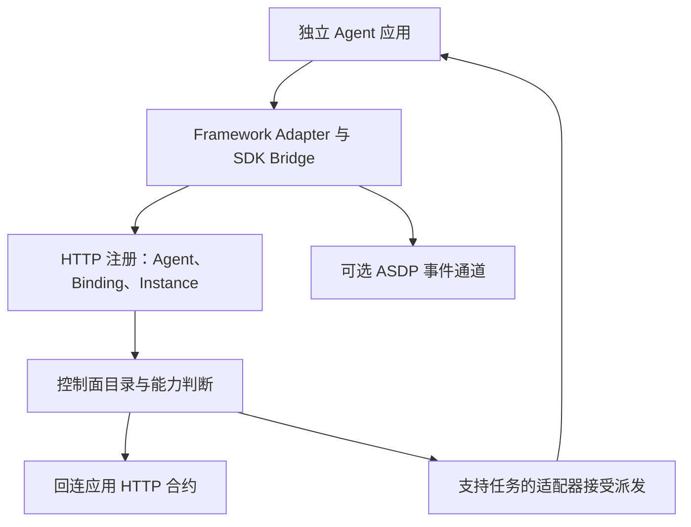

<Note>
此为预览文档，正式版本尚未发布。
</Note>

External 应用独立运行，SDK bridge 将应用身份、会话与已实现能力接入 Service。Service 不会因为注册成功而接管你的框架进程。

## 三个层次分别验收

1. **目录身份**：逻辑 Agent、运行绑定与实例注册成功，范围和副本身份正确。
2. **会话能力**：应用运行会话后，bridge 提供其声明的上下文、消息和命令；实时事件需要启用相应传输与框架 hook。
3. **工作执行**：具备任务入口的适配器接受 Attempt，执行并回报状态。此能力需单独实现与测试。

只有第二层的应用仍然有用：可以观察独立应用的运行情况。平台会根据真实 capability 判断 Chat、命令和派发是否可用。

## HTTP contract 与 ASDP 的分工

HTTP 注册建立目录身份；应用合约提供可查询的能力和会话操作。HTTP 请求的可达方向与应用向控制面注册的方向不同，部署时必须同时验证。

ASDP 提供长连接事件/控制传输。Java 可以单独使用 HTTP 注册；Python 当前的自动注册和 ASDP 初始化关联。标准 standalone 部署与 ASDP 部署的区别见[连接配置](/v2/zh/service/external-agent-configuration)。

事件 journal 帮助断线恢复，但不保存所有业务状态，也不代替框架自己的 Session store。应用需保留自己的数据、工具连接和任务幂等处理。

## 一个派发的执行过程

控制面根据绑定能力选择实例并建立 Attempt。应用获得该次执行的标识、generation 和任务范围上下文，由 `AgentTaskStarter` 或 `handle_agent_task` 创建隔离执行。执行者回报进度、评论与 Artifact，维持执行所需的租约/状态，再报告成功、失败或取消。

工作结果应关联同一次 Attempt。旧执行返回时必须接受控制面的过期身份检查，不能把旧结果重新贴成另一任务的成功。收到取消后向框架传播请求，并观察最终状态；HTTP 响应成功不证明业务执行已经停止。

## 参与 Team

普通成员交付自己承担的结果；Leader 还负责调度、汇总和节点收敛。把 External Agent 放进成员名单，不会自动赋予 coordinator 协议能力。先在[支持框架与扩展](/v2/zh/service/external-agent-frameworks)完成任务适配，再进行 [Team 协作验收](/v2/zh/service/team-collaboration)。
