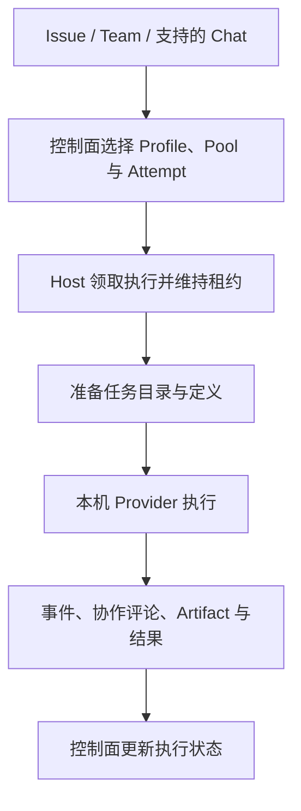

<Note>
此为预览文档，正式版本尚未发布。
</Note>

Hosted 的执行进程位于 Runtime Host 所在电脑或服务器。Service 保存工作和调度记录，Host 管理 provider 进程、任务目录与事件回传。

## 主机注册和任务选择

连接时 Host 注册稳定身份、范围、池、provider 描述与容量。调度结合 Agent 绑定、能力要求和运行策略产生 Attempt；Host 领取符合条件的工作并维持租约。Host 在线、provider 能 probe、Agent 可派发是三个不同检查点。

Runtime Profile 决定 provider 参数，Pool 提供可选执行主机。并发受 Host capacity 和上层调度策略共同约束。

## 准备与执行

Host 为执行准备任务工作目录，将平台支持的指令和能力文件映射到 provider 格式，再用该目录启动 provider。它不会默认切换到用户正在编辑的本地仓库；仓库、输入资料与分支需要在任务准备中明确。

任务范围凭据和工作上下文通过环境及 MCP/CLI 提供给执行者。provider 可以读取工作、发表评论和上传产物。把文件留在 Host 磁盘上并不等于其他协作者可以访问，应使用 Artifact 交付需要共享的结果。

## 事件、确认与恢复

适配器将 provider 事件转换为平台执行记录。支持的平台确认由 Host 转发工具请求并等待决定；不支持的平台确认必须按 provider 自身的权限方式处理。

Host 保留日志、provider 会话标识和 checkpoint，用于支持的恢复路径。重启时保留状态目录与 Host 身份；只声明 Resume 支持不能保证任意中断都能恢复，目标 provider 的会话仍需存在且可访问。OpenClaw 当前适配器不提供 Session resume。

## 重试和取消

取消会向执行链路传播，应检查 Attempt 终态以及 provider 进程是否结束。重试是新的 Attempt；只有符合恢复条件时才使用原 provider 会话。跨后端 fresh fallback 依赖持久 Issue、评论和 Artifact 重建上下文，不能搬迁进程内记忆。

使用 `agentscope runtime logs -f` 配合 Task/Attempt 诊断。若无任务可领，检查范围、池、绑定、容量与所需能力；若领取后失败，检查 provider 登录、参数、工作目录和工具依赖。

相关：[安装连接](/v2/zh/service/runtime-host) · [支持的 provider](/v2/zh/service/hosted-agent-providers) · [Team 协作](/v2/zh/service/team-collaboration)。
