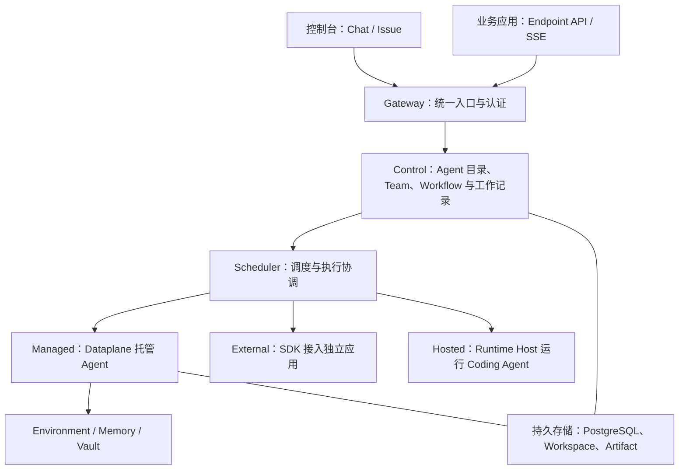

<Note>
此为预览文档，正式版本尚未发布。
</Note>

**AgentScope Service 是面向 Agent 应用的运行、管理与编排平台，让你把单个 Agent 或多 Agent 协作发布成可调用、可追踪的服务。**

你可以在控制台零代码创建云端 Agent，接入用 AgentScope 开发的应用，或使用 Codex 等 Coding Agent 执行工作。平台提供统一的对话、任务、协作与 API 入口，管理运行状态和交付结果，让不同运行方式的 Agent 在同一套工作流程中协作。

这是主要组件与职责的概览。Control 保存定义和工作，Scheduler 协调执行；Managed 的模型循环在 Dataplane 中运行，External 保留自己的应用进程，Hosted 在连接的主机上启动 provider。开发者可按[本地安装](/v2/zh/service/quickstart)使用 Docker Compose，管理员可按[生产安装](/v2/zh/service/kubernetes)使用 Helm 部署平台。

## 支持的三种 Agent 管理与编排方式

### 零代码开发应用：云端完全托管

**Managed Agent** 适合直接在控制台配置职责、模型、知识和工具的应用。Service 负责启动 Agent、运行模型与工具循环并保存会话状态，你无需编写 Agent 应用或单独维护其进程。

这里的云端是你所使用的 Service 部署环境；管理员需先配置模型和执行资源。你可按需绑定 Workspace、Environment、Memory 与 Vault，逐步给 Agent 增加能力。详见 [Managed Agent](/v2/zh/service/managed-agent)。

### 用 AgentScope 开发应用：接入已有 Agent

**External Agent** 适合需要用代码实现业务逻辑、已有部署或需要保留框架控制权的应用。你用 AgentScope 开发并运行 Agent，通过 SDK 注册到 Service，统一查看其身份、会话和已接入的能力。

应用的模型、依赖和进程仍由你管理。实现任务执行适配后，它也可以接收 Issue 或加入 Team；注册与可执行的能力范围由适配器决定。详见 [External Agent](/v2/zh/service/external-agent)。

### 使用 Codex 等 Agent：连接现成的执行能力

**Hosted Agent** 适合复用 Codex、Claude Code、Qoder、QwenPaw 或 OpenClaw。你在电脑或服务器上安装并登录相应 provider，再连接 Runtime Host，平台便可将工作调度到这台主机。

Service 管理任务与交付，Runtime Host 管理 provider 进程和工作目录。各 provider 对工具、子 Agent、审批和恢复的支持不同，详见 [Hosted Agent](/v2/zh/service/hosted-agent)及其[能力对照](/v2/zh/service/hosted-agent-providers)。

三种方式的 Agent 都可以按已具备的任务能力参与编排。使用 **Team** 让 Leader 动态委派、汇总成员结果，或使用 **Workflow** 固定步骤、条件和人工关口。

## 核心概念

### 能力定义

| 概念 | 作用 |
| --- | --- |
| Agent | 可复用的职责与运行配置，是执行工作的基本单元 |
| Team | 由 Leader 和成员组成，按目标动态协作 |
| Workflow | 定义步骤、依赖、分支与人工关口，按发布版本执行 |
| Endpoint | 将 Agent、Team 或 Workflow 发布为带认证的 API 入口 |
| Automation / Channel | 分别通过计划或事件、消息平台发起工作 |

### 工作与执行

| 概念 | 作用 |
| --- | --- |
| Chat / Session | Chat 是控制台对话入口；Session 保存运行时持续上下文 |
| Issue | 记录工作目标、负责人、讨论和验收要求 |
| Run / Node | 记录一次编排及其中的执行步骤 |
| AgentTask / Attempt | 分别记录派给 Agent 的工作和某次实际执行；重试可产生新的 Attempt |
| Comment / Artifact | 保存讨论、进度和可共享的交付文件 |
| Approval | 确认某项操作是否可以继续；交付结果的验收另行处理 |

普通 Chat 可以直接开始。工作型请求通过 Issue 和执行记录追踪过程；一次运行成功后，还需按该工作的完成策略检查或验收结果。

### 资源与权限

**Workspace** 保存指令、技能、工具和子 Agent 定义；**Environment** 决定 Managed 工具在哪里执行；**Memory** 保存共享知识；**Vault** 保存连接凭据。这些资源的绑定与验证在 Managed Agent 分类中展开。

**Namespace** 是资源和权限的组织范围。Workspace 是能力资源，不是 Namespace；看到某个 Agent 也不代表可以阅读它参与的所有私人工作。

### 版本

Agent、Workspace、Team 与 Workflow 的配置可以演进。Workflow revision 固定流程版本，Endpoint release 选择 API 当前暴露的目标；修改草稿后需发布或更新相应绑定，并用新工作验证。

从[快速开始](/v2/zh/service/first-session)创建第一个云端 Agent，再发布 API、注册代码应用并组织团队协作。
