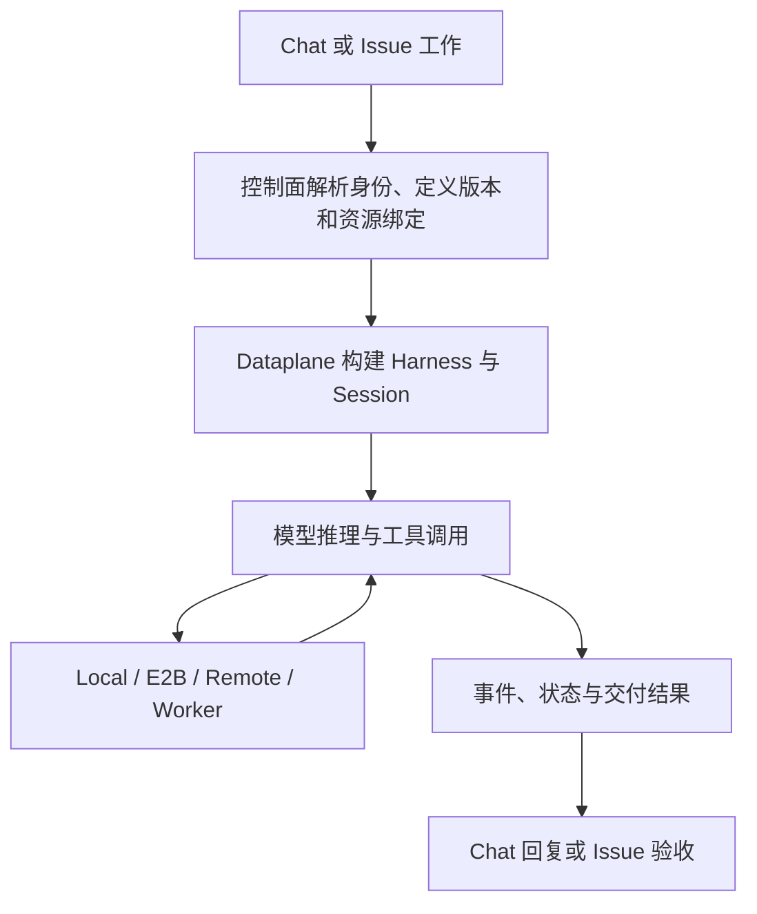

<Note>
此为预览文档，正式版本尚未发布。
</Note>

Managed 模式由 Service 持有 Agent 的运行生命周期。浏览器只提交工作和查看事件；模型循环在 Dataplane 中运行，文件与 Shell 工具按 Environment 路由。

## 创建运行上下文

控制面解析 Agent 定义、版本、环境及知识与凭据引用。Dataplane 将定义文件准备到会话目录，构建 Harness，并连接持久状态存储。定义快照、执行文件和共享资源各有自己的生命周期：保存 Agent 配置不等于修改正在执行的所有实例。

Workspace 保存能力定义；Environment 决定文件和命令在哪执行；Memory Store 是共享知识；Vault 在连接工具前解析凭据。资源用法集中在本分类的四个资源页面。

## 模型与工具循环

Harness 使用显式 Model 或部署默认 Model，按指令进行推理、请求工具并读取结果。`maxIters` 限制迭代，工具权限决定操作能否执行。需要确认时任务可能等待用户决定；这时重复发送相同工作可能造成额外执行。

Local 工具在 Dataplane 环境执行，sandbox 使用 E2B，remote 使用共享文件存储，self_hosted 将工具工作交给 Worker。self_hosted 中模型仍由 Dataplane 驱动；Worker 的职责是接收工具工作并返回结果。

## 持久化与恢复

会话状态、事件和协调记录存储在部署配置的持久存储中。多副本使用协调租约约束执行；恢复仍依赖数据库、工作文件、所选环境和外部工具可用。一次工具成功后的外部副作用不会因服务重启自动撤销。

共享 Memory 是按需访问的实时平台知识，不应理解为每次调用都完整复制进模型提示。修改它需要按共享知识维护流程处理，不能假设 Agent 定义版本同时固定所有外部知识。

## 完成不等于验收

Chat 的一轮回复结束与 Issue 的业务验收不同。Issue/Team 执行需记录 Attempt 结果；协调角色还需完成或失败对应 Run node。需要人工复核时，检查产物后在 Inbox 接受结果。细节见[Managed 任务结果](/v2/zh/service/managed-harness-task-outcomes)。

排障时先区分：模型连接失败、工具等待确认、Worker 离线、工具权限被拒绝、执行已结束但业务尚未验收。保留 Session、Run 和 Attempt 标识用于关联日志。
