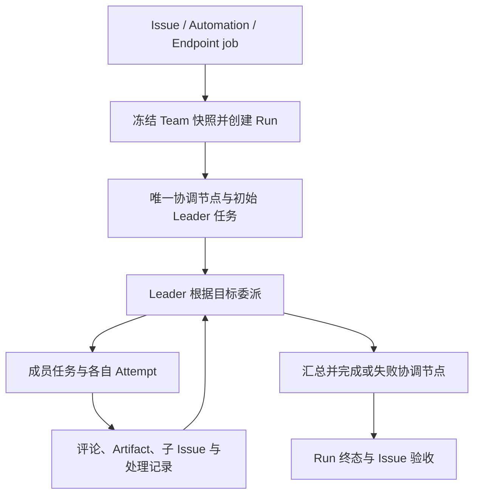

<Note>
此为预览文档，正式版本尚未发布。
</Note>

Team 是持久团队定义。一次团队工作创建 Run 和团队快照，由 Leader 驱动协调；它不是每次无条件并行运行所有成员。

## 定义与一次运行的关系

Team 定义包含 Leader、成员和策略；Run 固定这次协作的快照，便于追查当时的团队配置。控制面为 Team 创建一个 coordinator node 和初始 Leader 任务，而不是为每个成员无条件创建一次调用。

Leader 根据上下文选择成员。需要固定节点顺序、条件和汇合规则时使用 Workflow；Workflow 内也可以调用 Team 节点，把动态协作嵌入更大的流程。

## 从目标到执行

| 对象 | 在协作中记录什么 |
| --- | --- |
| Issue | 目标、负责人、讨论、交付与验收 |
| Run / Node | 本次协作及协调步骤的状态 |
| AgentTask | 指派给一个 Agent 的工作义务 |
| Attempt | 某个后端上的一次实际执行 |
| Comment / Artifact | 持久沟通与共享结果 |
| Child Issue | 可独立跟踪的子目标 |

同一 AgentTask 可以因重试产生多个 Attempt。执行者使用任务范围上下文与凭据，不能拿管理员凭据在普通终端代替一项正在派发的任务。

## 委派与持久沟通

成员根据职责提交结果，Leader 阅读、追问或要求修订。评论/mention 与任务输入的交付、确认、处理状态共同支持后续协作；重试时要保留去重和已处理信息，避免把同一条消息当成新任务重复执行。

跨成员共享使用 Issue、评论、Artifact 等持久对象。Managed Environment、Hosted 工作目录、External 私有文件不会仅因在同一 Team 中而自动合并。

## 如何结束工作

成员回复、Attempt 成功、coordinator node 完成、Run 终态和 Issue 验收分别表达不同层次。Leader 的最终文字不能代替节点完成。仍有必要子工作未完成时，应等待、调整计划或明确失败，不能用“报告已生成”掩盖未完成义务。

人工验收需要检查最终结果、重要来源和失败说明，再接受结果或要求修改。查看 Run succeeded/partial_succeeded 时也要核对业务验收要求。

## 扩展与恢复

新增成员前先单独验证它的能力，再检查 Leader 是否能正确使用该角色。混合 Managed、Hosted、External 时，用[成员配置](/v2/zh/service/team-configuration)中的检查条件逐个验收。

恢复依赖持久工作和执行状态；Runtime fresh fallback 重建上下文，不迁移旧进程。排障时沿 Issue → Run → Node → Task → Attempt 检查：未派发看就绪度与策略，执行卡住看后端与确认请求，交付未结束看成员义务和协调节点状态。
